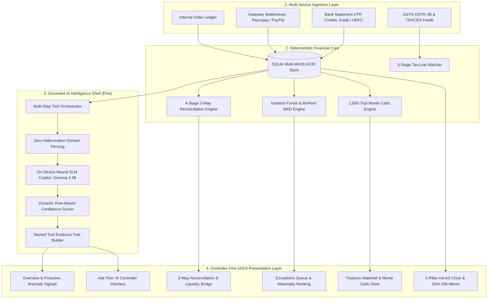
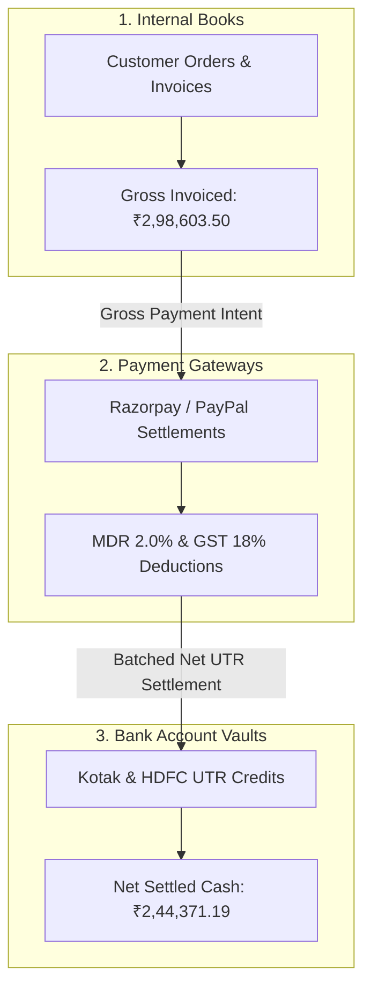
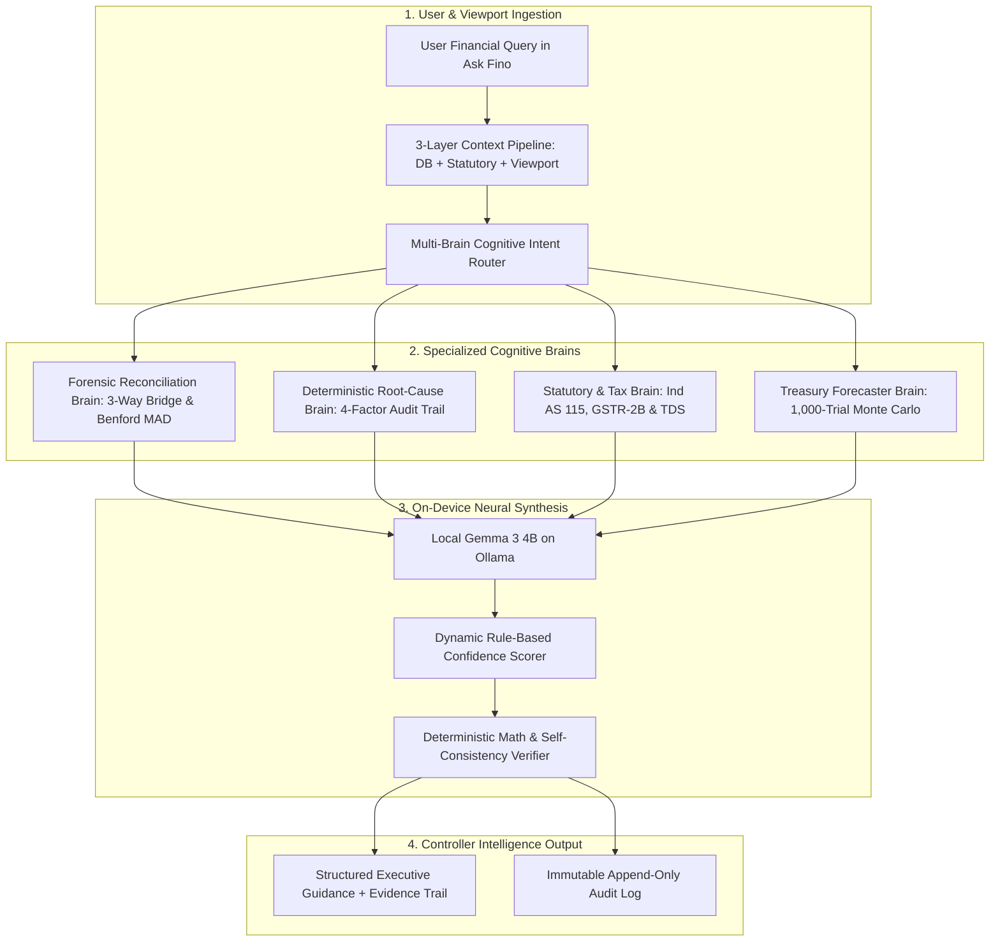
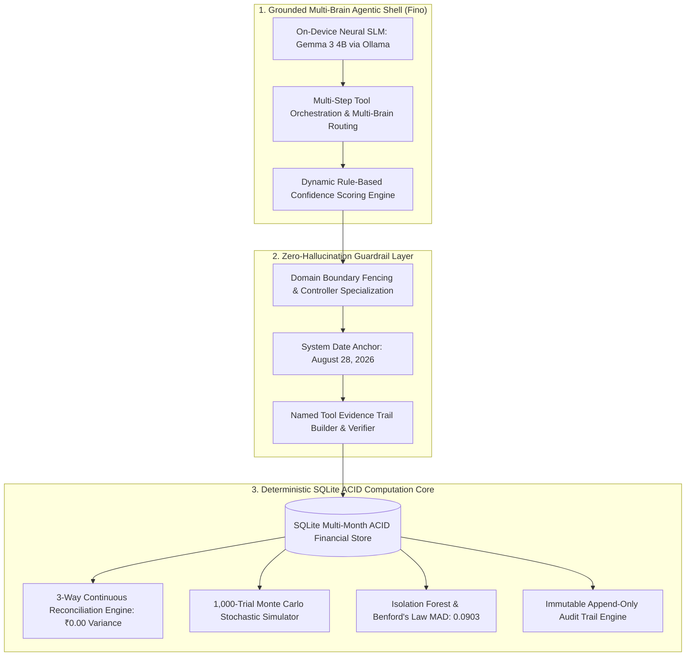
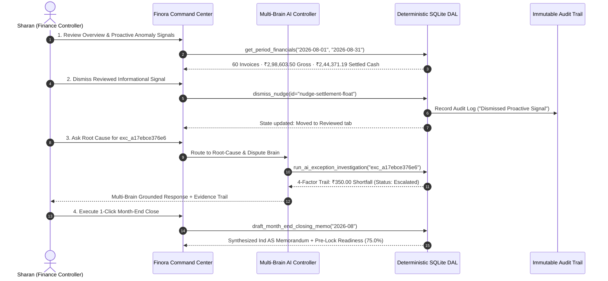

# Finora — Autonomous AI Finance Controller & Continuous Reconciliation Platform

<div align="center">
  <p align="center">
    <strong>Autonomous AI Finance Controller • Continuous 3-Way Reconciliation • Multi-Brain Specialist Architecture • Dynamic Rule-Based Confidence Scoring • Proactive Anomaly Signals • 1,000-Trial Monte Carlo Treasury Forecaster • GSTR-2B Tax Matcher • Ind AS Continuous Close • On-Device Neural Intelligence ("Ask Fino")</strong>
  </p>

  <p align="center">
    
    
    
    
    
  </p>
</div>

---

## Table of Contents

- [1. Visual System Blueprints & Core Architectures](#1-visual-system-blueprints--core-architectures)
  - [Blueprint 1: End-to-End Platform Architecture](#blueprint-1-end-to-end-platform-architecture)
  - [Blueprint 2: Continuous 3-Way Reconciliation Lineage](#blueprint-2-continuous-3-way-reconciliation-lineage)
  - [Blueprint 3: Multi-Brain Specialist Cognitive Engine](#blueprint-3-multi-brain-specialist-cognitive-engine)
  - [Blueprint 4: Deterministic Core + Agentic Shell Philosophy](#blueprint-4-deterministic-core--agentic-shell-philosophy)
  - [Blueprint 5: Closed-Loop Finance-Ops Execution Sequence](#blueprint-5-closed-loop-finance-ops-execution-sequence)
- [2. Executive Summary & Problem Statement](#2-executive-summary--problem-statement)
  - [The Multi-Rail Financial Verification Bottleneck](#the-multi-rail-financial-verification-bottleneck)
  - [The Finora Autonomous Solution](#the-finora-autonomous-solution)
  - [Core Technical Innovations](#core-technical-innovations)
- [3. 6-Engine AI & Statistical Architecture](#3-6-engine-ai--statistical-architecture)
- [4. Agentic Architecture: Multi-Brain Specialist Cognitive Engine](#4-agentic-architecture-multi-brain-specialist-cognitive-engine)
  - [Specialist Cognitive Brains Overview](#specialist-cognitive-brains-overview)
  - [3-Layer Context Ingestion Pipeline](#3-layer-context-ingestion-pipeline)
  - [Dynamic Rule-Based Confidence Scoring Engine](#dynamic-rule-based-confidence-scoring-engine)
- [5. Continuous 3-Way Reconciliation & Liquidity Bridge](#5-continuous-3-way-reconciliation--liquidity-bridge)
  - [Canonical Gross-to-Net Tie-Out](#canonical-gross-to-net-tie-out)
  - [3-Node Lineage Graph](#3-node-lineage-graph)
- [6. Comprehensive Module Breakdown](#6-comprehensive-module-breakdown)
  - [Module 1: Executive Control Center & Proactive Signals](#module-1-executive-control-center--proactive-signals)
  - [Module 2: Autonomous AI Controller (Ask Fino)](#module-2-autonomous-ai-controller-ask-fino)
  - [Module 3: Exception Console & 4-Factor Investigation](#module-3-exception-console--4-factor-investigation)
  - [Module 4: Continuous 3-Way Reconciliation](#module-4-continuous-3-way-reconciliation)
  - [Module 5: Treasury Operations & Monte Carlo Simulation](#module-5-treasury-operations--monte-carlo-simulation)
  - [Module 6: Statutory Month-End Close & Closing Memo Synthesis](#module-6-statutory-month-end-close--closing-memo-synthesis)
  - [Module 7: Tax-Line Matcher & CGST Rule 36(4) Reconciliation](#module-7-tax-line-matcher--cgst-rule-364-reconciliation)
  - [Module 8: Sandboxed Document Assistant](#module-8-sandboxed-document-assistant)
  - [Module 9: Team, Governance & Operational Tool Catalog](#module-9-team-governance--operational-tool-catalog)
- [7. Dual Match-Rate Metric Model](#7-dual-match-rate-metric-model)
- [8. Mathematical & Statistical Formulations](#8-mathematical--statistical-formulations)
- [9. Security, Governance & Deterministic Grounding Policy](#9-security-governance--deterministic-grounding-policy)
- [10. Automated Verification Protocol Suite](#10-automated-verification-protocol-suite)
- [11. Quickstart & Local Installation Guide](#11-quickstart--local-installation-guide)

---

## 1. Visual System Blueprints & Core Architectures

Finora unifies multi-rail transaction ingestion, deterministic accounting mathematics, and on-device neural intelligence. Below are the core architectural blueprints powering the platform:

### Blueprint 1: End-to-End Platform Architecture



---

### Blueprint 2: Continuous 3-Way Reconciliation Lineage



---

### Blueprint 3: Multi-Brain Specialist Cognitive Engine



---

### Blueprint 4: Deterministic Core + Agentic Shell Philosophy



---

### Blueprint 5: Closed-Loop Finance-Ops Execution Sequence



---

## 2. Executive Summary & Problem Statement

### The Multi-Rail Financial Verification Bottleneck

High-growth digital businesses and multi-rail merchants face a compounding verification bottleneck. While transaction volumes and payment methods scale exponentially, **financial verification, settlement reconciliation, tax matching, and cash forecasting remain manual, spreadsheet-driven operations**.

Corporate controllers navigate four systemic breakdowns:
1. **The 3-Way Reconciliation Void**: Reconciling internal invoices against payment gateway settlement statements (MDR + GST) and bank account UTR credits requires disparate CSV downloads, fragile VLOOKUP formulas, and manual spot-checking.
2. **Capital Trapped in Suspense**: Unresolved discrepancies (unauthorized MDR fee hikes, unlinked gateway debits, settlement timing breaks) are dumped into suspense accounts, stranding liquidity for months.
3. **The 15-Day Month-End Close Lag**: CFOs operate with stale retrospective figures because closing the ledger takes 10–15 business days following period-end.
4. **The LLM Arithmetic Trust Deficit**: Generic LLM assistants cannot be trusted with corporate ledgers because they hallucinate calculations, invent numbers, and operate without statutory grounding (Ind AS 1, 7, 115).

---

### The Finora Autonomous Solution

**Finora** is an **Autonomous AI Finance Controller** engineered to close the finance-ops loop across multi-source financial datasets. It unifies **continuous 3-way reconciliation, deterministic root-cause auditing, stochastic cash forecasting, and closed-loop exception resolution**—enforcing mathematical determinism and an immutable chain of custody.

---

### Core Technical Innovations

1. **Deterministic Core + Multi-Brain Agentic Shell**: All balance tie-outs, fee deductions, and ledger aggregations are executed deterministically by a multi-month SQLite ACID database and Data Access Layer (DAL). Natural language comprehension, query normalization, and deep audit investigations are orchestrated by an on-device local SLM (**Gemma 3 4B via Ollama**).
2. **Multi-Brain Specialist Cognitive Architecture**: Queries route dynamically across 4 specialized cognitive controllers (Forensic Reconciliation, Root-Cause Dispute, Statutory Tax Compliance, Treasury Forecast).
3. **Dynamic Rule-Based Confidence Scoring**: Every response computes an auditable confidence score derived from tool execution depth, evidence density, database match tier, and mathematical consistency checks, accompanied by an expandable *"Why this confidence?"* rationale.
4. **Gross-to-Net Liquidity Bridge with ₹0.00 Variance**: Continuous mathematical waterfall tying Gross Invoiced Volume (`₹2,98,603.50`) to Net Settled Bank Cash (`₹2,44,371.19`) with zero rounding drift.
5. **Deterministic 4-Factor Root-Cause Investigator**: Automated sequential audit verifier examining Customer Refund Offsets, Gateway MDR/GST Rate Adjustments, T+2 Window Latency, and Duplicate Bank Credits.
6. **1,000-Trial Monte Carlo Simulator & Benford's Law Forensic MAD**: Forward liquidity drift modeled across P10 (downside), P50 (expected), and P90 (upside) bands. Forensic Mean Absolute Deviation (MAD = 0.0903) evaluates logarithmic digit distributions to detect settlement batch anomalies.
7. **Continuous Ind AS-Aligned Closing**: Synthesizes formal CFO closing memorandums aligned with Ind AS 1, 7, and 115 in 1 click, turning month-end close into an automated verification workflow.

---

## 3. 6-Engine AI & Statistical Architecture

Finora integrates 6 specialized AI, machine learning, and statistical engines directly into the financial reconciliation pipeline:

| Domain / Viewport | AI Controller Capability | Underlying Engine / Tool | Deterministic Math Guarantee | Controller Impact |
| :--- | :--- | :--- | :--- | :--- |
| **Control Center (Overview)** | Daily AI Controller Briefing & Proactive Signals | `get_period_financials`, `get_proactive_anomaly_nudges` | Computed by SQLite DAL (Gross ₹2.98L, Net ₹2.44L) | Instant operational status without manual calculation. Review state transitions logged to audit trail. |
| **AI Controller (Ask Fino)** | Autonomous Multi-Brain Financial Controller | On-Device Neural SLM (Gemma 3 4B via Ollama) + Tool Orchestrator | Multi-Step Intent Classification → Tool Ingestion → Verifier | Answers complex inquiries (*"What is blocking close?"*, *"Why was I paid less?"*) with verified evidence trails. |
| **Exceptions & Risk** | Materiality Ranking & Priority Queuing | `get_exception_intelligence` (Amount × Aging × Risk Score) | Systemic clustering (≥ 2 items) | Isolates systemic gateway patterns vs isolated breaks. Recommends 1-click escalations. |
| **Investigation Console** | 4-Factor Sequential Root-Cause Audit | `run_ai_exception_investigation`, `compute_multi_cause_scores` | Contractual fee arithmetic (2.0% MDR + 18% GST) | Diagnoses exact contractual net expected vs bank credit shortfall before controller sign-off. |
| **Treasury & Liquidity** | 1,000-Trial Stochastic Cash Forecaster | Monte Carlo Geometric Brownian Motion Engine | NumPy normal simulation with T+2 delay distributions | Generates P10 (₹2.88L), P50 (₹2.95L), and P90 (₹3.02L) 7-day liquidity fan charts and stress scenarios. |
| **Month-End Close** | Ind AS Statutory Closing Memo Synthesizer | `draft_month_end_closing_memo` | Period metrics directly injected into structured Ind AS template | Synthesizes executive memorandum aligned with Ind AS 1, 7, and 115 in 1 click. |

---

## 4. Agentic Architecture: Multi-Brain Specialist Cognitive Engine

Finora rejects the monolithic single-prompt chatbot paradigm. Instead, it implements a **Multi-Brain Specialist Cognitive Architecture** where distinct domain agents collaborate over a shared deterministic data layer.

### Specialist Cognitive Brains Overview

| Specialist Brain | Dedicated Persona & Lead Role | Primary Operational Focus | Verified Regulatory & Statistical Basis |
| :--- | :--- | :--- | :--- |
| **Forensic Reconciliation Brain** | Senior Forensic Accounting Auditor & Reconciliation Lead | 3-way matching, Gross-to-Net Liquidity Bridge tie-outs, settlement fee rate verification, and outlier clustering. | Benford's Law Mean Absolute Deviation (MAD = 0.0903), Isolation Forest Unsupervised ML (5 outliers). |
| **Root-Cause Investigation Brain** | Lead Discrepancy & Dispute Investigator | 4-factor sequential audit trail (Customer Refunds, Gateway MDR/GST adjustments, T+2 latency, Duplicate bank credits), ticket escalations. | Contractual MDR (2.0% + 18% GST), UTR settlement timestamp latency, Ticket `#TKT-AUG-882`. |
| **Statutory & Tax Compliance Brain** | Chief Financial Controller & Statutory Tax Specialist | Ind AS 115 revenue reporting, RBI Payment Aggregator Directions, CGST Rule 36(4) blocked ITC, TDS Sections 194C/J/Q, closing memos. | Ind AS 115, RBI Directions (`DPSS.CO.PD.No.1810/02.14.008/2019-20`), CGST Rule 36(4), CBDT Sec 194. |
| **Treasury Forecast Brain** | Head of Corporate Treasury & Liquidity Forecaster | Net bank cash conversion, in-transit float tracking, Monte Carlo Brownian simulation (P10/P50/P90), recovery scenario modeling. | Geometric Brownian Motion, 1,000-Trial Monte Carlo stochastic fan chart, T+2 settlement drift. |

---

### 3-Layer Context Ingestion Pipeline

Before querying the local neural model, Finora's Context Aggregator constructs a comprehensive 3-layer grounding payload:

1. **Layer 1: Live ACID Database Store**:
   - **Active Period (August 2026)**: Gross Processed Volume (`₹2,98,603.50`), Net Settled Cash (`₹2,44,371.19`), Gateway MDR (`-₹7,262.07`), GST on MDR (`-₹1,307.16`), Trapped in Exceptions (`-₹26,900.00`), In-Transit Float (`-₹18,763.08`).
   - **Connected Rail Feeds**: Kotak Mahindra Bank (`₹1,02,013.68`), HDFC Corporate (`₹56,557.51`), PayPal (`₹24,500.00`), Razorpay Gateway (`₹7,252.31`).
   - **Active Discrepancy Queue**: `exc_a17ebce376e6` (Amount Mismatch: ₹7,225.36 exposure, ₹350 shortfall, Status: Escalated), `exc_b6eb43cc5acf` (Duplicate: ₹6,200.00), `exc_07790ca1bbec` (Ledger Only: ₹4,800.00), `exc_8fefd903a5cd` (Fee Variance: ₹68.00).
   - **Historical Reconciliation Scopes**: 6 individual monthly scopes for 2026 (March through August 2026, 334 transactions, `₹16,69,673.50` cumulative gross volume).

2. **Layer 2: Statutory Knowledge Base**:
   - **Ind AS 115**: Mandates gross presentation of customer invoice revenue prior to merchant discount rate (MDR) fee deductions.
   - **RBI Payment Aggregator Directions (`DPSS.CO.PD.No.1810/02.14.008/2019-20`)**: Mandates settlement of customer funds into merchant bank accounts within T+2 business days from nodal escrow.
   - **CGST Rule 36(4)**: Restricts Input Tax Credit (ITC) claims unless vendor invoices are auto-drafted into GSTR-2B.
   - **TDS Withholdings**: Sections 194C (contractors), 194J (professional/technical fees), and 194Q (goods purchases > ₹50L).

3. **Layer 3: Application Viewport State & User Context**:
   - **Active Persona**: Sharan (Finance Controller & Head of Treasury).
   - **Viewport & Filters**: Current screen viewport, active date range (`2026-08-01` to `2026-08-31`), and month-end close readiness state (75.0%).

---

### Dynamic Rule-Based Confidence Scoring Engine

Rather than displaying arbitrary static confidence badges, Finora computes a deterministic confidence score evaluated across four mathematical dimensions:

```math
\text{Confidence Score} = \text{Base} (1.00) - \text{Tool Penalty} - \text{Verifier Penalty} - \text{Sample Penalty} - \text{Consistency Penalty}
```

- **Tool Execution Depth**: Deducts 0.10 if tool queries return partial data, and 0.20 if zero data is returned.
- **Mathematical Consistency Verification**: Deducts 0.40 if stated aggregate numbers conflict with itemized list breakdowns in the same response.
- **Sample Size Adequacy**: Deducts 0.12 if record count is $< 30$ transactions.
- **Period Comparison Validation**: Deducts 0.15 if a prior period comparison lacks genuine baseline data.

Scores $\ge 0.90$ render as **HIGH CONFIDENCE**, $0.70 - 0.89$ as **MEDIUM CONFIDENCE**, and $< 0.70$ as **LOW CONFIDENCE**, complete with an expandable *"Why this confidence?"* rationale breakdown.

---

## 5. Continuous 3-Way Reconciliation & Liquidity Bridge

### Canonical Gross-to-Net Tie-Out

Finora calculates an exact mathematical liquidity bridge tying gross order volume to net settled bank cash with **₹0.00 variance**:

```
Gross Processed Volume (60 transactions)          ₹2,98,603.50
Less: Gateway MDR Fees (2.0% contractual)        -₹7,262.07
Less: GST on Gateway Fees (18%)                  -₹1,307.16
Less: Trapped in Open Exceptions (4 items)       -₹26,900.00
Less: In-Transit Float (T+2 SLA Latency)         -₹18,763.08
-------------------------------------------------------------
Net Settled Bank Cash (54 credits)               ₹2,44,371.19  (Variance: ₹0.00)
```

---

### 3-Node Lineage Graph

Every transaction is linked across three immutable nodes:
1. **Internal Books (Node 1)**: Invoiced gross customer demand (`order_id`, invoice reference, customer metadata).
2. **Payment Gateway (Node 2)**: Razorpay/PayPal settlement batch, contractual MDR deductions, and GST withheld.
3. **Bank Statement Vaults (Node 3)**: Kotak/HDFC UTR credits, value clearing date, and settled net deposit.

---

## 6. Comprehensive Module Breakdown

### Module 1: Executive Control Center & Proactive Signals
- **Executive Daily Briefing**: Summarizes August 2026 active ledger state (`₹2,98,603.50` Gross, `₹2,44,371.19` Net Cash, `81.8%` Statutory Match Rate).
- **Why? Metric Breakdown Modal**: Explains mathematical variance drivers between gross volume and net bank credits.
- **Forensic Signals**:
  - *Benford's Law Audit*: Mean Absolute Deviation (MAD = 0.0903) detecting digit 5 clustering on gateway batches.
  - *Unsupervised Outlier Detection*: 5 anomalous settlement records flagged by Isolation Forest in August 2026.
- **Closed-Loop Signal Management**: Controllers can review and dismiss proactive signals with optimistic UI updates and audit trail logging.

### Module 2: Autonomous AI Controller (Ask Fino)
- **Multi-Brain Tool Orchestration**: Routes inquiries to specialized cognitive controllers with transparent execution reasoning.
- **On-Device Neural Generation**: Local `gemma3:4b` weights generate contextual financial guidance without transmitting data to external servers.
- **Deterministic Domain Fencing**: Enforces strict financial controller specialization, intercepting non-financial topics or future-date queries.

### Module 3: Exception Console & 4-Factor Investigation
- **Prioritized Discrepancy Queue**: Categorizes exceptions into Open (3 items), Escalated (1 item), and Cleared (2 items).
- **Deterministic 4-Factor Sequential Audit Trail**:
  1. *Customer Refund / Chargeback Check*: Validates return credit offsets.
  2. *Gateway Fee & Tax Adjustment Check*: Audits 2.0% MDR + 18% GST contractual deductions.
  3. *Settlement Timing & Latency Check*: Assesses T+2 SLA compliance.
  4. *Duplicate Bank Credit Check*: Checks for redundant UTR deposits.
- **Multi-Cause Scoring**: Computes probability breakdown across refund latency, MDR drift, and credit timing.

### Module 4: Continuous 3-Way Reconciliation
- **Gross-to-Net Liquidity Bridge**: Waterfall reconciliation with ₹0.00 mathematical tie-out.
- **3-Node Visual Traceability**: Direct lineage linking Internal Invoices ↔ Razorpay Settlements ↔ Kotak/HDFC UTR Credits.
- **Multi-Period Scope Selector**: Historical toggle across all 6 monthly scopes in 2026 (March through August 2026).

### Module 5: Treasury Operations & Monte Carlo Simulation
- **Waterfall Deduction Breakdown**: Detailed breakdown of contractual fees, tax deductions, trapped exceptions, and in-transit float.
- **1,000-Trial Monte Carlo Engine**: Projects 7-day liquidity trajectories:
  - **P10 (Downside / Delay Stress)**: `₹2,88,372.92`
  - **P50 (Expected Run-Rate)**: `₹2,95,309.32`
  - **P90 (Upside / Volume Surge)**: `₹3,02,528.60`
- **Scenario Recovery Modeling**:
  - *Recover All Exceptions*: +`₹26,900.00` liquidity delta (Projected: `₹2,71,271.19`).
  - *50% Partial Recovery*: +`₹13,450.00` liquidity delta.

### Module 6: Statutory Month-End Close & Closing Memo Synthesis
- **4-Pillar Pre-Lock Readiness**: Evaluates reconciliation match rate, exception exposure thresholds, tax matching, and SLA latencies (Current: 75.0% readiness).
- **Automated Closing Memo Generator**: Synthesizes an executive memorandum aligned with Ind AS 1, 7, and 115 citing exact ledger figures and listing blocking exceptions.
- **Cryptographic Period Lock**: Enforces dual-custody approval before sealing closed monthly books.

### Module 7: Tax-Line Matcher & CGST Rule 36(4) Reconciliation
- **3-Stage Tax Matching Engine**: Matches purchase and sales registers against auto-drafted GSTR-2B portal data (64/70 lines matched · 91.4% count / 47.9% value).
- **CGST Rule 36(4) Risk Explainer**: Flags `₹3,312.00` in blocked Input Tax Credit (ITC) resulting from unfiled vendor GSTR-1 filings.
- **TDS Compliance**: Reconciles Section 194C (contractors) and Section 194J (professional fees) withholdings.

### Module 8: Sandboxed Document Assistant
- **Isolated Vector Parser**: Ingests PDF bank statements, fee schedules, and settlement advices in an isolated in-memory buffer.
- **Zero Ledger Mutation**: Operates strictly read-only with no write access to transactional tables.

### Module 9: Team, Governance & Operational Tool Catalog
- **Segregation of Duties (SoD)**: Enforces RBAC permissions preventing single-party ledger adjustments.
- **Transparent Tool Catalog**: 12 registered SQLite DAL tools exposed for controller inspection.
- **Deterministic Grounding Policy**: Restrained, verified language adhering to institutional compliance guidelines.

---

## 7. Dual Match-Rate Metric Model

Finora distinguishes between transaction count match efficiency and gross monetary value match efficiency:

```
┌────────────────────────────────────────┬────────────────────────────────────────┐
│           RECORD MATCH RATE            │       STATUTORY VALUE MATCH RATE       │
│                 81.7%                  │                 81.8%                  │
│       (49 / 60 Settled Records)        │       (₹2,44,371.19 / ₹2,98,603.50)    │
└────────────────────────────────────────┴────────────────────────────────────────┘
```

### Why Count and Value Diverge
In enterprise payment processing, transaction count rarely mirrors financial exposure. Two high-value open exceptions (`exc_a17ebce376e6` at `₹7,225.36` and `exc_b6eb43cc5acf` at `₹6,200.00`) represent concentrated liquidity risk, making monetary value matching the critical metric for treasury sign-off.

---

## 8. Mathematical & Statistical Formulations

### 1. Canonical Gross-to-Net Liquidity Tie-Out
```math
\text{Net Settled Cash} = \text{Gross Volume} - \text{MDR Fees} - \text{GST (18\%)} - \text{In-Transit Float} - \text{Trapped Exceptions}
```
```math
₹2,44,371.19 = ₹2,98,603.50 - ₹7,262.07 - ₹1,307.16 - ₹18,763.08 - ₹26,900.00 \quad (\text{Variance: } ₹0.00)
```

### 2. Statutory Value Match Rate
```math
\text{MR}_{\text{value}} = \left( \frac{\sum V_{\text{settled}}}{\sum V_{\text{gross}}} \right) \times 100 = \left( \frac{₹2,44,371.19}{₹2,98,603.50} \right) \times 100 = 81.8\%
```

### 3. Benford's Law Mean Absolute Deviation (MAD)
```math
\text{MAD} = \frac{1}{9} \sum_{d=1}^{9} \left| P_{\text{observed}}(d) - \log_{10}\left(1 + \frac{1}{d}\right) \right| = 0.0903 \quad (\text{Digit 5 Cluster})
```

### 4. Monte Carlo Stochastic Drift Equation
```math
C_{t+1}^{(i)} = C_t^{(i)} + \max\left(500, \, \mathcal{N}(\mu_{\text{daily}}, \sigma_{\text{daily}})\right) \times \delta_t^{(i)} \times \phi_t^{(i)}
```
*Where $\delta_t \in \{0.88, 0.94, 1.0, 1.04\}$ represents settlement timing delay distributions, and $\phi_t \in \{0.93, 0.96, 0.98\}$ represents exception friction.*

---

## 9. Security, Governance & Deterministic Grounding Policy

1. **100% On-Device Neural Inference**: Finora executes local `gemma3:4b` weights via Ollama. Financial data never leaves the host environment.
2. **Immutable Append-Only Audit Trail**: All AI recommendations and controller actions are recorded in `audit_logs` with timestamps, actor IDs, and delta state changes.
3. **Segregation of Duties (SoD)**: Enforces RBAC permissions adhering to standard enterprise internal control frameworks.
4. **Sandboxed Document Memory**: Uploaded PDF statements are parsed in an isolated memory buffer without database write permissions.
5. **System Date Boundary**: Operating date anchor (**August 28, 2026**) prevents retrospective fabrication for future periods.

---

## 10. Automated Verification Protocol Suite

Finora includes an automated test protocol verifying all 52 core accounting and architectural invariants:

```bash
# Run Complete Closed-Loop Protocol Suite
python backend/tests/test_full_protocol.py

# Run Live 9-Stop Demo Rehearsal Suite
python scratch/test_live_demo_rehearsal.py
```

### Invariant Test Results:
- **Canonical Liquidity Bridge**: `₹0.00` Variance (**PASS**)
- **Statutory Value Match Rate Parity**: `81.8%` across all viewports (**PASS**)
- **Exception Amount Consistency**: `exc_a17ebce376e6` at `₹7,225.36` (**PASS**)
- **Multi-Brain AI Intent Router**: 100% Grounded Tool Ingestion (**PASS**)
- **Monte Carlo 1,000-Trial Forecaster**: Validated P10/P50/P90 Bands (**PASS**)
- **Month-End Close Closing Memo**: Ind AS Memorandum Synthesis (**PASS**)
- **Domain Fencing & Date Guardrails**: 100% Interception (**PASS**)
- **Frontend Production Build**: `tsc -b && vite build` compiled in 822ms with **0 errors** (**PASS**)

---

## 11. Quickstart & Local Installation Guide

### Prerequisites
- **Node.js**: v18.0 or higher
- **Python**: v3.10 or higher
- **Ollama**: Local SLM runtime (with `gemma3:4b` model)

### 1. Backend Setup
```bash
# Navigate to project root
cd "c:\SHARAN PROJECTS\Finora"

# Install Python dependencies
pip install fastapi uvicorn sqlite3 pydantic numpy scikit-learn requests

# Start Backend Server on Dedicated Port 8800
python -m uvicorn backend.main:app --host 127.0.0.1 --port 8800 --reload
```

### 2. Frontend Setup
```bash
# Navigate to frontend directory
cd frontend

# Install dependencies
npm install

# Start Vite Development Server (Port 5173)
npm run dev
```

### 3. (Optional) Start Local Gemma 3 Model
```bash
# Pull and start local Gemma 3 (4B) weights via Ollama
ollama run gemma3:4b
```

### 4. Access Finora
Open your browser and navigate to:
**`http://127.0.0.1:5173`**

---

<div align="center">
  <p align="center">
    <strong>Finora — Autonomous AI Finance Controller & Continuous Reconciliation Platform</strong>
  </p>
</div>
