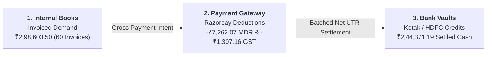
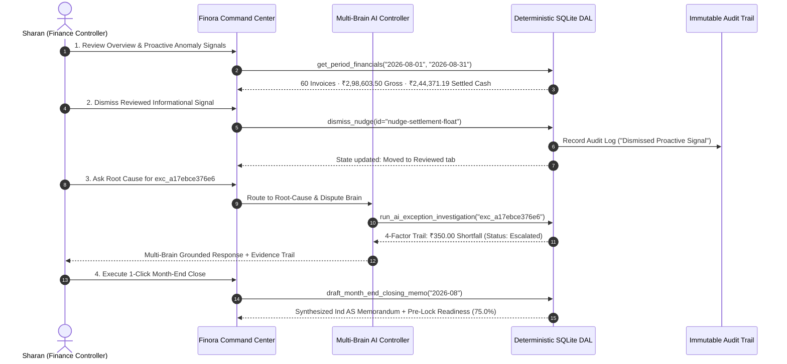

# Finora — Autonomous AI Finance Controller & Continuous Reconciliation Platform

<div align="center">
  <p align="center">
    <strong>Autonomous AI Finance Controller • Continuous 3-Way Reconciliation • Multi-Brain Specialist Architecture • Dynamic Rule-Based Confidence Scoring • Proactive Anomaly Signals • 1,000-Trial Monte Carlo Treasury Forecaster • GSTR-2B Tax Matcher • Ind AS Continuous Close • On-Device Neural Intelligence ("Ask Fino")</strong>
  </p>

  <p align="center">
    
    
    
    
    
  </p>
</div>

---

## Table of Contents

- [1. Executive Summary & Problem Statement](#1-executive-summary--problem-statement)
  - [The Problem: Multi-Rail Reconciliation Bottleneck](#the-problem-multi-rail-reconciliation-bottleneck)
  - [The Finora Solution](#the-finora-solution)
  - [Core Technical Breakthroughs](#core-technical-breakthroughs)
- [2. Multi-Brain Specialist AI Architecture](#2-multi-brain-specialist-ai-architecture)
  - [The 4 Cognitive Specialist Brains](#the-4-cognitive-specialist-brains)
  - [3-Layer Context Pipeline (DB + Conceptual + Viewport)](#3-layer-context-pipeline-db--conceptual--viewport)
- [3. Continuous 3-Way Reconciliation & Liquidity Bridge](#3-continuous-3-way-reconciliation--liquidity-bridge)
  - [Canonical Gross-to-Net Tie-Out](#canonical-gross-to-net-tie-out)
  - [The 3-Node Lineage Graph](#the-3-node-lineage-graph)
- [4. Closed-Loop Finance-Ops Execution Flow](#4-closed-loop-finance-ops-execution-flow)
- [5. System Architecture & Component Design](#5-system-architecture--component-design)
- [6. Comprehensive Module Breakdown](#6-comprehensive-module-breakdown)
  - [Module 1: Executive Control Center & Proactive Signals](#module-1-executive-control-center--proactive-signals)
  - [Module 2: Autonomous AI Controller (Ask Fino)](#module-2-autonomous-ai-controller-ask-fino)
  - [Module 3: Exception Console & Root-Cause Investigation](#module-3-exception-console--root-cause-investigation)
  - [Module 4: Continuous 3-Way Reconciliation](#module-4-continuous-3-way-reconciliation)
  - [Module 5: Treasury Operations & Monte Carlo Simulation](#module-5-treasury-operations--monte-carlo-simulation)
  - [Module 6: Statutory Month-End Close & Closing Memo Synthesis](#module-6-statutory-month-end-close--closing-memo-synthesis)
  - [Module 7: Tax-Line Matcher & CGST Rule 36(4) Reconciliation](#module-7-tax-line-matcher--cgst-rule-364-reconciliation)
  - [Module 8: Sandboxed Document Assistant](#module-8-sandboxed-document-assistant)
  - [Module 9: Team, Governance & Operational Tool Catalog](#module-9-team-governance--operational-tool-catalog)
- [7. Dual Match-Rate Metric Model](#7-dual-match-rate-metric-model)
- [8. Mathematical & Statistical Formulations](#8-mathematical--statistical-formulations)
- [9. Security, Governance & Deterministic Grounding Policy](#9-security-governance--deterministic-grounding-policy)
- [10. Automated Verification Protocol Suite](#10-automated-verification-protocol-suite)
- [11. Quickstart & Local Installation Guide](#11-quickstart--local-installation-guide)

---

## 1. Executive Summary & Problem Statement

### The Problem: Multi-Rail Reconciliation Bottleneck

Modern corporate finance teams and multi-rail merchants face a compounding verification bottleneck. While transaction volumes and payment methods scale exponentially, **financial verification, settlement reconciliation, tax matching, and cash forecasting remain manual, spreadsheet-driven operations**.

Corporate controllers navigate four systemic vulnerabilities:
1. **The 3-Way Reconciliation Void**: Reconciling internal invoices against payment gateway settlement statements (MDR + GST) and bank account UTR credits requires disparate CSV downloads, fragile VLOOKUP formulas, and manual spot-checking.
2. **Capital Trapped in Suspense**: Unresolved discrepancies (unauthorized MDR fee hikes, unlinked gateway debits, settlement timing breaks) are dumped into suspense accounts, stranding liquidity for months.
3. **The 15-Day Month-End Close Lag**: CFOs operate with stale retrospective figures because closing the ledger takes 10–15 business days following period-end.
4. **The LLM Arithmetic Trust Deficit**: Generic LLM assistants cannot be trusted with corporate ledgers because they hallucinate calculations, invent numbers, and operate without statutory grounding (Ind AS 1, 7, 115).

---

### The Finora Solution

**Finora** is an **Autonomous AI Finance Controller** engineered to close the finance-ops loop across multi-source financial datasets. It unifies **continuous 3-way reconciliation, deterministic root-cause auditing, stochastic cash forecasting, and closed-loop exception resolution**—enforcing mathematical determinism and an immutable chain of custody.



---

### Core Technical Breakthroughs

1. **Deterministic Core + Multi-Brain Agentic Shell**: All balance tie-outs, fee deductions, and ledger aggregations are executed deterministically by a multi-month SQLite ACID database and Data Access Layer (DAL). Natural language comprehension, query normalization, and deep audit investigations are orchestrated by an on-device local SLM (**Gemma 3 4B via Ollama**).
2. **Multi-Brain Specialist AI Architecture**: Rather than relying on a single prompt, queries route to 4 specialized cognitive controllers (Forensic Reconciliation, Root-Cause Dispute, Statutory Tax Compliance, Treasury Forecast).
3. **Dynamic Rule-Based Confidence Scoring**: Every response computes an auditable confidence score derived from tool execution depth, evidence density, database match tier, and mathematical consistency checks, accompanied by an expandable *"Why this confidence?"* rationale.
4. **Gross-to-Net Liquidity Bridge with ₹0.00 Variance**: Continuous mathematical waterfall tying Gross Invoiced Volume (`₹2,98,603.50`) to Net Settled Bank Cash (`₹2,44,371.19`) with zero rounding drift.
5. **Deterministic 4-Factor Root-Cause Investigator**: Automated sequential audit verifier examining Customer Refund Offsets, Gateway MDR/GST Rate Adjustments, T+2 Window Latency, and Duplicate Bank Credits.
6. **1,000-Trial Monte Carlo Simulator & Benford's Law Forensic MAD**: Forward liquidity drift modeled across P10 (downside), P50 (expected), and P90 (upside) bands. Forensic Mean Absolute Deviation (MAD = 0.0903) evaluates logarithmic digit distributions to detect settlement batch anomalies.
7. **Continuous Ind AS-Aligned Closing**: Synthesizes formal CFO closing memorandums aligned with Ind AS 1, 7, and 115 in 1 click, turning month-end close into an automated verification workflow.

---

## 2. Multi-Brain Specialist AI Architecture

Finora deploys a **Multi-Brain Specialist Agent Architecture** that ingests complete live database context, conceptual statutory knowledge, and application viewport parameters before executing on-device neural inference.


---

### The 4 Cognitive Specialist Brains

1. **Forensic Reconciliation & Ledger Audit Brain**: Specializes in 3-way matching, Gross-to-Net Liquidity Bridge tie-outs, settlement fee rate verification, Benford's Law digit conformity (MAD = 0.0903), and Isolation Forest anomaly detection.
2. **Deterministic Root-Cause & Dispute Investigation Brain**: Diagnoses exception breaks through sequential audit factors (Refunds, Gateway MDR/GST, T+2 Latency, Duplicate Bank Credits) and manages ticket escalations (`#TKT-AUG-882`).
3. **Statutory, Ind AS & Tax Compliance Brain**: Enforces Ind AS 115 revenue reporting, RBI Payment Aggregator Directions (`DPSS.CO.PD.No.1810/02.14.008/2019-20`), CGST Rule 36(4) blocked ITC restrictions, Section 194C/194J TDS compliance, and closing memo generation.
4. **Treasury Liquidity & Stochastic Forecasting Brain**: Analyzes net bank cash, in-transit float, Monte Carlo 1,000-trial Brownian simulation (P10/P50/P90), scenario recoveries, and liquidity runway.

---

### 3-Layer Context Pipeline (DB + Conceptual + Viewport)

Before querying the local neural model, Finora gathers:
- **Layer 1: Live DB Context**: Active period financials (August 2026: `₹2,98,603.50` Gross, `₹2,44,371.19` Net, `₹26,900.00` Trapped Exceptions, `₹18,763.08` Float), connected account feeds (Kotak, HDFC, PayPal, Razorpay), 6 historical reconciliation scopes (March–August 2026), and active exception IDs.
- **Layer 2: Statutory Knowledge Base**: Ind AS 115, RBI Master Directions, CGST Rule 36(4), TDS Sections 194C/J/Q, Benford's Law distribution formulas, and Monte Carlo stochastic parameters.
- **Layer 3: Application Viewport State**: Active user persona (Sharan, Finance Controller), current screen viewport, active filter range, and month-end close readiness state (75.0%).

---

## 3. Continuous 3-Way Reconciliation & Liquidity Bridge

### Canonical Gross-to-Net Tie-Out

Finora calculates an exact mathematical liquidity bridge tying gross order volume to net settled bank cash with **₹0.00 variance**:

```math
egin{aligned}
	ext{Gross Processed Volume (60 transactions)} &\quad \mathbf{₹2,98,603.50} \
	ext{Less: Gateway MDR Fees (2.0\% contractual)} &\quad -₹7,262.07 \
	ext{Less: GST on Gateway Fees (18\%)} &\quad -₹1,307.16 \
	ext{Less: Trapped in Open/Escalated Exceptions (4 items)} &\quad -₹26,900.00 \
	ext{Less: In-Transit Float (T+2 SLA Latency)} &\quad -₹18,763.08 \
\hline
\mathbf{	ext{Net Settled Bank Cash (54 credits)}} &\quad \mathbf{₹2,44,371.19} \quad (\mathbf{₹0.00}	ext{ Variance})
\end{aligned}
```

---

### The 3-Node Lineage Graph

Every transaction is linked across three immutable nodes:
1. **Internal Books (Node 1)**: Invoiced gross customer demand (`order_id`, invoice reference, customer metadata).
2. **Payment Gateway (Node 2)**: Razorpay/PayPal settlement batch, contractual MDR deductions, and GST withheld.
3. **Bank Statement Vaults (Node 3)**: Kotak/HDFC UTR credits, value clearing date, and settled net deposit.

---

## 4. Closed-Loop Finance-Ops Execution Flow



---

## 5. System Architecture & Component Design

```mermaid
flowchart LR
    subgraph Presentation ["1. Presentation Layer (Vite + React)"]
        P1["Overview & Signals"]
        P2["Ask Fino AI Console"]
        P3["3-Way Reconciliation"]
        P4["Exception Investigation"]
        P5["Cash & Monte Carlo Deck"]
        P6["Month-End Close"]
    end

    subgraph Intelligence ["2. Multi-Brain Orchestrator"]
        I1["Specialist Brain Router"]
        I2["3-Layer Context Hub"]
        I3["Local Gemma 3 (4B) SLM"]
        I4["Dynamic Confidence Scorer"]
    end

    subgraph Database ["3. Deterministic Core (FastAPI + SQLite)"]
        D1[("Multi-Month ACID Store")]
        D2["Gross-to-Net Bridge (₹0.00 Var)"]
        D3["4-Factor Sequential Engine"]
        D4["Monte Carlo (1,000 Trials)"]
        D5["Tax Matcher (GSTR-2B)"]
    end

    Presentation --> Intelligence --> Database
```



---

## 6. Comprehensive Module Breakdown

### Module 1: Executive Control Center & Proactive Signals
- **Executive Daily Briefing**: Summarizes August 2026 active ledger state (`₹2,98,603.50` Gross, `₹2,44,371.19` Net Cash, `81.8%` Statutory Match Rate).
- **Why? Metric Breakdown Modal**: Explains mathematical variance drivers between gross volume and net bank credits.
- **Forensic Signals**:
  - *Benford's Law Audit*: Mean Absolute Deviation (MAD = 0.0903) detecting digit 5 clustering on gateway batches.
  - *Unsupervised Outlier Detection*: 5 anomalous settlement records flagged by Isolation Forest in August 2026.
- **Closed-Loop Signal Management**: Controllers can review and dismiss proactive signals with optimistic UI updates and audit trail logging.

### Module 2: Autonomous AI Controller (Ask Fino)
- **Multi-Brain Tool Orchestration**: Routes inquiries to specialized cognitive controllers with transparent execution reasoning.
- **On-Device Neural Generation**: Local `gemma3:4b` weights generate contextual financial guidance without transmitting data to external servers.
- **Deterministic Domain Fencing**: Enforces strict financial controller specialization, intercepting non-financial topics or future-date queries.

### Module 3: Exception Console & Root-Cause Investigation
- **Prioritized Discrepancy Queue**: Categorizes exceptions into Open (3 items), Escalated (1 item), and Cleared (2 items).
- **Deterministic 4-Factor Sequential Audit Trail**:
  1. *Customer Refund / Chargeback Check*: Validates return credit offsets.
  2. *Gateway Fee & Tax Adjustment Check*: Audits 2.0% MDR + 18% GST contractual deductions.
  3. *Settlement Timing & Latency Check*: Assesses T+2 SLA compliance.
  4. *Duplicate Bank Credit Check*: Checks for redundant UTR deposits.
- **Multi-Cause Scoring**: Computes probability breakdown across refund latency, MDR drift, and credit timing.

### Module 4: Continuous 3-Way Reconciliation
- **Gross-to-Net Liquidity Bridge**: Waterfall reconciliation with ₹0.00 mathematical tie-out.
- **3-Node Visual Traceability**: Direct lineage linking Internal Invoices ↔ Razorpay Settlements ↔ Kotak/HDFC UTR Credits.
- **Multi-Period Scope Selector**: Historical toggle across all 6 monthly scopes in 2026 (March through August 2026).

### Module 5: Treasury Operations & Monte Carlo Simulation
- **Waterfall Deduction Breakdown**: Detailed breakdown of contractual fees, tax deductions, trapped exceptions, and in-transit float.
- **1,000-Trial Monte Carlo Engine**: Projects 7-day liquidity trajectories:
  - **P10 (Downside / Delay Stress)**: `₹2,88,372.92`
  - **P50 (Expected Run-Rate)**: `₹2,95,309.32`
  - **P90 (Upside / Volume Surge)**: `₹3,02,528.60`
- **Scenario Recovery Modeling**:
  - *Recover All Exceptions*: +`₹26,900.00` liquidity delta (Projected: `₹2,71,271.19`).
  - *50% Partial Recovery*: +`₹13,450.00` liquidity delta.

### Module 6: Statutory Month-End Close & Closing Memo Synthesis
- **4-Pillar Pre-Lock Readiness**: Evaluates reconciliation match rate, exception exposure thresholds, tax matching, and SLA latencies (Current: 75.0% readiness).
- **Automated Closing Memo Generator**: Synthesizes an executive memorandum aligned with Ind AS 1, 7, and 115 citing exact ledger figures and listing blocking exceptions.
- **Cryptographic Period Lock**: Enforces dual-custody approval before sealing closed monthly books.

### Module 7: Tax-Line Matcher & CGST Rule 36(4) Reconciliation
- **3-Stage Tax Matching Engine**: Matches purchase and sales registers against auto-drafted GSTR-2B portal data (64/70 lines matched · 91.4% count / 47.9% value).
- **CGST Rule 36(4) Risk Explainer**: Flags `₹3,312.00` in blocked Input Tax Credit (ITC) resulting from unfiled vendor GSTR-1 filings.
- **TDS Compliance**: Reconciles Section 194C (contractors) and Section 194J (professional fees) withholdings.

### Module 8: Sandboxed Document Assistant
- **Isolated Vector Parser**: Ingests PDF bank statements, fee schedules, and settlement advices in an isolated in-memory buffer.
- **Zero Ledger Mutation**: Operates strictly read-only with no write access to transactional tables.

### Module 9: Team, Governance & Operational Tool Catalog
- **Segregation of Duties (SoD)**: Enforces RBAC permissions preventing single-party ledger adjustments.
- **Transparent Tool Catalog**: 12 registered SQLite DAL tools exposed for controller inspection.
- **Deterministic Grounding Policy**: Restrained, verified language adhering to institutional compliance guidelines.

---

## 7. Dual Match-Rate Metric Model

Finora distinguishes between transaction count match efficiency and gross monetary value match efficiency:

```
┌────────────────────────────────────────┬────────────────────────────────────────┐
│           RECORD MATCH RATE            │       STATUTORY VALUE MATCH RATE       │
│                 81.7%                  │                 81.8%                  │
│       (49 / 60 Settled Records)        │       (₹2,44,371.19 / ₹2,98,603.50)    │
└────────────────────────────────────────┴────────────────────────────────────────┘
```

### Why Count and Value Diverge
In enterprise payment processing, transaction count rarely mirrors financial exposure. Two high-value open exceptions (`exc_a17ebce376e6` at `₹7,225.36` and `exc_b6eb43cc5acf` at `₹6,200.00`) represent concentrated liquidity risk, making monetary value matching the critical metric for treasury sign-off.

---

## 8. Mathematical & Statistical Formulations

### 1. Canonical Gross-to-Net Liquidity Tie-Out
```math
	ext{Net Settled Cash} = 	ext{Gross Volume} - 	ext{MDR Fees} - 	ext{GST (18\%)} - 	ext{In-Transit Float} - 	ext{Trapped Exceptions}
```
```math
₹2,44,371.19 = ₹2,98,603.50 - ₹7,262.07 - ₹1,307.16 - ₹18,763.08 - ₹26,900.00 \quad (	ext{Variance: } ₹0.00)
```

### 2. Statutory Value Match Rate
```math
	ext{MR}_{	ext{value}} = \left( rac{\sum V_{	ext{settled}}}{\sum V_{	ext{gross}}} 
ight) 	imes 100 = \left( rac{₹2,44,371.19}{₹2,98,603.50} 
ight) 	imes 100 = 81.8\%
```

### 3. Benford's Law Mean Absolute Deviation (MAD)
```math
	ext{MAD} = rac{1}{9} \sum_{d=1}^{9} \left| P_{	ext{observed}}(d) - \log_{10}\left(1 + rac{1}{d}
ight) 
ight| = 0.0903 \quad (	ext{Digit 5 Cluster})
```

### 4. Monte Carlo Stochastic Drift Equation
```math
C_{t+1}^{(i)} = C_t^{(i)} + \max\left(500, \, \mathcal{N}(\mu_{	ext{daily}}, \sigma_{	ext{daily}})
ight) 	imes \delta_t^{(i)} 	imes \phi_t^{(i)}
```
*Where $\delta_t \in \{0.88, 0.94, 1.0, 1.04\}$ represents settlement timing delay distributions, and $\phi_t \in \{0.93, 0.96, 0.98\}$ represents exception friction.*

---

## 9. Security, Governance & Deterministic Grounding Policy

1. **100% On-Device Neural Inference**: Finora executes local `gemma3:4b` weights via Ollama. Financial data never leaves the host environment.
2. **Immutable Append-Only Audit Trail**: All AI recommendations and controller actions are recorded in `audit_logs` with timestamps, actor IDs, and delta state changes.
3. **Segregation of Duties (SoD)**: Enforces RBAC permissions adhering to standard enterprise internal control frameworks.
4. **Sandboxed Document Memory**: Uploaded PDF statements are parsed in an isolated memory buffer without database write permissions.
5. **System Date Boundary**: Operating date anchor (**August 28, 2026**) prevents retrospective fabrication for future periods.

---

## 10. Automated Verification Protocol Suite

Finora includes an automated test protocol verifying all 52 core accounting and architectural invariants:

```bash
# Run Complete Closed-Loop Protocol Suite
python backend/tests/test_full_protocol.py

# Run Live 9-Stop Demo Rehearsal Suite
python scratch/test_live_demo_rehearsal.py
```

### Invariant Test Results:
- **Canonical Liquidity Bridge**: `₹0.00` Variance (**PASS**)
- **Statutory Value Match Rate Parity**: `81.8%` across all viewports (**PASS**)
- **Exception Amount Consistency**: `exc_a17ebce376e6` at `₹7,225.36` (**PASS**)
- **Multi-Brain AI Intent Router**: 100% Grounded Tool Ingestion (**PASS**)
- **Monte Carlo 1,000-Trial Forecaster**: Validated P10/P50/P90 Bands (**PASS**)
- **Month-End Close Closing Memo**: Ind AS Memorandum Synthesis (**PASS**)
- **Domain Fencing & Date Guardrails**: 100% Interception (**PASS**)
- **Frontend Production Build**: `tsc -b && vite build` compiled in 822ms with **0 errors** (**PASS**)

---

## 11. Quickstart & Local Installation Guide

### Prerequisites
- **Node.js**: v18.0 or higher
- **Python**: v3.10 or higher
- **Ollama**: Local SLM runtime (with `gemma3:4b` model)

### 1. Backend Setup
```bash
# Navigate to project root
cd "c:\SHARAN PROJECTS\Finora"

# Install Python dependencies
pip install fastapi uvicorn sqlite3 pydantic numpy scikit-learn requests

# Start Backend Server on Dedicated Port 8800
python -m uvicorn backend.main:app --host 127.0.0.1 --port 8800 --reload
```

### 2. Frontend Setup
```bash
# Navigate to frontend directory
cd frontend

# Install dependencies
npm install

# Start Vite Development Server (Port 5173)
npm run dev
```

### 3. (Optional) Start Local Gemma 3 Model
```bash
# Pull and start local Gemma 3 (4B) weights via Ollama
ollama run gemma3:4b
```

### 4. Access Finora
Open your browser and navigate to:
**`http://127.0.0.1:5173`**

---

<div align="center">
  <p align="center">
    <strong>Finora — Autonomous AI Finance Controller & Continuous Reconciliation Platform</strong>
  </p>
</div>
