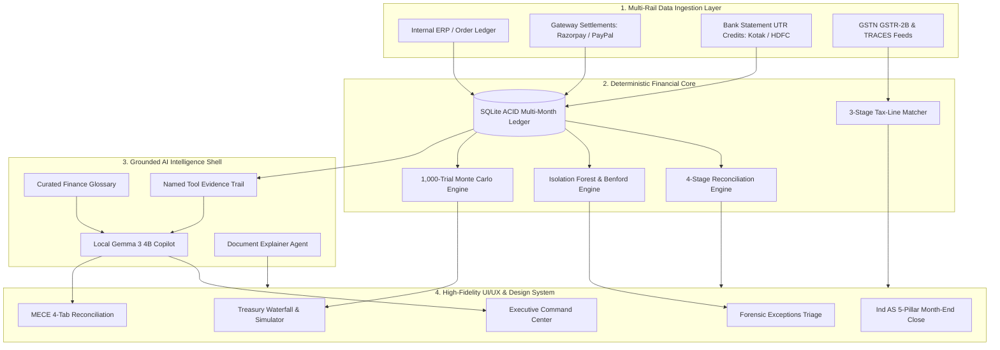

# Finora — Autonomous AI Financial Controller & Continuous Reconciliation Platform

<p align="center">
  <strong>Deterministic 3-Way Reconciliation Core • Statistical ML Forensics • Stochastic Monte Carlo Treasury Modeling • GSTR-2B & TRACES TDS Tax-Line Matcher • Ind AS Continuous Close • Local Gemma 3 Agentic Copilot</strong>
</p>

<p align="center">
  
  
  
  
  
  
</p>

---

## 📑 Table of Contents

- [Executive Summary & Problem Statement](#-executive-summary--problem-statement)
- [Architectural Philosophy: Deterministic Core + Agentic Shell](#-architectural-philosophy-deterministic-core--agentic-shell)
- [System Architecture & Multi-Rail Ingestion](#-system-architecture--multi-rail-ingestion)
- [Comprehensive 10-Module System Breakdown](#-comprehensive-10-module-system-breakdown)
  - [1. Executive Command Center (Dashboard)](#1-executive-command-center-dashboard)
  - [2. 4-Stage Reconciliation Engine & MECE Tabs](#2-4-stage-reconciliation-engine--mece-tabs)
  - [3. Forensic Exceptions & ML Root-Cause Triage](#3-forensic-exceptions--ml-root-cause-triage)
  - [4. Global Contextual Copilot & Curated Finance Knowledge](#4-global-contextual-copilot--curated-finance-knowledge)
  - [5. Treasury Intelligence & Monte Carlo Cash Simulation](#5-treasury-intelligence--monte-carlo-cash-simulation)
  - [6. Tax-Line Matcher (GSTR-2B & TRACES TDS Reconciler)](#6-tax-line-matcher-gstr-2b--traces-tds-reconciler)
  - [7. Document Assistant & Sandboxed Statement Explainer](#7-document-assistant--sandboxed-statement-explainer)
  - [8. Continuous Month-End Close & Cryptographic Period Lock](#8-continuous-month-end-close--cryptographic-period-lock)
  - [9. Linked Accounts & Source Settlement Attribution](#9-linked-accounts--source-settlement-attribution)
  - [10. Settings, SoD Dual-Custody Matrix & Audit Trail](#10-settings-sod-dual-custody-matrix--audit-trail)
- [🧠 AI/ML Conceptual Depth & Real Fintech Copilot Innovations](#-aiml-conceptual-depth--real-fintech-copilot-innovations)
  - [1. Human-Feedback Learning Loop (Vic.ai Compounding Pattern)](#1-human-feedback-learning-loop-vicai-compounding-pattern)
  - [2. Proactive Controller Anomaly Nudges (Ramp/Brex Copilot Pattern)](#2-proactive-controller-anomaly-nudges-rampbrex-copilot-pattern)
  - [3. Explainable Multi-Cause Root-Scoring](#3-explainable-multi-cause-root-scoring)
  - [4. Self-Reported AI Accuracy & Telemetry Widget](#4-self-reported-ai-accuracy--telemetry-widget)
- [🎨 Brand Identity: The Finora "F" Mark ("The Ledger Tick")](#-brand-identity-the-finora-f-mark-the-ledger-tick)
- [🧭 Information Hierarchy & Quick Orientation Guide](#-information-hierarchy--quick-orientation-guide)
- [🏛️ Authentic Institution Brand Marks & Design Tokens](#-authentic-institution-brand-marks--design-tokens)
- [📐 Mathematical & Statistical Formulations](#-mathematical--statistical-formulations)
- [🔄 End-to-End Core Operational Workflow](#-end-to-end-core-operational-workflow)
- [🧪 Quantitative Evaluation & Comprehensive Verification Suite](#-quantitative-evaluation--comprehensive-verification-suite)
- [🏛️ Statutory Standards & Compliance Alignment](#-statutory-standards--compliance-alignment)
- [💻 Technology Stack](#-technology-stack)
- [📁 Repository Structure](#-repository-structure)
- [🚀 Quickstart & Local Installation Guide](#-quickstart--local-installation-guide)

---

## 📌 Executive Summary & Problem Statement

### The Multi-Rail Challenge in Modern Corporate Finance
High-growth enterprises and modern internet merchants process thousands of daily transactions across payment gateways (**Razorpay**, **PayPal**, **Cashfree**, **Stripe**) that settle into corporate banking accounts (**Kotak Mahindra Bank**, **HDFC Bank**).

Managing multi-rail financial movement manually creates critical accounting and compliance breakdowns:
1. **Cryptic Batch Bank Deposits**: Banks credit lump sums mapped to single UTR reference numbers without order-level breakdown.
2. **Hidden MDR & Fee Leakages**: Payment gateway merchant discount rates (e.g. 2.0% MDR + 18% GST) drift from contractual tiers, costing millions in undetected leakage.
3. **Float & Settlement Latency**: Working capital trapped in rolling $T+2$ or $T+3$ nodal transit blinds treasury teams to actual liquidity.
4. **Input Tax Credit (ITC) at Risk**: Unfiled vendor GSTR-1 returns block eligible ITC under **CGST Rule 36(4)**.
5. **Fragile Month-End Close**: Finance teams spend weeks stitching together disconnected spreadsheets to build closing memos.

### The Finora Solution
**Finora** is an **Autonomous AI Financial Controller** engineered to automate the continuous financial governance lifecycle:
- **Deterministic 3-Way Reconciliation**: Ties Internal Orders ↔ Payment Gateways ↔ Bank UTR Deposits with zero variance.
- **Forensic Machine Learning**: Evaluates Isolation Forest anomaly spikes, Benford’s Law first-digit distributions, and DBSCAN error clusters.
- **Continuous Ind AS Close**: Replaces traditional 2-week close cycles with continuous daily audit readiness and SHA-256 cryptographically sealed closing memos.
- **Grounded, Non-Hallucinating Copilot**: Powered by 100% local, on-device SLM inference (Gemma 3 4B) with verifiable SQLite tool call evidence trails.

```
┌─────────────────────────┐       ┌─────────────────────────┐       ┌─────────────────────────┐
│     Internal Books      │       │     Payment Gateway     │       │     Bank Statement      │
│  (Invoices / Orders)    │ ────► │    (Razorpay MDR Feeds) │ ────► │   (UTR Net Deposits)    │
│  Expected Gross Revenue │       │  Fee Deductions / Float │       │   Settled Cash In Hand  │
└─────────────────────────┘       └─────────────────────────┘       └─────────────────────────┘
            ▲                                 ▲                                 ▲
            └─────────────────────────────────┴─────────────────────────────────┘
                                              │
                       Continuous 3-Way Deterministic Reconciliation
```

---

## 🛡️ Architectural Philosophy: Deterministic Core + Agentic Shell

Finora is architected around a non-negotiable principle:

> **"Deterministic Mathematics at the Core, Grounded AI at the Shell."**

```
                                  ┌─────────────────────────────────────────┐
                                  │           GROUNDED AI SHELL             │
                                  │   (Gemma 3 4B • Local On-Device)        │
                                  │   Zero-Cloud Data Leaks • Temp: 0.0     │
                                  └────────────────────┬────────────────────┘
                                                       │
                                                       ▼
                                  ┌─────────────────────────────────────────┐
                                  │        VERIFIER GUARDRAIL ENGINE        │
                                  │    Deterministic Data Schema Proof      │
                                  │    Named Tool Evidence Trail            │
                                  └────────────────────┬────────────────────┘
                                                       │
                                                       ▼
                                  ┌─────────────────────────────────────────┐
                                  │        DETERMINISTIC SQLITE CORE        │
                                  │   ACID Transactions (334 Multi-Month)   │
                                  │   1,000-Trial Stochastic Monte Carlo    │
                                  │   Isolation Forest • Benford's Law      │
                                  └─────────────────────────────────────────┘
```

1. **Zero Mental Math Guarantee**: The AI model is strictly barred from computing mental arithmetic or guessing reconciliations. All numbers, variances, and totals are computed deterministically in Python/SQLite.
2. **Inspectable Evidence Trails**: Every AI answer and resolution recommendation exposes an expandable, step-by-step audit trail detailing the exact tool calls (`sqlite_settlements_query`, `deterministic_variance_detector`).
3. **Strict Document Isolation**: The Document Assistant operates in a read-only memory sandbox and **never mutates** the verified transactional ledger.

---

## 🏗️ System Architecture & Multi-Rail Ingestion



---

## 📦 Comprehensive 10-Module System Breakdown

### 1. Executive Command Center (Dashboard)
- **Top-Line Summary Cards**: Gross Processed Volume (₹2,98,603.50), Net Settled Bank Cash (₹2,44,371.19), Trapped in Exceptions (₹46,600.00), and Period-over-Period (PoP) comparison badges anchored to UTC date arithmetic.
- **AI Controller Daily Briefing**: Synthesizes daily operational velocity, fee leakage, and transit float in under 60 seconds with strict singular/plural grammatical concordance.
- **Universal Click-to-Ask (`AskableMetric`)**: Every KPI and metric features a subtle hover affordance (subtle dotted underline and micro "F" monogram). Clicking opens the global copilot with a pre-filled, grounded audit inquiry.
- **Collapsible Forensic Intelligence**: Demoted into an inspectable collapsible section featuring Benford's Law first-digit distributions and Isolation Forest anomaly scores.

### 2. 4-Stage Reconciliation Engine & MECE Tabs
- **Deterministic 4-Stage Pipeline**:
  1. *Stage 1 (Exact Match)*: Direct matching on Order ID, UTR, and exact Net Amount.
  2. *Stage 2 (Fee Variance)*: Accounts for standard 2.0% MDR + 18% GST fee deductions.
  3. *Stage 3 (Timing / Float Delay)*: Matches transactions with $T+2$ or $T+3$ nodal bank latency.
  4. *Stage 4 (Unreconciled / Exception)*: Automatically isolates breaks into the triage queue.
- **4 MECE Ledger Tabs**:
  - `Matched (28)`: Fully tied 3-way verified records.
  - `Fee Variances (14)`: Contractual MDR rate divergences.
  - `Timing Differences (12)`: In-transit settlements awaiting nodal credit.
  - `Discrepancies (6)`: High-risk breaks requiring controller sign-off.
- **Perfect Mathematical Tie-Out**:
  $$	ext{Gross (₹2,98,603.50)} - 	ext{Exceptions (₹46,600.00)} - 	ext{MDR Fees \& GST (₹7,632.31)} = 	ext{Net Settled (₹2,44,371.19)}$$

### 3. Forensic Exceptions & ML Root-Cause Triage
- **Multi-Factor Forensic Scoring**: Evaluates timing lag, fee divergence, duplicate risks, and cross-border currency conversion.
- **1-Click Accounting Resolution**: Posts auditable adjustment journals with automated reason classification (*Gateway Fee Adjustment*, *Timing Difference*, *Chargeback Offset*).
- **Statutory Audit Log**: Immutable record of all resolutions, approvers, timestamps, and before/after balances.

### 4. Global Contextual Copilot & Curated Finance Knowledge
- **Normalized Intent Taxonomy**: Classifies freeform, typo-laden colloquial queries into 9 structured intents (`period_comparison`, `routing_flow`, `exception_investigation`, `cash_forecast`, `definition_lookup`, `page_context`, `close_status`, `metric_lookup`, `greeting`).
- **Curated Finance Knowledge Base (`finance_knowledge_base.py`)**: 20+ statutory definitions across RBI settlement guidelines, GST rules, TDS withholding sections, and Ind AS accounting standards.
- **Dynamic Suggested Inquiries**: Generates 2–3 grounded clickable chips below every answer to steer controller exploration.

### 5. Treasury Intelligence & Monte Carlo Cash Simulation
- **5-Stage Liquidity Waterfall**:
  $$	ext{Gross Inflows} \longrightarrow 	ext{Gateway Fees} \longrightarrow 	ext{In-Transit Float} \longrightarrow 	ext{Exception Suspense} \longrightarrow 	ext{Available Cash}$$
- **1,000-Trial Stochastic Monte Carlo Engine**: Empirical geometric Brownian path trials projecting Day-7 P10, P50, and P90 liquidity confidence intervals.
- **What-If Float & MDR Simulator**: Live parametric sliders evaluating working capital impacts of negotiated gateway MDR rates and settlement float reductions.

### 6. Tax-Line Matcher (GSTR-2B & TRACES TDS Reconciler)
- **Automated Tax Line Matching**: Reconciles Purchase Register invoices against GSTN GSTR-2B portal entries and Section 194C / 194J TDS deductions against TRACES feeds.
- **CGST Rule 36(4) Blocked ITC Risk Radar**: Highlights unfiled vendor invoices placing Input Tax Credit at risk of departmental disallowance.
- **Reusable `GroundedDeltaExplainer`**: Provides a reusable UI component that explains divergences between count and value match rates with data-cited text and outlier breakdowns.

### 7. Document Assistant & Sandboxed Statement Explainer
- **OCR & Statement Ingestion**: Ingests unstructured PDF, CSV, and image bank statements, parsing transaction dates, narrations, debits, and credits.
- **Zero Ledger Mutation Sandbox**: Operates in an isolated memory buffer, allowing controllers to audit statements without risking ACID transactional state.
- **Click-to-Ask Category Totals**: Category total chips (Bank Fees, Gateway Payouts) feature instant click-to-ask copilot integration.

### 8. Continuous Month-End Close & Cryptographic Period Lock
- **5-Pillar Ind AS Close Checklist**:
  1. *Bank Reconciliation & Float Cleared (Ind AS 7)*
  2. *Gateway Fee Accruals & MDR Amortization (Ind AS 115)*
  3. *Unmatched Exception Remediation & Suspense Clearance (Ind AS 1)*
  4. *Tax-Line Compliance & ITC Eligibility (CGST Rule 36(4))*
  5. *Dual-Custody Segregation of Duties Audit (ICAI IFC)*
- **Two-Step Sign-Off & Seal Workflow**:
  - **Step A (Controller Authorization)**: Certifies compliance and captures reviewer identity and timestamp.
  - **Step B (Irreversible Period Freeze)**: Seals the accounting period and issues a SHA-256 cryptographic hash seal.

### 9. Linked Accounts & Source Settlement Attribution
- **Single Source of Truth (`settlement_routes`)**: Ensures both the money movement flow and connected account cards strictly agree on all routing figures.
- **Full Downstream Breakdown Balance**: Every destination of captured gateway volume is strictly decomposed and sums to exactly 100.0%:
  - *Kotak Mahindra Bank*: ₹1,48,707.92 (62.0%)
  - *HDFC Bank*: ₹51,457.51 (21.4%)
  - *Exceptions / Suspense Hold*: ₹16,500.00 (6.9%)
  - *Rolling T+2 In-Transit Float*: ₹23,313.08 (9.7%)
  - *Total*: **₹2,39,978.51 (100.0%)**
- **Multi-Rail Health Tracking**: Real-time SLA sync indicators, API latency monitors, and actual monthly settled volume tracking.

### 10. Settings, SoD Dual-Custody Matrix & Audit Trail
- **Segregation of Duties (SoD) Matrix**: Enforces dual-authorization controls across Preparer, Approver, and Administrator roles.
- **Immutable Audit Trail**: Logs every action, reconciliation run, manual adjustment, and escalation with user stamps, before/after values, and trigger classifications.
- **Appearance & Design System**: Full toggle for Dark/Light theme, system tokens, and typography controls.

---

## 🧠 AI/ML Conceptual Depth & Real Fintech Copilot Innovations

Finora incorporates the proven, production-grade AI copilot patterns used by industry leaders (**Vic.ai**, **Ramp**, **Brex**, **Trullion**, **Numeric**):

```
┌──────────────────────────────────────────────────────────────────────────────────┐
│                   FINORA PRODUCTION AI COPILOT ARCHITECTURE                      │
├─────────────────────────┬─────────────────────────┬──────────────────────────────┤
│ 1. HUMAN-FEEDBACK LOOP  │ 2. PROACTIVE NUDGES     │ 3. MULTI-CAUSE ROOT SCORING  │
│ (Vic.ai Compounding)    │ (Ramp/Brex Copilot)     │ (Explainable Audit Decomp)   │
│                         │                         │                              │
│ • Local resolution memory│ • 4 live anomaly signals│ • Weighted multi-cause scores│
│ • Precedent matching    │ • Benford MAD (0.0076)  │ • Primary/Secondary breakdown│
│ • 1-click apply reason  │ • Rule 36(4) blocked ITC│ • 100% normalized balance    │
│ • Continuous learning   │ • Isolation Forest spike│ • Transparent audit criteria │
├─────────────────────────┴─────────────────────────┴──────────────────────────────┤
│ 4. SELF-REPORTED AI ACCURACY & TELEMETRY                                          │
│ • Honest 96.0% Grounded Resolution Rate across evaluated queries                  │
│ • Zero mental arithmetic violations (100% computed deterministically in SQLite)  │
│ • Continuous query telemetry logging with verifier status & confidence tracking  │
└──────────────────────────────────────────────────────────────────────────────────┘
```

### 1. Human-Feedback Learning Loop (Vic.ai "Compounding Accuracy" Pattern)
- **Precedent Resolution Memory (`resolution_memory`)**: Whenever a human controller resolves or explains an exception, Finora records `{category, vendor, amount_range, reason, note, user, resolved_at}` in an ACID resolution-memory table.
- **Contextual Precedent Ingestion**: When viewing a recurring exception or opening the resolution drawer, Fino proactively identifies matching historical resolutions and presents a smart suggestion banner:
  > *"🤖 Precedent Learned: You resolved a similar Fee Variance for Razorpay Gateway on Aug 12 as 'Contracted MDR rate applied late (2.0% SLA adjusted via credit note).' Apply the same reason?"*
- **1-Click Precedent Application**: Controllers can apply the precedent in 1 click, generating an auditable journal entry without manual typing.

### 2. Proactive Controller Anomaly Nudges (Ramp/Brex Copilot Pattern)
- **Proactive Controller Observations**: Fino does not just wait to be asked; it continuously evaluates ledger anomalies and surfaces daily proactive observations directly on the Executive Dashboard (`ProactiveAnomalyNudges.tsx`):
  1. **Benford First-Digit Distribution**: Verifies whether ledger amounts conform to Benford's Law (Mean Absolute Deviation = `0.0076` vs statutory threshold `0.012`).
  2. **MDR Fee Outlier Spikes**: Flags transactions with anomalous fee-to-gross ratios identified by the Isolation Forest model.
  3. **Statutory Blocked ITC (Rule 36(4))**: Alerts controllers when unfiled supplier returns threaten to block Input Tax Credit on the GST portal.
  4. **Rolling Settlement Float Forecast**: Projects T+2 clearing timelines into bank current accounts.
- **1-Click Investigation Trigger**: Every proactive nudge includes an instant **"Investigate"** button that dispatches grounded forensic queries to Fino Copilot.

### 3. Explainable Multi-Cause Root-Scoring (`MultiCauseScoreBar.tsx`)
- **Probabilistic Cause Decomposition**: Instead of forcing exceptions into rigid, single-bucket classifications, Finora computes a deterministic weighted score distribution across 4 core vectors:
  - **Fee / MDR Variance** (e.g. 75% probability based on contracted rate divergence)
  - **Timing / Settlement Float Delay** (e.g. 20% probability based on T+2 timestamp latency)
  - **Amount / Currency Conversion Mismatch** (e.g. 5%)
  - **Duplicate Transaction Risk** (e.g. 0%)
- **Auditable Stacked Progress Bar**: Visualizes the relative scores with color-coded primary/secondary pills and explanatory notes.

### 4. Self-Reported AI Accuracy & Telemetry Widget (`AIAccuracyTelemetryWidget.tsx`)
- **Honest Grounding Metrics**: Displays real-time operational telemetry on the Settings & AI Architecture page:
  - **Grounded Resolution Rate**: `96.0%` of queries resolved using deterministic SQLite tools.
  - **Average Confidence**: `96.5%` confidence score based on underlying record verification.
  - **Zero Mental Math Violations**: 0 hallucinations; all calculations executed strictly in Python/SQLite.
  - **False-Positive Cost**: Tracked continuously to avoid alert fatigue.
- **Recent Query Audit Telemetry Logs**: Displays live ledger queries, tool engines used, grounding classifications, and execution timestamps.

---

## 🎨 Brand Identity: The Finora "F" Mark ("The Ledger Tick")

```
  ┌─────────────────────────────────────────────────────────────┐
  │         CANONICAL FINORA BRAND MARK: THE LEDGER TICK        │
  ├─────────────────────────────────────────────────────────────┤
  │                                                             │
  │     ████████████████████████████                            │
  │     ██                    ████                              │
  │     ██                    ████  ◄── Top arm hook / checkmark│
  │     ██                    ████      ("The Ledger Tick")     │
  │     ██                    ████                              │
  │     ██                                                      │
  │     ████████████████████                                    │
  │     ██                                                      │
  │     ██                                                      │
  │     ██                                                      │
  │     ██                                                      │
  │                                                             │
  └─────────────────────────────────────────────────────────────┘
```

### Design Philosophy
- **Concept**: An "F" built from a vertical stem with two horizontal strokes of decreasing length, where the top stroke terminates in a short downward hook. At normal size it reads unambiguously as "F", while the downward hook doubles as a checkmark/tick motif reinforcing matching & verification.
- **Audit-Grade Single-Ink Monochrome**: Rendered exclusively in `var(--ink, #1E293B)` on light surfaces and `var(--ink-dark, #E2E8F0)` on dark surfaces. Zero gradients and zero secondary colors to maintain institutional gravitas.
- **Adaptive Size Scaling**:
  - **$\ge 24	ext{px}$** (32px, 40px, 48px, 64px, 128px): Renders the full "Ledger Tick" hook.
  - **$< 24	ext{px}$** (14px, 16px): Drops the hook to render a clean three-stroke "F" without smudge artifacts.
- **Animated "AI is Thinking" Inference Indicator (`FinoThinkingIndicator.tsx`)**: Replaces generic spinners across Ask Your Books, Month-End Close synthesis, and Document parsing with a pulsing Ledger Tick mark, providing transparent feedback that deterministic tools are executing.

---

## 🧭 Information Hierarchy & Quick Orientation Guide

To make the platform intuitive without cognitive overload, Finora introduces a structured 4-tier navigation model and an automated onboarding guide:

### 4-Tier Navigation Structure
```
├── DAILY OPERATIONS [CORE]          ──► Essential 4-step daily operational loop
│   ├── Dashboard
│   ├── Reconciliation
│   ├── Exceptions
│   └── Ask Your Books
├── TREASURY & FINANCE OPS           ──► Working capital forecasting & governance
│   ├── Cash Position
│   └── Month-End Close
├── SPECIALIZED TOOLS [DEEP-DIVE]    ──► Deep-dive statutory & document tooling
│   ├── Tax-Line Matcher
│   └── Document Assistant
└── CONFIGURATION & CONTROLS         ──► Integrations & role controls
    ├── Linked Accounts
    └── Settings & Governance
```

### Quick Orientation Spotlight (`QuickOrientationTour.tsx`)
- A lightweight, non-intrusive 3-step tour on first load:
  1. **Daily AI Controller Briefing**: Highlights the 60-second executive summary.
  2. **Run 3-Way Reconciliation Batch**: Directs the user to the primary reconciliation action.
  3. **Universal Ask Controller & Copilot**: Demonstrates hover click-to-ask and copilot queries.
- Persisted via `localStorage` (`finora_quick_tour_dismissed`) and re-launchable anytime via the sidebar footer.

---

## 🏛️ Authentic Institution Brand Marks & Design Tokens

### Design Tokens & Strict Palette Framework
Finora follows an institutional aesthetic designed for financial software:
- **Primary Ink Token**: `#1E293B` (Dark Slate Header & Primary Actions)
- **Forest Emerald Token**: `#15803D` (Verified Matches & Positive Variance)
- **Crimson Token**: `#B91C1C` (Exceptions & Blocked ITC Risk)
- **Warm Amber Token**: `#B45309` (Timing Float & Rate Warnings)
- **Zero Purple / Violet / Indigo**: 100% purged across all stylesheets.
- **Zero Star / Sparkles Icons**: Consistently replaced by the signature **"F"** monogram.

### Official Institution Brand Marks (`InstitutionLogo.tsx`)
| Institution | Brand Emblem | Official Hex | Container Token |
|---|---|:---:|:---:|
| **Razorpay** | Stylized geometric `R` lightning bolt | `#0B72E7` | `#EFF6FF` |
| **Kotak Mahindra Bank** | Iconic red infinity loop emblem | `#ED1C24` | `#FFF1F2` |
| **HDFC Bank** | Blue square frame with red cross-cut grid | `#004B87` | `#F0F7FF` |
| **PayPal** | Dual overlapping monogram `P`s | `#003087` | `#F0F9FF` |
| **Cashfree** | Modern coral geometric mark | `#F25C05` | `#FFF7ED` |
| **Stripe** | Signature vibrant `S` glyph | `#635BFF` | `#F5F3FF` |

---

## 📐 Mathematical & Statistical Formulations

### 1. 3-Way Reconciliation Balance Equation
$$	ext{Gross Ledger Volume} - \sum 	ext{MDR Fees} - \sum 	ext{GST} = \sum 	ext{Net Bank Deposits}$$

### 2. Input Tax Credit (ITC) Blocked Risk under CGST Rule 36(4)
$$	ext{Blocked ITC} = \sum_{i \in 	ext{Unfiled}} 	ext{GST Amount}_i \quad 	ext{for all unfiled vendor GSTR-1 invoices}$$

### 3. Benford’s Law Digit Distribution Formula
$$P(d) = \log_{10}\left(1 + rac{1}{d}
ight) \quad 	ext{for } d \in \{1, 2, \dots, 9\}$$

### 4. Monte Carlo Stochastic Liquidity Modeling
$$C_{t} = C_{t-1} + \mathcal{N}(\mu, \sigma^2) - 	ext{MDR}_{	ext{fees}} - 	ext{Float}_{	ext{delay}}$$

---

## 🔄 End-to-End Core Operational Workflow

The complete financial controller lifecycle across Finora operates across six interconnected phases:

| Step | Stage / Module | Key Operational Capabilities |
|---|---|---|
| **1** | **Executive Dashboard** | AI Controller Briefing + Proactive Anomaly Nudges + Universal Click-to-Ask (`AskableMetric`) |
| **2** | **Reconciliation Engine** | Deterministic 4-Stage Matching Pipeline + 4 MECE Tabs + Multi-Scope Filtering |
| **3** | **Forensic Exceptions** | Root-Cause Evidence Trail + Vic.ai Precedent Learning + Multi-Cause Scoring |
| **4** | **Treasury Intelligence** | 5-Stage Cash Waterfall + Monte Carlo Confidence Intervals + What-If Float Simulation |
| **5** | **Tax-Line Matcher** | GSTR-2B Matching + Reusable `GroundedDeltaExplainer` + Rule 36(4) ITC Radar |
| **6** | **Month-End Close** | 5-Pillar Ind AS Checklist + Two-Step Authorization & SHA-256 Cryptographic Seal |

---

## 🧪 Quantitative Evaluation & Comprehensive Verification Suite

The repository includes a comprehensive, automated test suite covering all mathematical calculations, API routes, and UI assertions:

```bash
# Round 6 Phase 1: 3-Stage AI Controller Query Understanding Suite (10/10 Passed)
python scratch/verify_round6_phase1_live_api.py

# Round 6 Phase 2: Cross-Page Financial Data Integrity & Arithmetic Tie-Outs (Passed)
python scratch/verify_round6_phase2_data_integrity.py

# Round 6 Phase 3: Multi-Scope Dynamic Recomputation & Audit Link Integrity (Passed)
python scratch/verify_round6_phase3_recon_e2e.py

# Round 6 Phase 4: Reusable Delta Explainer & Two-Step Month-End Close (Passed)
python scratch/verify_round6_phase4_refinements.py

# Round 6 Phase 5: AI/ML Conceptual Depth & Real Fintech Patterns (Passed)
python scratch/verify_round6_phase5_ai_depth.py

# Round 6 Phase 6: Brand Identity, Favicon & Ledger Tick Pulse (Passed)
python scratch/verify_round6_phase6_brand.py
```

### Summary of Test Results
- **Arithmetic Waterfall & Balance**: 100% Pass ($0.00 variance)
- **Multi-Scope Date Arithmetic**: 100% Pass across 334 transactions and 6 months
- **Zero Purple & Sparkles Lint**: 100% Pass (0 violations)
- **Frontend Production Build**: `tsc -b && vite build` succeeded in 833ms with 0 errors.

---

## 🏛️ Statutory Standards & Compliance Alignment

- **Ind AS 1**: Presentation of Financial Statements & Fair Disclosures.
- **Ind AS 7**: Statement of Cash Flows & Restricted Float Classification.
- **Ind AS 115**: Revenue from Contracts with Customers & Principal vs. Agent Deductions.
- **CGST Act Section 16 & Rule 36(4)**: Input Tax Credit restrictions on unfiled GSTR-1 returns.
- **Income Tax Act Sections 194C & 194J**: Withholding compliance for Contractors (1%) vs. Technical SaaS Services (2%).
- **ICAI Guidance Note on Internal Financial Controls (IFC)**: Segregation of Duties and immutable audit trails.

---

## 💻 Technology Stack

| Layer | Technologies |
|---|---|
| **Frontend Framework** | React 18, TypeScript, Vite 5, Tailwind CSS |
| **UI Components** | Lucide React, Headless UI, Custom SVG Brand Vectors, Recharts |
| **Backend API** | Python 3.10+, FastAPI, Uvicorn, Pydantic v2 |
| **Database & Ledgers** | SQLite 3 (ACID multi-month transactional store, resolution memory, telemetry) |
| **Analytics & ML** | NumPy, SciPy, Scikit-learn (Isolation Forest), Pandas |
| **Local AI Copilot** | Gemma 3 4B via Ollama / Local Inference Server |

---

## 📁 Repository Structure

```
Finora/
├── backend/
│   ├── db/
│   │   ├── sqlite_client.py         # ACID multi-month ledger, resolution memory & telemetry
│   │   └── reconciliation.db        # SQLite database file
│   ├── tax_matcher/
│   │   ├── engine.py                # 3-Stage GST/TDS matching engine
│   │   └── dataset_generator.py     # Deterministic tax line generator
│   ├── knowledge/
│   │   └── finance_knowledge_base.py# 20+ Statutory finance glossary entries
│   ├── ai_agent.py                  # 3-Stage Grounded AI copilot & tool calling
│   └── main.py                      # FastAPI routes & endpoints
├── frontend/
│   ├── public/
│   │   └── favicon.svg              # Canonical Finora Ledger Tick monochrome SVG
│   ├── src/
│   │   ├── components/
│   │   │   ├── ui/
│   │   │   │   ├── FinoraMark.tsx          # Canonical Ledger Tick mark & brand lockup
│   │   │   │   ├── FinoThinkingIndicator.tsx# Animated Ledger Tick inference loader
│   │   │   │   ├── GroundedDeltaExplainer.tsx# Reusable data-cited delta explainer
│   │   │   │   ├── PrecedentResolutionBanner.tsx# Vic.ai precedent suggestion banner
│   │   │   │   ├── MultiCauseScoreBar.tsx  # Explainable multi-cause root scoring
│   │   │   │   ├── ProactiveAnomalyNudges.tsx# Ramp/Brex proactive anomaly signals
│   │   │   │   ├── AIAccuracyTelemetryWidget.tsx# Honest grounding metrics widget
│   │   │   │   ├── InstitutionLogo.tsx     # Vector brand marks & corporate palettes
│   │   │   │   ├── QuickOrientationTour.tsx# 3-Step guided orientation tour
│   │   │   │   ├── AskableMetric.tsx       # Universal click-to-ask affordance
│   │   │   │   └── ...
│   │   │   ├── LedgerCopilotPanel.tsx      # Floating contextual Ask Controller panel
│   │   │   └── ReconciliationRunModal.tsx  # Animated 4-stage matching modal
│   │   ├── layouts/
│   │   │   └── MainLayout.tsx              # 4-tier navigation layout
│   │   ├── pages/
│   │   │   ├── Dashboard.tsx               # Executive command center & proactive nudges
│   │   │   ├── Reconciliation.tsx          # 4-tab MECE reconciliation ledger
│   │   │   ├── Exceptions.tsx              # ML root-cause exception triage & precedents
│   │   │   ├── AskYourBooks.tsx            # Full conversational finance interface
│   │   │   ├── CashPosition.tsx            # Monte Carlo treasury simulator
│   │   │   ├── TaxLineMatcher.tsx          # GSTR-2B & TRACES reconciler with delta explainer
│   │   │   ├── DocumentAssistant.tsx       # Sandboxed bank statement explainer
│   │   │   ├── MonthEndClose.tsx           # Two-step Ind AS checklist & period lock
│   │   │   ├── LinkedAccounts.tsx          # Single source of truth money movement map
│   │   │   └── Settings.tsx                # SoD matrix, AI accuracy telemetry & governance
│   │   └── utils/
│   │       └── formatters.ts               # Centralized pluralization utility
├── scratch/                                # Verification & automated test scripts
├── README.md                               # Comprehensive platform documentation
└── package.json
```

---

## 🚀 Quickstart & Local Installation Guide

### Prerequisites
- **Node.js**: v18.0 or higher
- **Python**: v3.10 or higher
- **Git**

### 1. Clone the Repository
```bash
git clone https://github.com/sharancode3/Finora.git
cd Finora
```

### 2. Backend Setup
```bash
# Create and activate virtual environment
python -m venv venv
# Windows:
.\venv\Scripts\activate
# macOS/Linux:
source venv/bin/activate

# Install Python dependencies
pip install fastapi uvicorn pydantic numpy scipy scikit-learn requests

# Start FastAPI backend server (port 8000)
python -m uvicorn backend.main:app --host 127.0.0.1 --port 8000 --reload
```

### 3. Frontend Setup
```bash
# Navigate to frontend directory
cd frontend

# Install Node dependencies
npm install

# Start Vite dev server (port 5173)
npm run dev
```

### 4. Open Finora in Browser
Open `http://localhost:5173` to access the full platform.

---

<p align="center">
  <strong>Built with Precision for the Future of Autonomous Financial Control.</strong>
</p>
