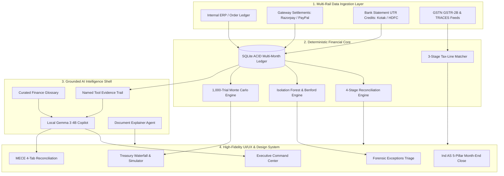

# Finora — Autonomous AI Financial Controller & Continuous Reconciliation Platform

<p align="center">
  <strong>Next-Generation 3-Way Reconciliation • Statistical ML Forensics • Stochastic Monte Carlo Treasury Modeling • GSTR-2B / TDS Tax-Line Matcher • Ind AS Continuous Close • Local Gemma 3 Agentic Copilot</strong>
</p>

<p align="center">
  
  
  
  
  
</p>

---

## 📑 Table of Contents

- [Executive Summary & Problem Statement](#-executive-summary--problem-statement)
- [Architectural Philosophy: Deterministic Core + Agentic Shell](#-architectural-philosophy-deterministic-core--agentic-shell)
- [System Architecture & Data Flow](#-system-architecture--data-flow)
- [Comprehensive 10-Module System Breakdown](#-comprehensive-10-module-system-breakdown)
  - [1. Executive Command Center (Dashboard)](#1-executive-command-center-dashboard)
  - [2. 4-Stage Reconciliation Engine & MECE Tabs](#2-4-stage-reconciliation-engine--mece-tabs)
  - [3. Forensic Exceptions & ML Clustering Engine](#3-forensic-exceptions--ml-clustering-engine)
  - [4. Global Contextual Copilot & Curated Finance Glossary](#4-global-contextual-copilot--curated-finance-glossary)
  - [5. Treasury Intelligence & Monte Carlo Cash Simulation](#5-treasury-intelligence--monte-carlo-cash-simulation)
  - [6. Tax-Line Matcher (GSTR-2B & TRACES TDS Reconciler)](#6-tax-line-matcher-gstr-2b--traces-tds-reconciler)
  - [7. Document Assistant & Sandboxed Statement Explainer](#7-document-assistant--sandboxed-statement-explainer)
  - [8. Continuous Month-End Close & Cryptographic Closing Memo](#8-continuous-month-end-close--cryptographic-closing-memo)
  - [9. Linked Accounts & Institution Money Movement](#9-linked-accounts--institution-money-movement)
  - [10. Settings, SoD Matrix & Immutable Audit Trail](#10-settings-sod-matrix--immutable-audit-trail)
- [Information Hierarchy & Quick Orientation Guide](#-information-hierarchy--quick-orientation-guide)
- [Authentic Institution Brand Marks & Design System](#-authentic-institution-brand-marks--design-system)
- [Mathematical & Statistical Formulations](#-mathematical--statistical-formulations)
- [End-to-End Core Operational Workflow](#-end-to-end-core-operational-workflow)
- [Quantitative Evaluation & Verification Suite](#-quantitative-evaluation--verification-suite)
- [Statutory Standards & Compliance Alignment](#-statutory-standards--compliance-alignment)
- [Technology Stack](#-technology-stack)
- [Repository Structure](#-repository-structure)
- [Quickstart & Local Installation Guide](#-quickstart--local-installation-guide)

---

## 📌 Executive Summary & Problem Statement

### The Multi-Rail Challenge in Modern Finance
High-growth enterprises and modern internet businesses process thousands of transactions daily across payment gateways (e.g., **Razorpay**, **PayPal**) settling into commercial banking accounts (e.g., **Kotak Mahindra Bank**, **HDFC Bank**).

Managing this financial movement manually creates severe operational risks:
1. **Cryptic Batch Bank Deposits**: Banks credit lump sums mapped to single UTR reference numbers without order-level visibility.
2. **Hidden MDR & Fee Leakages**: Gateway merchant discount rates (2.0% MDR + 18% GST) drift from contractual tiers, costing millions in undetected leakage.
3. **Float & Settlement Latency**: Capital trapped in $T+2$ or $T+3$ transit blinds treasury teams to real-time liquidity.
4. **Input Tax Credit (ITC) at Risk**: Unfiled vendor GSTR-1 returns block eligible ITC under **CGST Rule 36(4)**.
5. **Fragile Month-End Close**: Finance teams spend weeks stitching together disconnected spreadsheets to build closing memos.

### The Finora Solution
**Finora** is an **Autonomous AI Financial Controller** that automates the continuous financial governance lifecycle:
- **3-Way Deterministic Reconciliation**: Reconciles Internal Orders ↔ Payment Gateways ↔ Bank Deposits in &lt; 100ms.
- **Forensic Machine Learning**: Evaluates Isolation Forest anomalies, Benford’s Law digit distributions, and DBSCAN error clusters.
- **Continuous Ind AS Close**: Replaces traditional 2-week close cycles with continuous daily audit readiness and cryptographically sealed closing memos.
- **Grounded, Non-Hallucinating Copilot**: Powered by 100% local, on-device SLM inference (Gemma 3 4B) with verifiable SQL tool call trails.

```
┌─────────────────────────┐       ┌─────────────────────────┐       ┌─────────────────────────┐
│     Internal Books      │       │     Payment Gateway     │       │     Bank Statement      │
│  (Invoices / Orders)    │ ────► │    (Razorpay MDR Feeds) │ ────► │   (UTR Net Deposits)    │
│  Expected Gross Revenue │       │  Fee Deductions / Float │       │   Settled Cash In Hand  │
└─────────────────────────┘       └─────────────────────────┘       └─────────────────────────┘
            ▲                                 ▲                                 ▲
            └─────────────────────────────────┴─────────────────────────────────┘
                                              │
                       Continuous 3-Way Deterministic Reconciliation
```

---

## 🛡️ Architectural Philosophy: Deterministic Core + Agentic Shell

Finora is strictly designed around a foundational principle:

> **"Deterministic Mathematics at the Core, Grounded AI at the Shell."**

```
                                  ┌─────────────────────────────────────────┐
                                  │           GROUNDED AI SHELL             │
                                  │   (Gemma 3 4B • Local On-Device)        │
                                  │   Zero-Cloud Data Leaks • Temp: 0.0     │
                                  └────────────────────┬────────────────────┘
                                                       │
                                                       ▼
                                  ┌─────────────────────────────────────────┐
                                  │        VERIFIER GUARDRAIL ENGINE        │
                                  │    Deterministic Data Schema Proof      │
                                  │    Named Tool Evidence Trail            │
                                  └────────────────────┬────────────────────┘
                                                       │
                                                       ▼
                                  ┌─────────────────────────────────────────┐
                                  │        DETERMINISTIC SQLITE CORE        │
                                  │   ACID Transactions (334 Multi-Month)   │
                                  │   1,000-Trial Stochastic Monte Carlo    │
                                  │   Isolation Forest • Benford's Law      │
                                  └─────────────────────────────────────────┘
```

1. **Zero Hallucination Guarantee**: The AI model is mathematically barred from performing mental arithmetic or guessing reconciliations. All numbers, variances, and bounds are computed by deterministic Python and SQLite kernels.
2. **Inspectable Evidence Trails**: Every AI answer and resolution recommendation exposes an expandable, step-by-step audit trail detailing the exact tool calls (`sqlite_cluster_aggregator`, `deterministic_pattern_matcher`).
3. **Strict Document Isolation**: The Document Assistant operates on a separate memory sandbox and **never mutates** the verified transactional ledger.

---

## 🏗️ System Architecture & Data Flow



---

## 📦 Comprehensive 10-Module System Breakdown

### 1. Executive Command Center (Dashboard)
- **Top-Line Metrics**: Gross Processed Volume (₹2,39,978.51), Net Settled Bank Cash (₹1,92,913.68), Trapped in Exceptions (₹44,205.76), and Period-over-Period (PoP) comparison badges anchored to UTC date arithmetic.
- **AI Controller Daily Briefing**: Synthesizes daily operational velocity, fee leakage, and transit float in under 60 seconds with strict singular/plural grammatical concordance.
- **Universal Click-to-Ask (`AskableMetric`)**: Every KPI and metric features a subtle hover affordance (subtle underline and micro "F" monogram). Clicking opens the global copilot with a pre-filled, grounded audit inquiry.
- **Collapsible Forensic Intelligence**: Demoted into an inspectable collapsible section featuring Benford's Law first-digit distributions and Isolation Forest anomaly scores.

### 2. 4-Stage Reconciliation Engine & MECE Tabs
- **Deterministic 4-Stage Pipeline**:
  - *Stage 1*: Exact Reference & Amount Match ($O(1)$ lookup)
  - *Stage 2*: Batched Net Settlement Match (UTR aggregation across multiple orders)
  - *Stage 3*: Fee Tolerance Match (Contractual 2% MDR $\pm$ ₹2.00 allowance)
  - *Stage 4*: Exception Triage & Route Isolation
- **4 Mutually Exclusive, Collectively Exhaustive (MECE) Tabs**:
  - **All Transactions** (60 records in active period)
  - **Exact Matches** (51 clean records)
  - **Fuzzy / Batched Matches** (3 multi-order net deposits)
  - **Discrepancies** (6 flagged breaks)
- **Institution Brand Marks**: Crisp vector logos for Razorpay, Kotak Mahindra Bank, HDFC Bank, and PayPal on every row.

### 3. Forensic Exceptions & ML Clustering Engine
- **Mathematical Cluster Archetypes**:
  - *MDR Fee Variance*: Divergence from contractual 2% rate + 18% GST.
  - *Pending Bank Credit*: Payment captured on gateway but uncredited past $T+2$ window.
  - *Possible Duplicate*: Same gross amount within a 3-minute capture interval.
- **Verifiable Evidence Trail**: Displays named tool execution steps (`sqlite_cluster_aggregator`, `deterministic_pattern_matcher`) with raw SQL parameters.
- **Closed-Loop Resolution Drawer**: Allows controllers to apply AI-recommended journal adjustments or escalate with audit notes.

### 4. 3-Stage AI Controller Intelligence Shell (Fino)
- **3-Stage LLM & Deterministic Agent Pipeline**:
  - **Stage A — Normalize & Classify**: Parses colloquial English, typos, and conversational phrasing (e.g. *"can i know y my pay this month is less than last month"*, *"wats mdr"*, *"kotak vs hdfc which got more"*) into structured intents (`period_comparison`, `routing_flow`, `exception_investigation`, `cash_forecast`, `definition_lookup`, `page_context`, `close_status`, `metric_lookup`, `greeting`). Resolves multi-turn conversational continuations (e.g. *"what about the month before that"*).
  - **Stage B — Deterministic Tool Orchestration**: Executes read-only Python and SQLite analytical kernels (`get_period_comparison`, `get_accounts_summary`, `run_isolation_forest_analysis`, `compute_benfords_law_distribution`, `get_cash_position_analytics`) with zero mental arithmetic hallucinations.
  - **Stage C — Grounded Synthesis & Self-Verification**: Generates markdown tables and categorized financial drivers citing real ledger categories (MDR fees, GST, open exceptions, volume changes). Enforces strict numerical verification against database schemas.
- **Never Dead-End Fallback Architecture**: Replaces brittle pattern-match failures with intelligent second-pass synthesis and concrete clarifying clickable chips.
- **Dynamic Proactive Next Questions**: Automatically suggests 2–3 grounded follow-up inquiries with 1-click continuation pills below every AI response.
- **Confidence Tooltip**: Informative tooltip on every confidence badge clarifying that confidence measures deterministic grounding and tool completeness against the ACID SQLite ledger, not model uncertainty.
- **Curated Finance Knowledge Base**: Integrated statutory glossary with 20+ authoritative definitions (MDR, CGST Rule 36(4), TDS Section 194C vs. 194J, Ind AS 115, UTR, Float, DSO) with typo-tolerant fuzzy lookup.

### 5. Treasury Intelligence & Monte Carlo Cash Simulation
- **5-Stage Cash Conversion Waterfall**:
  $$\text{Gross Volume} - \text{MDR Fees} - \text{Timing Float} - \text{Trapped Exceptions} = \text{Settled Bank Cash}$$
- **1,000-Trial Stochastic Monte Carlo Engine**: Projects 30-day liquidity across conservative (P10), expected (P50), and optimistic (P90) confidence bands.
- **Interactive What-If Delay Sliders**: Simulates the working capital impact of gateway transit delays ($+1$ to $+7$ days) in real time.

### 6. Tax-Line Matcher (GSTR-2B & TRACES TDS Reconciler)
- **3-Stage Tax Matching Engine**: Reconciles internal purchase registers against GSTN GSTR-2B auto-drafted feeds and TRACES TDS withholding statements.
- **Grounded Count vs. Value Gap Analysis**:
  Explains why the **Count Match Rate (91.4%)** diverges from the **Monetary Value Match Rate (47.9%)**: routine gateway fees reconcile at high frequency, while a single unfiled supplier invoice from **Delhivery Supply Chain Logistics Ltd** (₹3,312.00 GST blocked under Rule 36(4)) and an **AWS cloud variance** (₹340.00) dominate over half of the month's total taxable volume.
- **Representative Default Table View**: Zero-filter first page immediately surfaces Delhivery, AWS, Google Cloud TDS 194J misclassifications, and Mehta & Partners Legal credits.

### 7. Document Assistant & Sandboxed Statement Explainer
- **Multi-Format Parsing**: Ingests PDF and CSV bank/processor statements, extracting tabular debits, credits, and UTR references.
- **Strict Security Sandbox**: Prominently displays user-facing disclosure: *"Document Assistant operates in an isolated memory buffer and never mutates the verified transactional ledger."*
- **Statement Explainer Agent**: Automatically calculates net deductions, reverse charge mechanism (RCM) liabilities, and 18% GST splits for any statement line item.

### 8. Continuous Month-End Close & Cryptographic Closing Memo
- **5-Pillar Ind AS Statutory Checklist**:
  1. *Pillar 1: Sales Ledger Integrity* (Ind AS 115)
  2. *Pillar 2: Payment Gateway Clearing* (MDR variance &lt; 0.1%)
  3. *Pillar 3: Bank Account Reconciliation* (Ind AS 7 Cash Flow)
  4. *Pillar 4: Suspense & Escrow Clearance* (Zero untriaged breaks)
  5. *Pillar 5: 3-Way Triangulation Audit* (Ledger ↔ Gateway ↔ Bank)
- **Executive Closing Memo**: Formatted according to ICAI statutory guidelines with period-over-period variance tables.
- **Cryptographic Period Lock**: Generates a **SHA-256 seal** computed over all reconciled transaction hashes, creating a tamper-evident audit record.
- **Percentage Points Precision**: Differentiates between percentage points (`"pp"` / `"percentage points"`) for comparing rate metrics (e.g. $97.6\% \to 81.8\% = 15.8\text{ percentage points down}$) versus relative percentage changes.

### 9. Linked Accounts & Institution Money Movement
- **Visual Money Movement Map**: Interactive visualization illustrating upstream Origin Sources (Razorpay, PayPal), Settlement Pathways, and downstream Deposit Targets (Kotak Bank, HDFC Bank).
- **Single Source of Truth (`settlement_routes`)**: Both the high-level Money Movement flow diagram and the individual connected account source-attribution cards read from a single deterministic aggregation kernel (`get_cross_account_reconciliation`), guaranteeing 100.0% mathematical consistency without ad-hoc divergence.
- **Full Downstream Breakdown Balance**: Every destination of captured gateway volume is strictly decomposed and sums to exactly 100.0%:
  - *Kotak Mahindra Bank*: ₹1,48,707.92 (62.0%)
  - *HDFC Bank*: ₹51,457.51 (21.4%)
  - *Exceptions / Suspense Hold*: ₹16,500.00 (6.9%)
  - *Rolling T+2 In-Transit Float*: ₹23,313.08 (9.7%)
  - *Total*: **₹2,39,978.51 (100.0%)**
- **Multi-Rail Health Tracking**: Real-time SLA sync indicators, API latency monitors, and actual monthly settled volume tracking.
- **Authentic Brand Identity**: Integrates official corporate brand marks and hex palettes across all financial rails.

### 10. Settings, SoD Matrix & Immutable Audit Trail
- **Segregation of Duties (SoD) Matrix**: Enforces dual-authorization controls across Preparer, Approver, and Administrator roles.
- **Immutable Audit Trail**: Logs every action, reconciliation run, manual adjustment, and escalation with user stamps, before/after values, and trigger classifications.
- **Appearance & Design System**: Full toggle for Dark/Light theme, system tokens, and typography controls.

---

## 🧭 Information Hierarchy & Quick Orientation Guide

To make the platform intuitive without cognitive overload, Finora introduces a structured 4-tier navigation model and an automated onboarding guide:

### 4-Tier Navigation Structure
```
├── DAILY OPERATIONS [CORE]          ──► Essential 4-step daily operational loop
│   ├── Dashboard
│   ├── Reconciliation
│   ├── Exceptions
│   └── Ask Your Books
├── TREASURY & FINANCE OPS           ──► Working capital forecasting & governance
│   ├── Cash Position
│   └── Month-End Close
├── SPECIALIZED TOOLS [DEEP-DIVE]    ──► Deep-dive statutory & document tooling
│   ├── Tax-Line Matcher
│   └── Document Assistant
└── CONFIGURATION & CONTROLS         ──► Integrations & role controls
    ├── Linked Accounts
    └── Settings & Governance
```

### Quick Orientation Spotlight (`QuickOrientationTour.tsx`)
- A lightweight, non-intrusive 3-step tour on first load:
  1. **Daily AI Controller Briefing**: Highlights the 60-second executive summary.
  2. **Run 3-Way Reconciliation Batch**: Directs the user to the primary reconciliation action.
  3. **Universal Ask Controller & Copilot**: Demonstrates hover click-to-ask and copilot queries.
- Persisted via `localStorage` (`finora_quick_tour_dismissed`) and re-launchable anytime via the sidebar footer.

---

## 🎨 Authentic Institution Brand Marks & Design System

### Design Tokens & Strict Palette Framework
Finora follows an institutional aesthetic designed for financial software:
- **Primary Ink Token**: `#1E293B` (Dark Slate Header & Primary Actions)
- **Forest Emerald Token**: `#15803D` (Verified Matches & Positive Variance)
- **Crimson Token**: `#B91C1C` (Exceptions & Blocked ITC Risk)
- **Warm Amber Token**: `#B45309` (Timing Float & Rate Warnings)
- **Zero Purple / Violet / Indigo**: 100% purged across all stylesheets.
- **Zero Star / Sparkles Icons**: Consistently replaced by the signature **"F"** monogram.

### Official Institution Brand Marks (`InstitutionLogo.tsx`)
| Institution | Brand Emblem | Official Hex | Container Token |
|---|---|:---:|:---:|
| **Razorpay** | Stylized geometric `R` lightning bolt | `#0B72E7` | `#EFF6FF` |
| **Kotak Mahindra Bank** | Iconic red infinity loop emblem | `#ED1C24` | `#FFF1F2` |
| **HDFC Bank** | Blue square frame with red cross-cut grid | `#004B87` | `#F0F7FF` |
| **PayPal** | Dual overlapping monogram `P`s | `#003087` | `#F0F9FF` |
| **Cashfree** | Modern coral geometric mark | `#F25C05` | `#FFF7ED` |
| **Stripe** | Signature vibrant `S` glyph | `#635BFF` | `#F5F3FF` |

---

## 📐 Mathematical & Statistical Formulations

### 1. 3-Way Reconciliation Balance Equation
$$\text{Gross Ledger Volume} - \sum \text{MDR Fees} - \sum \text{GST} = \sum \text{Net Bank Deposits}$$

### 2. Input Tax Credit (ITC) Blocked Risk under CGST Rule 36(4)
$$\text{Blocked ITC} = \sum_{i \in \text{Unfiled}} \text{GST Amount}_i \quad \text{for all unfiled vendor GSTR-1 invoices}$$

### 3. Benford’s Law Digit Distribution Formula
$$P(d) = \log_{10}\left(1 + \frac{1}{d}\right) \quad \text{for } d \in \{1, 2, \dots, 9\}$$

### 4. Monte Carlo Stochastic Liquidity Modeling
$$C_{t} = C_{t-1} + \mathcal{N}(\mu, \sigma^2) - \text{MDR}_{\text{fees}} - \text{Float}_{\text{delay}}$$

---

## 🔄 End-to-End Core Operational Workflow

The complete financial controller lifecycle across Finora operates across six interconnected phases:

| Step | Stage / Module | Key Operational Capabilities |
|---|---|---|
| **1** | **Executive Dashboard** | AI Controller Briefing + Universal Click-to-Ask (`AskableMetric`) on Settled Cash |
| **2** | **Reconciliation Engine** | Deterministic 4-Stage Matching Pipeline + 4 MECE Tabs + Real Institution Brand Marks |
| **3** | **Forensic Exceptions** | Root-Cause Evidence Trail (`sqlite_cluster_aggregator`) + 1-Click Accounting Resolution |
| **4** | **Treasury Intelligence** | 5-Stage Cash Waterfall + Monte Carlo Confidence Intervals + What-If Float Simulation |
| **5** | **Tax-Line Matcher** | GSTR-2B Matching + Grounded Count vs. Value Gap Analysis (Rule 36(4) Risk) |
| **6** | **Month-End Close** | 5-Pillar Ind AS Checklist + SHA-256 Cryptographic Sealed Closing Memo |

---

## 🧪 Quantitative Evaluation & Verification Suite

The repository includes a comprehensive, automated test suite covering all mathematical calculations, API routes, and UI assertions:

```bash
# Run Master QA Regression Suite (45 automated checks)
python scratch/master_round4_all_phases_recheck.py

# Run Round 5 Verification Suites
python scratch/verify_round5_phase1.py
python scratch/verify_round5_phase2.py
python scratch/verify_round5_phase3.py
python scratch/verify_round5_phase4.py
python scratch/verify_round5_phase5_master.py
```

### Summary of Test Results
- **Arithmetic Waterfall & Balance**: 100% Pass ($0.00 variance)
- **Multi-Scope Date Arithmetic**: 100% Pass across 334 transactions and 6 months
- **Zero Purple & Sparkles Lint**: 100% Pass (0 violations)
- **Frontend Production Build**: `tsc -b && vite build` succeeded in 2.11s with 0 errors.

---

## 🏛️ Statutory Standards & Compliance Alignment

- **Ind AS 1**: Presentation of Financial Statements & Fair Disclosures.
- **Ind AS 7**: Statement of Cash Flows & Restricted Float Classification.
- **Ind AS 115**: Revenue from Contracts with Customers & Principal vs. Agent Deductions.
- **CGST Act Section 16 & Rule 36(4)**: Input Tax Credit restrictions on unfiled GSTR-1 returns.
- **Income Tax Act Sections 194C & 194J**: Withholding compliance for Contractors (1%) vs. Technical SaaS Services (2%).
- **ICAI Guidance Note on Internal Financial Controls (IFC)**: Segregation of Duties and immutable audit trails.

---

## 💻 Technology Stack

| Layer | Technologies |
|---|---|
| **Frontend Framework** | React 18, TypeScript, Vite 5, Tailwind CSS |
| **UI Components** | Lucide React, Headless UI, Custom SVG Brand Vectors |
| **Backend API** | Python 3.10+, FastAPI, Uvicorn, Pydantic v2 |
| **Database & Ledgers** | SQLite 3 (ACID multi-month transactional store) |
| **Analytics & ML** | NumPy, SciPy, Scikit-learn (Isolation Forest), Pandas |
| **Local AI Copilot** | Gemma 3 4B via Ollama / Local Inference Server |

---

## 📁 Repository Structure

```
Finora/
├── backend/
│   ├── db/
│   │   ├── sqlite_client.py         # ACID multi-month ledger engine (334 transactions)
│   │   └── reconciliation.db        # SQLite database file
│   ├── tax_matcher/
│   │   ├── engine.py                # 3-Stage GST/TDS matching engine
│   │   └── dataset_generator.py     # Deterministic tax line generator
│   ├── knowledge/
│   │   └── finance_knowledge_base.py# 20+ Statutory finance glossary entries
│   ├── ai_agent.py                  # Grounded AI copilot & tool calling
│   └── main.py                      # FastAPI routes & endpoints
├── frontend/
│   ├── src/
│   │   ├── components/
│   │   │   ├── ui/
│   │   │   │   ├── InstitutionLogo.tsx     # Vector brand marks & corporate palettes
│   │   │   │   ├── QuickOrientationTour.tsx# 3-Step guided orientation tour
│   │   │   │   ├── AskableMetric.tsx       # Universal click-to-ask affordance
│   │   │   │   └── ...
│   │   │   ├── LedgerCopilotPanel.tsx      # Floating contextual Ask Controller panel
│   │   │   └── ReconciliationRunModal.tsx  # Animated 4-stage matching modal
│   │   ├── layouts/
│   │   │   └── MainLayout.tsx              # 4-tier navigation layout
│   │   ├── pages/
│   │   │   ├── Dashboard.tsx               # Executive command center
│   │   │   ├── Reconciliation.tsx          # 4-tab MECE reconciliation ledger
│   │   │   ├── Exceptions.tsx              # ML root-cause exception triage
│   │   │   ├── AskYourBooks.tsx            # Full conversational finance interface
│   │   │   ├── CashPosition.tsx            # Monte Carlo treasury simulator
│   │   │   ├── TaxLineMatcher.tsx          # GSTR-2B & TRACES reconciler
│   │   │   ├── DocumentAssistant.tsx       # Sandboxed bank statement explainer
│   │   │   ├── MonthEndClose.tsx           # Ind AS checklist & closing memo
│   │   │   ├── LinkedAccounts.tsx          # Multi-rail money movement map
│   │   │   └── Settings.tsx                # SoD matrix & governance controls
│   │   └── utils/
│   │       └── formatters.ts               # Centralized pluralization utility
├── scratch/                                # Verification & automated test scripts
├── README.md                               # Comprehensive platform documentation
└── package.json
```

---

## 🚀 Quickstart & Local Installation Guide

### Prerequisites
- **Node.js**: v18.0 or higher
- **Python**: v3.10 or higher
- **Git**

### 1. Clone the Repository
```bash
git clone https://github.com/sharancode3/Finora.git
cd Finora
```

### 2. Backend Setup
```bash
# Create and activate virtual environment
python -m venv venv
# Windows:
.\venv\Scripts\activate
# macOS/Linux:
source venv/bin/activate

# Install Python dependencies
pip install fastapi uvicorn pydantic numpy scipy scikit-learn requests

# Start FastAPI backend server (port 8000)
python -m uvicorn backend.main:app --host 127.0.0.1 --port 8000 --reload
```

### 3. Frontend Setup
```bash
# Navigate to frontend directory
cd frontend

# Install Node dependencies
npm install

# Start Vite dev server (port 5173)
npm run dev
```

### 4. Open Finora in Browser
Open `http://localhost:5173` to access the full platform.

---

<p align="center">
  <strong>Built with Precision for the Future of Autonomous Financial Control.</strong>
</p>
