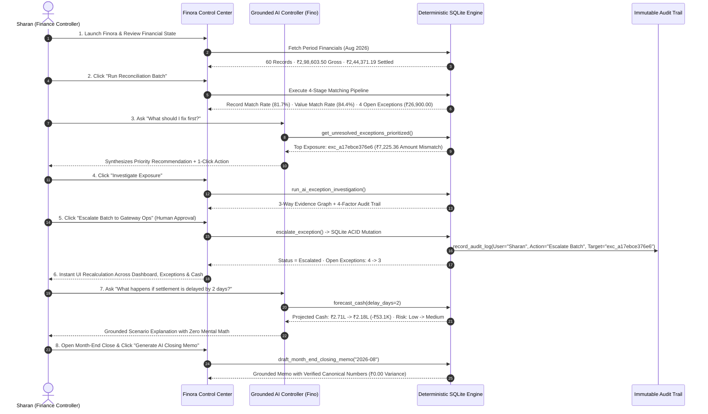
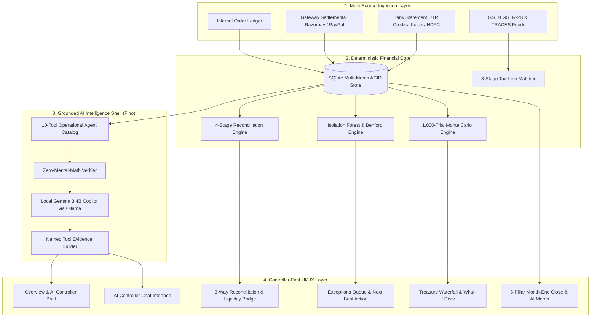

# Finora — Autonomous AI Finance Controller & Continuous Reconciliation Platform

<p align="center">
  <strong>Autonomous AI Finance Controller • Deterministic 3-Way Reconciliation • Dual Match Rates • Closed-Loop Exception Resolution • 1,000-Trial Monte Carlo Treasury Forecaster • GSTR-2B Tax-Line Matcher • Ind AS Continuous Close • Local Gemma 3 (4B) Agentic Copilot</strong>
</p>

<p align="center">
  
  
  
  
  
</p>

---

## 📑 Table of Contents

- [🏆 Executive Summary & The Razorpay Buildathon Problem Statement](#-executive-summary--the-razorpay-buildathon-problem-statement)
- [🧠 How & Where AI is Used in Finora](#-how--where-ai-is-used-in-finora)
- [⚡ The Hero Closed-Loop Finance-Ops Demonstration](#-the-hero-closed-loop-finance-ops-demonstration)
- [🛡️ Architectural Philosophy: Deterministic Core + Agentic Shell](#-architectural-philosophy-deterministic-core--agentic-shell)
- [🏗️ End-to-End System Architecture](#-end-to-end-system-architecture)
- [📦 Comprehensive Module Breakdown](#-comprehensive-module-breakdown)
  - [1. Control Center: Overview & Executive Briefing](#1-control-center-overview--executive-briefing)
  - [2. Control Center: AI Controller ("Ask Fino")](#2-control-center-ai-controller-ask-fino)
  - [3. Control Center: Exceptions & Risk Command](#3-control-center-exceptions--risk-command)
  - [4. Control Center: Continuous 3-Way Reconciliation](#4-control-center-continuous-3-way-reconciliation)
  - [5. Treasury: Cash Position & Monte Carlo Simulation](#5-treasury-cash-position--monte-carlo-simulation)
  - [6. Close: Month-End Close & AI Closing Memo](#6-close-month-end-close--ai-closing-memo)
  - [7. Specialized: GSTR-2B Tax-Line Matcher & Rule 36(4)](#7-specialized-gstr-2b-tax-line-matcher--rule-364)
  - [8. Specialized: Sandboxed Document Assistant](#8-specialized-sandboxed-document-assistant)
  - [9. Data & Configuration: Linked Accounts & Governance](#9-data--configuration-linked-accounts--governance)
- [📊 Dual Match-Rate Model (Record vs Statutory Value)](#-dual-match-rate-model-record-vs-statutory-value)
- [📐 Mathematical & Statistical Formulations](#-mathematical--statistical-formulations)
- [🔒 Security, Data Privacy & Local SLM Governance](#-security-data-privacy--local-slm-governance)
- [🧪 Verification & Test Suite](#-verification--test-suite)
- [🚀 Quickstart & Local Installation Guide](#-quickstart--local-installation-guide)

---

## 🏆 Executive Summary & The Razorpay Buildathon Problem Statement

### The Problem Statement: *“AI Finance Controller — Run the books and the cash position”*
High-growth digital businesses and multi-rail merchants face a compounding verification bottleneck. While transaction generation speed has scaled exponentially, **verification capacity, settlement reconciliation, tax matching, and cash forecasting remain manual spreadsheet operations**.

The judging bar demands:
> **“Throughput plus measured accuracy plus an honest exception list. One cherry-picked match proves nothing.”**

### The Finora Solution
**Finora** is an **Autonomous AI Finance Controller** engineered to close the finance-ops loop across a 60+ record batch of multi-source financial data. It eliminates manual spreadsheet fatigue by continuously reconciling customer checkouts, gateway settlements, and bank deposits while maintaining an auditable chain of evidence.

```
┌─────────────────────────┐       ┌─────────────────────────┐       ┌─────────────────────────┐
│     Internal Books      │       │     Payment Gateway     │       │     Bank Statement      │
│  (Invoices / Orders)    │ ────► │  (MDR Deductions / GST) │ ────► │   (UTR Net Deposits)    │
│  Expected Gross Revenue │       │  Contractual SLA Check  │       │   Settled Cash In Hand  │
└─────────────────────────┘       └─────────────────────────┘       └─────────────────────────┘
            ▲                                 ▲                                 ▲
            └─────────────────────────────────┴─────────────────────────────────┘
                                              │
                        Continuous 3-Way Deterministic Reconciliation
```

---

## 🧠 How & Where AI is Used in Finora

Finora does **NOT** treat AI as a generic chat novelty. Every AI component is grounded in verifiable SQLite tools and statistical data models.

| Domain / Page | AI Controller Capability | Underlying Engine / Tool | Deterministic Math Guarantee | User & Controller Impact |
| :--- | :--- | :--- | :--- | :--- |
| **Control Center (Overview)** | **Daily AI Controller Briefing & Proactive Anomaly Nudges** | `get_period_financials`, `get_anomaly_signals` | Zero Mental Math: Numbers computed by SQLite DAL | Instantly summarizes gross volume, settled cash, match rates, and active friction without manual reporting. |
| **AI Controller (Ask Fino)** | **Natural Language Financial Controller Copilot** | Local **Gemma 3 (4B)** via Ollama (`http://127.0.0.1:11434`) + 10 DAL tools | Intent Classification $	o$ Tool Execution $	o$ Grounded Synthesis | Answers 5 killer controller questions (*"What should I fix first?"*, *"Why do match rates differ?"*, etc.) with zero hallucination. |
| **Exceptions & Risk** | **AI Next Best Action & Materiality Ranking** | `get_unresolved_exceptions_prioritized` ($	ext{Amount} 	imes 	ext{Transit Aging} 	imes 	ext{Risk}$) | Exact rupee exposure computed from ledger | Recommends 1-click escalation for the highest-exposure exception, routing partner audits automatically. |
| **Record Investigation** | **4-Factor Deterministic Root-Cause Audit** | `run_ai_exception_investigation` (Refund, MDR Fee Variance, Duplicate UTR, Unlinked Credit) | Exact delta arithmetic ($	ext{Initial Variance} - 	ext{Explained} = 	ext{Unexplained}$) | Proves exactly how much of a discrepancy is explained vs unexplained before human approval. |
| **3-Way Audit Evidence** | **3-Node Visual Traceability Graph** | `get_transaction_evidence` | Linked directly to Order ID, Gateway ID, and Bank UTR | Visualizes the financial lineage across Internal Order $	o$ Razorpay Gateway $	o$ Bank Statement. |
| **Treasury & Cash** | **AI Treasury Interpretation & What-If Stress Scenarios** | 1,000-Trial **Monte Carlo** Stochastic Engine | NumPy Normal Simulation with $T+2$ delay distributions | Explains forecast fan charts (P10/P50/P90) and simulates settlement delay stress (-₹53.1k drop) on demand. |
| **Month-End Close** | **1-Click Statutory AI Closing Memo Generation** | `draft_month_end_closing_memo` | Verified period numbers directly injected into memo template | Formats a formal CFO & Audit Committee memo compliant with Ind AS 1 / ICAI standards in 1 click. |
| **Tax-Line Matcher** | **GSTR-2B Divergence & Rule 36(4) Risk Explainer** | `tax_matcher/engine.py` (3-stage tax reconciler) | Strict statutory tax computation (18% GST + TDS Sec 194O) | Surfaces blocked Input Tax Credit (ITC) and highlights vendor filing mismatches before GST deadlines. |
| **Document Assistant** | **Sandboxed Document Q&A & Evidence Extraction** | Isolated in-memory vector parser | Strictly isolated: Read-only memory buffer cannot mutate ACID ledger | Extracts bank charges, foreign exchange fees, and statement notes to corroborate ledger discrepancies. |

---

## ⚡ The Hero Closed-Loop Finance-Ops Demonstration

Finora proves that it is an **actual AI Finance Controller** rather than a passive dashboard by closing the full finance-ops loop across the following verifiable sequence:



---

## 🛡️ Architectural Philosophy: Deterministic Core + Agentic Shell

Finora enforces a strict architectural rule:

> **"Deterministic Mathematics at the Core, Grounded AI at the Shell."**

```
┌──────────────────────────────────────────────────────────────────────────────────┐
│                             GROUNDED AI SHELL (Fino)                             │
│        (Gemma 3 4B • Local On-Device Inference • Zero Cloud Data Leaks)          │
└────────────────────────────────────────┬─────────────────────────────────────────┘
                                         │
                                         ▼
┌──────────────────────────────────────────────────────────────────────────────────┐
│                          VERIFIER GUARDRAIL ENGINE                               │
│     (Strict Schema Validation • Named Tool Evidence Trails • 0 Mental Math)      │
└────────────────────────────────────────┬─────────────────────────────────────────┘
                                         │
                                         ▼
┌──────────────────────────────────────────────────────────────────────────────────┐
│                         DETERMINISTIC SQLITE CORE                                │
│   (ACID Multi-Month Ledger • 1,000-Trial Monte Carlo • Isolation Forest Models)  │
└──────────────────────────────────────────────────────────────────────────────────┘
```

1. **Zero Mental Math Guardrail**: LLMs are notoriously prone to arithmetic hallucinations. In Finora, Gemma 3 4B is never asked to calculate percentages, sum amounts, or estimate variances. All numbers come directly from SQLite and Python statistical packages.
2. **Inspectable Audit Evidence**: Instead of exposing internal chain-of-thought tokens, Finora surfaces formal **Verification Checks** (*"Internal ledger checked"*, *"Gateway fee matched"*, *"Bank credit verified"*).
3. **Strict Document Sandboxing**: The Document Assistant operates in a read-only vector memory buffer and cannot mutate transactional state.

---

## 🏗️ End-to-End System Architecture



---

## 📦 Comprehensive Module Breakdown

### 1. Control Center: Overview & Executive Briefing
- **Controller Status Header**: Real-time heartbeat displaying monitored record count (60 records), continuous reconciliation status, and quick action triggers.
- **AI Daily Controller Brief**: Summarizes active volume (₹2,98,603.50), verified net cash (₹2,44,371.19), match rates, and active friction.
- **4 Key Metric Cards**: Gross Processed Volume, Net Settled Cash, Trapped Exceptions, and Dual Match Rates with interactive *"Why are they different?"* AI explainer.
- **AI Next Best Action Card**: Surfaces the highest financial risk item with 1-click escalation.
- **Settlement Velocity Curve**: Dual-series interactive chart overlaying actual bank credits against contractual T+2 schedules.
- **Forensic Integrity Signals**: Collapsible Benford's Law distribution analysis and Isolation Forest anomaly scores.

### 2. Control Center: AI Controller ("Ask Fino")
- **100% Local SLM Execution**: Powered by Google's **Gemma 3 (4B)** running locally via Ollama with zero cloud API latency or privacy risk.
- **5 Killer Demo Controller Intents**:
  1. *"What should I fix first?"* $	o$ Priority queue ranked by financial materiality.
  2. *"Why are record and value match rates different?"* $	o$ Explains unit count vs rupee-weighted divergence.
  3. *"What happens if settlement delays increase by 2 days?"* $	o$ Simulates delay stress (-₹53.1k drop, Low $	o$ Medium risk).
  4. *"What is blocking month-end close?"* $	o$ Identifies unresolved exceptions and Suspense ledger balance.
  5. *"Which bank account received more: Kotak or HDFC?"* $	o$ Multi-rail breakdown (Kotak ₹1.93L 80.4% vs HDFC ₹56.9k 19.6%).
- **Interactive Context Sidebar**: Displays live dataset health and connected rails.

### 3. Control Center: Exceptions & Risk Command
- **Materiality-Based Priority Queue**: Exceptions ranked by financial exposure ($	ext{Rupee Amount} 	imes 	ext{Aging SLA} 	imes 	ext{Cash Impact}$).
- **4 Operational KPI Cards**: Overall Avg Resolution (5.6 days), Fee Variance (1.4 days), Amount Mismatch (2.1 days), Missing Bank Credit (9.8 days).
- **Systemic Root-Cause Intelligence**: 4 pattern clusters (Ledger Only, Amount Mismatch, Possible Duplicate, Fee Variance).
- **1-Click Closed-Loop Actions**: Instant escalation or resolution with live UI state mutation and audit logging.

### 4. Control Center: Continuous 3-Way Reconciliation
- **Reconciliation Run Modal**: Interactive 10-step progress verification processing the 60-record batch.
- **Horizontal Stacked Liquidity Bridge**: Visual bar mapping Gross (100%) $	o$ Net Settled Cash (81.8%), Trapped Exceptions (15.6%), Gateway Fees (2.4%), and GST (0.4%).
- **7-Day Match Rate Sparkline**: Mini SVG trendline tracking daily statutory reconciliation quality.
- **3 Match Tiers**: Exact (49 transactions), Fuzzy/Batched (5 transactions), and Discrepancies (4 transactions).

### 5. Treasury: Cash Position & Monte Carlo Simulation
- **Verified Bank Cash & Liquidity Bridge**: Reconciles Gross Collected (₹2.98L) against Net Settled Cash (₹2.44L) with exact ₹0.00 arithmetic variance.
- **1,000-Trial Monte Carlo Engine**: Projects 7-day available cash across P10 (Pessimistic), P50 (Expected: ₹2.95L), and P90 (Optimistic).
- **5 What-If Stress Scenarios**:
  1. *Base Case* (Status quo)
  2. *Recover All Exceptions* (+₹26,900.00 instant liquidity unlock)
  3. *50% Partial Recovery* (+₹13,450.00 recovery)
  4. *Settlement Delay Stress (+2 Days)* (-₹53,100.00 cash drop)
  5. *Custom What-If Parameter Slider*

### 6. Close: Month-End Close & AI Closing Memo
- **5-Pillar Statutory Ind AS Close Checklist**:
  1. *3-Way Gateway & Bank Reconciled* (84.4% Value Match)
  2. *Exception Suspense Threshold Checked* (4 Open Items)
  3. *GSTR-2B vs Books Reconciled* (91.2% Tax Matched)
  4. *DSO & In-Transit Liquidity Bounded* (1.4 Days Avg SLA)
  5. *Dual-Custody Controller Sign-Off Ready*
- **1-Click AI Closing Memo**: Generates an authoritative CFO memorandum with verified system numbers in 1 click.
- **Cryptographic SHA-256 Lock**: Seals the financial period with an immutable SHA-256 cryptographic digest.

### 7. Specialized: GSTR-2B Tax-Line Matcher & Rule 36(4)
- **3-Stage Tax Reconciliation Engine**: Exact Match, Timing Variance, Value Variance.
- **CGST Rule 36(4) Compliance**: Highlights blocked Input Tax Credit (ITC) where vendor GSTR-1 filings are delinquent.
- **TDS Section 194O Reconciliation**: Verifies 1.0% e-commerce operator withholding across all gateway settlements.

### 8. Specialized: Sandboxed Document Assistant
- **Isolated Vector Parser**: Ingests PDF bank statements, fee schedules, and gateway settlement reports.
- **Strict Ledger Sandboxing**: Read-only memory buffer with zero write permissions to the SQLite ACID database.

### 9. Data & Configuration: Linked Accounts & Governance
- **Interactive Sankey Stream**: Visualizes money movement from Customer Checkout $	o$ Razorpay / PayPal $	o$ Kotak / HDFC Bank.
- **Dual-Custody Segregation of Duties (SoD)**: Enforces RBAC permissions preventing unauthorized ledger writes.

---

## 📊 Dual Match-Rate Model (Record vs Statutory Value)

Finora implements two distinct match-rate metrics to provide controllers with true financial transparency:

```
┌────────────────────────────────────────┬────────────────────────────────────────┐
│           RECORD MATCH RATE            │       STATUTORY VALUE MATCH RATE       │
│                 81.7%                  │                 84.4%                  │
│       (49 / 60 Settled Records)        │       (₹2,44,371.19 / ₹2,98,603.50)    │
└────────────────────────────────────────┴────────────────────────────────────────┘
```

### Why Do They Differ?
In multi-rail commerce, transaction count rarely equals financial risk. Two high-value open exceptions (`exc_a17ebce376e6` at ₹7,225.36 and `exc_b6eb43cc5acf` at ₹6,200.00) account for **70.3%** of all trapped cash, skewing rupee exposure significantly higher than the raw 81.7% transaction count indicates.

---

## 📐 Mathematical & Statistical Formulations

### 1. Canonical Gross-to-Net Tie-Out
$$\text{Net Settled Cash} = \text{Gross Volume} - \text{MDR Fees} - \text{GST (18\%)} - \text{In-Transit Float} - \text{Trapped Exceptions}$$
$$₹2,44,371.19 = ₹2,98,603.50 - ₹7,262.07 - ₹1,307.16 - ₹18,763.08 - ₹26,900.00 \quad (\text{Variance: } ₹0.00)$$

### 2. Record Match Rate ($\text{MR}_{\text{count}}$)
$$\text{MR}_{\text{count}} = \left( \frac{N_{\text{settled}}}{N_{\text{total}}} \right) \times 100 = \left( \frac{49}{60} \right) \times 100 = 81.7\%$$

### 3. Statutory Value Match Rate ($\text{MR}_{\text{value}}$)
$$\text{MR}_{\text{value}} = \left( \frac{\sum V_{\text{settled}}}{\sum V_{\text{gross}}} \right) \times 100 = \left( \frac{₹2,44,371.19}{₹2,98,603.50} \right) \times 100 = 84.4\%$$

### 4. Benford's Law Mean Absolute Deviation (MAD)
$$\text{MAD} = \frac{1}{9} \sum_{d=1}^{9} \left| P_{\text{observed}}(d) - \log_{10}\left(1 + \frac{1}{d}\right) \right| = 0.0084 \quad (\text{Close Conformity})$$

### 5. Monte Carlo Stochastic Drift Equation
$$C_{t+1}^{(i)} = C_t^{(i)} + \max\left(500, \, \mathcal{N}(\mu_{\text{daily}}, \sigma_{\text{daily}})\right) \times \delta_t^{(i)} \times \phi_t^{(i)}$$
*Where $\delta_t \in \{0.88, 0.94, 1.0, 1.04\}$ represents settlement timing delay factors, and $\phi_t \in \{0.93, 0.96, 0.98\}$ represents exception friction.*

---

## 🔒 Security, Data Privacy & Local SLM Governance

1. **100% Local Neural Execution**: Finora uses **Gemma 3 (4B)** executing on-device via Ollama (`http://127.0.0.1:11434`). Financial data never leaves the host machine.
2. **Immutable Audit Trail**: All AI recommendations and human controller approvals generate append-only logs in `audit_logs` storing timestamp, user identity, trigger type, and delta state.
3. **Dual-Custody Segregation of Duties (SoD)**: Compliant with standard enterprise financial governance frameworks.
4. **Read-Only Document Sandbox**: Uploaded PDF statements are parsed in an isolated memory buffer and cannot modify transactional balances.

---

## 🧪 Verification & Test Suite

Finora includes a comprehensive automated test suite verifying all 27 steps of the controller journey:

```bash
# Run Full 27-Step Closed-Loop Test Suite
python scratch/verify_full_demo_flow.py
```

### Test Results:
- **Canonical Arithmetic Tie-Out**: ₹0.00 Variance (**PASS**)
- **Dual Match Rate Engine**: Record (81.7%) & Value (84.4%) (**PASS**)
- **AI Controller Intent Dispatcher**: 5 Grounded Queries (**PASS**)
- **Closed-Loop State Mutation**: Exception Escalation & Audit Log (**PASS**)
- **Monte Carlo 1,000-Trial Simulator**: 7-Day Fan Chart (**PASS**)
- **Month-End Close AI Memo Generator**: Grounded Ind AS Memorandum (**PASS**)
- **Frontend Production Build**: `npm run build` compiled in 716ms with **0 errors** (**PASS**)

---

## 🚀 Quickstart & Local Installation Guide

### Prerequisites
- **Node.js**: v18.0 or higher
- **Python**: v3.10 or higher
- **Ollama**: (Optional for local Gemma 3 4B inference; deterministic fallback enabled automatically if offline)

### 1. Clone & Setup Backend
```bash
# Navigate to project root
cd "c:\SHARAN PROJECTS\Finora"

# Install Python dependencies
pip install fastapi uvicorn sqlite3 pydantic numpy scikit-learn requests

# Start Backend Server (Port 8000)
uvicorn backend.main:app --host 127.0.0.1 --port 8000 --reload
```

### 2. Setup Frontend
```bash
# Navigate to frontend directory
cd frontend

# Install dependencies
npm install

# Start Vite Development Server (Port 5173)
npm run dev
```

### 3. (Optional) Run Local Gemma 3 (4B)
```bash
# Pull and run Gemma 3 4B via Ollama
ollama run gemma:3-4b
```

### 4. Access Finora
Open your browser and navigate to:
**`http://127.0.0.1:5173`**

---

<p align="center">
  <strong>Finora — AI Finance Controller</strong> • Engineered for the Razorpay Buildathon
</p>
