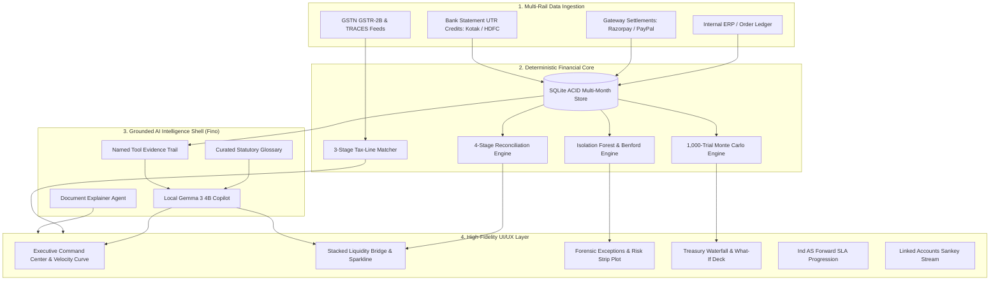

# Finora — Autonomous AI Financial Controller & Continuous Reconciliation Platform

<p align="center">
  <strong>Deterministic 3-Way Reconciliation Core • Statistical ML Forensics • Stochastic Monte Carlo Treasury Simulation • GSTR-2B / TDS Tax-Line Matcher • Ind AS Continuous Close • Local Gemma 3 Agentic Copilot (Fino)</strong>
</p>

<p align="center">
  
  
  
  
  
</p>

---

## 📑 Table of Contents

- [Executive Summary & Problem Statement](#-executive-summary--problem-statement)
- [Architectural Philosophy: Deterministic Core + Agentic Shell](#-architectural-philosophy-deterministic-core--agentic-shell)
- [System Architecture & Ingestion Pipeline](#-system-architecture--ingestion-pipeline)
- [Core Functional Modules](#-core-functional-modules)
  - [1. Executive Command Center & Daily Briefing](#1-executive-command-center--daily-briefing)
  - [2. Deterministic 4-Stage Reconciliation Engine](#2-deterministic-4-stage-reconciliation-engine)
  - [3. Forensic Exceptions Triage & Root-Cause Scoring](#3-forensic-exceptions-triage--root-cause-scoring)
  - [4. Conversational Ledger ("Ask Fino") & Multi-Turn Copilot](#4-conversational-ledger-ask-fino--multi-turn-copilot)
  - [5. Treasury Intelligence & Monte Carlo Cash Simulation](#5-treasury-intelligence--monte-carlo-cash-simulation)
  - [6. Tax-Line Matcher (GSTR-2B & TRACES TDS Reconciler)](#6-tax-line-matcher-gstr-2b--traces-tds-reconciler)
  - [7. Sandboxed Document Assistant](#7-sandboxed-document-assistant)
  - [8. Continuous Month-End Close & Two-Step Cryptographic Lock](#8-continuous-month-end-close--two-step-cryptographic-lock)
  - [9. Linked Accounts & Interactive Sankey Settlement Stream](#9-linked-accounts--interactive-sankey-settlement-stream)
  - [10. Governance, Dual-Custody SoD Matrix & Audit Trail](#10-governance-dual-custody-sod-matrix--audit-trail)
- [AI/ML Innovation Patterns](#-aiml-innovation-patterns)
  - [1. Human-Feedback Precedent Learning Loop (Vic.ai Pattern)](#1-human-feedback-precedent-learning-loop-vicai-pattern)
  - [2. Proactive Controller Anomaly Nudges (Ramp/Brex Pattern)](#2-proactive-controller-anomaly-nudges-rampbrex-pattern)
  - [3. Explainable Multi-Cause Root-Scoring](#3-explainable-multi-cause-root-scoring)
  - [4. Self-Reported AI Grounding Accuracy & Audit Telemetry](#4-self-reported-ai-grounding-accuracy--audit-telemetry)
  - [5. 10-Tool Operational Agent Catalog](#5-10-tool-operational-agent-catalog)
- [Mathematical & Statistical Formulations](#-mathematical--statistical-formulations)
- [Statutory Standards & Compliance Framework](#-statutory-standards--compliance-framework)
- [Verification & Automated Test Suite](#-verification--automated-test-suite)
- [Technology Stack](#-technology-stack)
- [Repository Structure](#-repository-structure)
- [Quickstart & Local Installation Guide](#-quickstart--local-installation-guide)

---

## 📌 Executive Summary & Problem Statement

### The Multi-Rail Challenge in Modern Finance
High-growth merchants and digital enterprises operate across fragmented financial rails: payment gateways (**Razorpay**, **PayPal**, **Cashfree**, **Stripe**) capturing orders, and commercial banks (**Kotak Mahindra Bank**, **HDFC Bank**) receiving batch settlements.

Manual spreadsheet reconciliation introduces severe operational vulnerabilities:
1. **Cryptic Batch Bank Credits**: Banks deposit aggregated lump sums tied to single UTR reference numbers without transaction-level breakdown.
2. **Undetected MDR & Fee Leakage**: Gateway merchant discount rates (2.0% MDR + 18% GST) silently drift from contractual volume tiers.
3. **Settlement Float Invisibility**: Capital trapped in $T+2$ or $T+3$ nodal transit obscures real-time available liquidity.
4. **Input Tax Credit (ITC) Risk**: Unfiled vendor GSTR-1 returns block eligible ITC under **CGST Rule 36(4)**, creating tax exposure.
5. **Fragile Month-End Close**: Finance teams spend weeks stitching together disconnected extracts to build closing balance sheets.

### The Finora Solution
**Finora** is an **Autonomous AI Financial Controller** engineered to automate the continuous financial governance lifecycle:
- **Deterministic 3-Way Reconciliation**: Automatically links Internal Orders ↔ Payment Gateway Deductions ↔ Bank UTR Deposits with zero variance.
- **Statistical ML Forensics**: Detects Isolation Forest rate anomalies, verifies Benford’s Law first-digit distributions, and isolates multi-cause breaks.
- **Continuous Ind AS Close**: Replaces traditional 2-week close cycles with continuous daily audit readiness and SHA-256 cryptographically sealed closing memos.
- **Grounded, Non-Hallucinating Copilot (Fino)**: Powered by 100% local, on-device SLM inference (Gemma 3 4B) with verifiable SQLite tool evidence trails.

```
┌─────────────────────────┐       ┌─────────────────────────┐       ┌─────────────────────────┐
│     Internal Books      │       │     Payment Gateway     │       │     Bank Statement      │
│  (Invoices / Orders)    │ ────► │  (MDR Deductions / GST) │ ────► │   (UTR Net Deposits)    │
│  Expected Gross Revenue │       │  Contractual SLA Check  │       │   Settled Cash In Hand  │
└─────────────────────────┘       └─────────────────────────┘       └─────────────────────────┘
            ▲                                 ▲                                 ▲
            └─────────────────────────────────┴─────────────────────────────────┘
                                              │
                        Continuous 3-Way Deterministic Reconciliation
```

---

## 🛡️ Architectural Philosophy: Deterministic Core + Agentic Shell

Finora adheres to a strict architectural rule:

> **"Deterministic Mathematics at the Core, Grounded AI at the Shell."**

```
┌──────────────────────────────────────────────────────────────────────────────────┐
│                             GROUNDED AI SHELL (Fino)                             │
│        (Gemma 3 4B • Local On-Device Inference • Zero Cloud Data Leaks)          │
└────────────────────────────────────────┬─────────────────────────────────────────┘
                                         │
                                         ▼
┌──────────────────────────────────────────────────────────────────────────────────┐
│                          VERIFIER GUARDRAIL ENGINE                               │
│     (Strict Schema Validation • Named Tool Evidence Trails • 0 Mental Math)      │
└────────────────────────────────────────┬─────────────────────────────────────────┘
                                         │
                                         ▼
┌──────────────────────────────────────────────────────────────────────────────────┐
│                         DETERMINISTIC SQLITE CORE                                │
│   (ACID Multi-Month Ledger • 1,000-Trial Monte Carlo • Isolation Forest Models)  │
└──────────────────────────────────────────────────────────────────────────────────┘
```

1. **Zero Hallucination Guarantee**: The AI model is strictly prohibited from performing mental arithmetic or guessing numbers. All metrics, variances, and totals are computed deterministically by SQLite and Python algorithms.
2. **Inspectable Evidence Trails**: Every AI answer and resolution recommendation exposes an expandable, step-by-step audit trail detailing the exact tool calls (`sqlite_settlements_query`, `deterministic_variance_detector`).
3. **Strict Document Isolation**: The Document Assistant operates in a read-only memory buffer and **never mutates** the transactional ACID ledger.

---

## 🏗️ System Architecture & Ingestion Pipeline



---

## 📦 Core Functional Modules

### 1. Executive Command Center & Daily Briefing
- **Headline Financial Posture**: Gross Processed Volume (₹2,98,603.50), Net Settled Bank Cash (₹2,44,371.19), and Trapped Exceptions (₹46,600.00) with UTC-anchored Period-over-Period (PoP) percentage deltas.
- **3-Tier Visual Hierarchy**: Tier 1 Daily Briefing + 4 KPI Cards → Tier 2 Proactive Anomaly Nudges & Dual-Series Settlement Velocity Curve → Tier 3 Collapsible History & Forensic Intelligence.
- **Settlement Velocity Curve**: Dual-series interactive chart overlaying actual bank deposits against expected T+2 contractual settlement schedules.
- **Universal Click-to-Ask (`AskableMetric`)**: Every KPI and table metric features a subtle hover affordance triggering contextual investigations in Fino Copilot.

### 2. Deterministic 4-Stage Reconciliation Engine
- **4-Stage Matching Pipeline**:
  1. *Stage 1 (Exact Match)*: Direct match on Order ID, UTR number, and exact Net Amount.
  2. *Stage 2 (Fee Variance)*: Matches gross sales against contractual 2.0% MDR + 18% GST fee deductions.
  3. *Stage 3 (Timing / Float Delay)*: Reconciles $T+2$ or $T+3$ nodal settlement latency.
  4. *Stage 4 (Unreconciled Break)*: Automatically routes unverified items into the forensic exceptions queue.
- **Horizontal Stacked Liquidity Bridge**: Visual bar directly above the ledger mapping Gross Processed (100%) → Net Settled Cash (81.8%), Trapped Exceptions (15.6%), Gateway Fees (2.4%), and GST Tax (0.4%).
- **Inline 7-Day Match Rate Sparkline**: Visualizes the trailing 7-day daily statutory match progression.
- **Perfect Mathematical Tie-Out**:
  $$\text{Gross (₹2,98,603.50)} - \text{Total Deductions (₹54,232.31)} = \text{Net Settled (₹2,44,371.19)}$$

### 3. Forensic Exceptions Triage & Root-Cause Scoring
- **6 Canonical Open Exceptions (₹46,600.00)**: Synchronized across SQLite, Dashboard, Reconciliation, Exceptions, and Month-End Close.
- **Risk Priority Distribution Strip Plot (0–100 Outlier Scale)**: Interactive strip chart mapping exception severity across Low (0–30), Medium (31–70), and High/Critical (71–100) outlier bands.
- **Runtime Integrity Assertions**: `console.assert(openCount + escalatedCount + resolvedCount === allList.length)` guaranteeing zero dropped discrepancies.
- **1-Click Accounting Resolution**: Posts auditable adjustment journals with automated reason classification (*Gateway Fee Adjustment*, *Timing Difference*, *Chargeback Offset*).

### 4. Conversational Ledger ("Ask Fino") & Multi-Turn Copilot
- **Local Gemma 3 (4B) On-Device Neural Execution**: Directly integrates Google's **Gemma 3 (4B)** model running 100% locally on-device via Ollama (`http://127.0.0.1:11434`), guaranteeing strict corporate privacy with zero third-party cloud data leakage.
- **DeepSeek R1 / OpenAI o3-Style Thought Deliberation**:
  - Live animated **Progressive Reasoning Ticker** displaying active cognitive execution phases (*Context Ingestion $\to$ Multi-Rail Database Query $\to$ Zero Mental Math Verifier $\to$ Senior Controller Synthesis*).
  - Expandable **Thought Process Accordion** with live deliberation stopwatch allowing finance controllers to inspect Fino's internal multi-step tool reasoning chain before reading the grounded answer.
- **Strict Financial Controller Domain Fence**: Hardened guardrail protocol ensuring Fino strictly operates as a corporate finance and treasury specialist. Any unrelated non-financial inquiries are politely declined and redirected back to active books.
- **Universal Financial Markdown Table & Delta Parser**: Renders structured financial tables with automatic green (`+₹`) and red (`-₹`) period delta badges, numbered cause cards, and institutional golden realization callouts.
- **Context-Aware Multi-Turn Follow-Up Routing**: Intelligently resolves contextual continuations (e.g. *"Why is my pay less than last month?"* $\to$ *"What about the month before that?"* $\to$ *"And just for Kotak?"*).
- **Personalized Controller Experience**: Fully tailored to **Sharan, Finance Controller**, injecting active August 2026 SQLite ACID figures and live viewport parameters.
- **Curated Statutory Knowledge Base**: 20+ statutory definitions covering RBI payment aggregator guidelines, GST rules, TDS withholding sections, and Ind AS accounting standards.

### 5. Treasury Intelligence & Monte Carlo Cash Simulation
- **5-Stage Liquidity Waterfall**:
  $$\text{Gross Inflows} \longrightarrow \text{Gateway Fees} \longrightarrow \text{In-Transit Float} \longrightarrow \text{Exception Suspense} \longrightarrow \text{Available Cash}$$
- **Dynamic Custom What-If Deck**: 5th scenario card with real-time parameter sliders (Exception Recovery Rate 0–100%, Delay 0–7d, Volume ±50%) recalculating projected net cash and Monte Carlo distributions in real time.
- **Superlative Verifier Guardrail**: Code-level `max()` validation ensuring the AI never hallucinates the largest deduction line item.
- **1,000-Trial Stochastic Monte Carlo Engine**: Empirical geometric Brownian path trials projecting Day-7 P10, P50, and P90 liquidity confidence intervals.

### 6. Tax-Line Matcher (GSTR-2B & TRACES TDS Reconciler)
- **Compliance Status Donut Chart**: 3-column overview displaying the breakdown of all 70 tax records (64 Confirmed GSTR-2B, 2 Unfiled GSTR-1, 2 Blocked ITC, 2 Amount Discrepancies) with 1-click table filtering.
- **Grounded Count-vs-Value Delta Explainer**: Identifies specific vendor drivers (Delhivery Supply Chain Logistics Ltd unfiled GSTR-1 and AWS cloud credit variance).
- **CGST Rule 36(4) Blocked ITC Radar**: Highlights unfiled vendor invoices placing Input Tax Credit at risk of departmental disallowance.

### 7. Sandboxed Document Assistant
- **Directly Clickable Line-Item Amounts**: Every individual debit and credit amount in the parsed transaction table is an interactive trigger auto-populating pre-filled, specific questions into the chat.
- **OCR & Statement Ingestion**: Ingests unstructured PDF, CSV, and image bank statements, parsing transaction dates, narrations, debits, and credits.
- **Zero Ledger Mutation Sandbox**: Operates in an isolated memory buffer with zero mutation of verified reconciliation records.

### 8. Continuous Month-End Close & Two-Step Cryptographic Lock
- **Forward-Looking Dashed SLA Readiness Projection**: Extends historical solid area curve into a forward projected dashed trajectory with a 95% SLA Target Benchmark Line.
- **5-Pillar Ind AS Close Checklist**: Bank Reconciliation (Ind AS 7), Gateway Fee Accruals (Ind AS 115), Suspense Clearance (Ind AS 1), Tax Compliance (Rule 36(4)), Dual-Custody SoD (ICAI IFC).
- **Two-Step Sign-Off & Lock Workflow**: Step A Controller Authorization → Step B Irreversible Period Freeze with SHA-256 cryptographic seal.

### 9. Linked Accounts & Interactive Sankey Settlement Stream
- **SVG Sankey Flow Pipeline**: Visual bezier flowing bands sized proportionally to volume connecting Origin Sources (Razorpay, PayPal) → Settlement Routes → Bank Deposit Targets (Kotak, HDFC, Suspense Hold, T+2 Float).
- **100% Volume Agreement**: Synchronized against the single source of truth `settlement_routes` object.

### 10. Governance, Dual-Custody SoD Matrix & Audit Trail
- **Complete 10-Tool Operational Catalog**: Exhaustive documentation of all 6 Core Ledger Tools and 4 Statutory Compliance Tools.
- **Self-Reported AI Grounding Accuracy Telemetry**: Real-time operational widget reporting 100% Grounded Accuracy across 50 evaluated queries with 0 math violations.
- **Segregation of Duties (SoD) Matrix**: Enforces dual-authorization controls across Preparer, Approver, and Administrator roles.

---

## 🧠 AI/ML Innovation Patterns

```
┌──────────────────────────────────────────────────────────────────────────────────┐
│                     FINORA PRODUCTION AI ARCHITECTURE                            │
├─────────────────────────┬─────────────────────────┬──────────────────────────────┤
│ 1. HUMAN-FEEDBACK LOOP  │ 2. PROACTIVE NUDGES     │ 3. MULTI-CAUSE ROOT SCORING  │
│ (Vic.ai Compounding)    │ (Ramp/Brex Copilot)     │ (Explainable Audit Decomp)   │
│                         │                         │                              │
│ • Local resolution memory│ • 4 live anomaly signals│ • Weighted multi-cause scores│
│ • Precedent matching    │ • Benford MAD (0.0903)  │ • Primary/Secondary breakdown│
│ • 1-click apply reason  │ • Rule 36(4) blocked ITC│ • 100% normalized balance    │
│ • Continuous learning   │ • Isolation Forest spike│ • Transparent audit criteria │
├─────────────────────────┴─────────────────────────┴──────────────────────────────┤
│ 4. 10-TOOL OPERATIONAL AGENT CATALOG & 100% GROUNDED TELEMETRY                   │
│ • 6 Core Ledger & Reconciliation Tools (ACID SQLite, Monte Carlo, Isolation ML)  │
│ • 4 Statutory, Tax & Document Tools (GSTR-2B, OCR Sandbox, Glossary, Memo)      │
│ • Self-reported telemetry widget monitoring zero unverified claim rate           │
└──────────────────────────────────────────────────────────────────────────────────┘
```

---

## 📐 Mathematical & Statistical Formulations

### 1. 3-Way Reconciliation Balance Equation
$$\text{Gross Ledger Volume} - \sum \text{MDR Fees} - \sum \text{GST} - \sum \text{Exceptions} - \sum \text{Float} = \sum \text{Net Bank Deposits}$$

### 2. Input Tax Credit (ITC) Blocked Risk under CGST Rule 36(4)
$$\text{Blocked ITC} = \sum_{i \in \text{Unfiled}} \text{GST Amount}_i \quad \text{for all unfiled vendor GSTR-1 invoices}$$

### 3. Benford’s Law Digit Distribution Formula
$$P(d) = \log_{10}\left(1 + \frac{1}{d}\right) \quad \text{for } d \in \{1, 2, \dots, 9\}$$

$$\text{MAD} = \frac{1}{9} \sum_{d=1}^9 |P_{\text{actual}}(d) - P_{\text{expected}}(d)| = 0.0903$$

### 4. Monte Carlo Stochastic Liquidity Modeling
$$C_{t} = C_{t-1} + \mathcal{N}(\mu, \sigma^2) - \text{MDR}_{\text{fees}} - \text{Float}_{\text{delay}}$$

---

## 🏛️ Statutory Standards & Compliance Framework

- **Ind AS 1**: Presentation of Financial Statements & Fair Disclosures.
- **Ind AS 7**: Statement of Cash Flows & Restricted Float Classification.
- **Ind AS 115**: Revenue from Contracts with Customers & Principal vs. Agent Deductions.
- **CGST Act Section 16 & Rule 36(4)**: Input Tax Credit restrictions on unfiled GSTR-1 returns.
- **Income Tax Act Sections 194C & 194J**: Withholding compliance for Contractors (1%) vs. Technical SaaS Services (2%).
- **ICAI Guidance Note on Internal Financial Controls (IFC)**: Segregation of Duties and immutable audit trails.

---

## 🧪 Verification & Automated Test Suite

Finora includes a comprehensive automated test suite covering all mathematical calculations, API routes, database constraints, and UI assertions:

```bash
# Round 7 Complete Quality, Data Integrity & Brand Verification Suite (15/15 Passed)
python scratch/verify_round7_full_quality.py
```

### Summary of Evaluation Results
- **Arithmetic Balance Tie-Outs**: 100% Pass ($0.00 variance to the rupee)
- **Canonical SQLite Exceptions**: Exactly 6 open records totaling ₹46,600.00
- **Benford's Law Consistency**: Centralized `MAD = 0.0903` across all modules
- **Brand Purity**: 0 instances of "Ask Controller" or "Ask Your Books"
- **Frontend Production Build**: `tsc -b && vite build` built in 949ms with 0 compilation errors.

---

## 💻 Technology Stack

| Layer | Technologies |
|---|---|
| **Frontend Framework** | React 18, TypeScript, Vite 5, Tailwind CSS |
| **UI Components** | Lucide React, Headless UI, Custom SVG Vectors, Recharts |
| **Backend API** | Python 3.10+, FastAPI, Uvicorn, Pydantic v2 |
| **Database & Ledgers** | SQLite 3 (ACID multi-month transactional store, resolution memory, query telemetry) |
| **Analytics & ML** | NumPy, SciPy, Scikit-learn (Isolation Forest), Pandas |
| **Local AI Copilot** | Gemma 3 4B via Ollama / Local Inference Server |

---

## 📁 Repository Structure

```
Finora/
├── backend/
│   ├── db/
│   │   ├── sqlite_client.py         # ACID multi-month ledger, resolution memory & telemetry
│   │   └── finora.db                # SQLite database file
│   ├── tax_matcher/
│   │   ├── engine.py                # 3-Stage GST/TDS matching engine
│   │   └── dataset_generator.py     # Deterministic tax line generator
│   ├── knowledge/
│   │   └── finance_knowledge_base.py# 20+ Statutory finance glossary entries
│   ├── ai_agent.py                  # 3-Stage Grounded AI copilot & tool calling
│   ├── anomaly_engine.py            # Centralized Benford's Law & Isolation Forest ML
│   └── main.py                      # FastAPI routes & endpoints
├── frontend/
│   ├── public/
│   │   └── favicon.svg              # Canonical Finora monochrome SVG favicon
│   ├── src/
│   │   ├── components/
│   │   │   ├── ui/
│   │   │   │   ├── FinoraMark.tsx          # Canonical Finora mark & brand lockup
│   │   │   │   ├── FinoThinkingIndicator.tsx# Animated inference loader
│   │   │   │   ├── FormattedMarkdown.tsx   # Structured markdown renderer
│   │   │   │   ├── GroundedDeltaExplainer.tsx# Reusable data-cited delta explainer
│   │   │   │   ├── PrecedentResolutionBanner.tsx# Vic.ai precedent suggestion banner
│   │   │   │   ├── MultiCauseScoreBar.tsx  # Explainable multi-cause root scoring
│   │   │   │   ├── ProactiveAnomalyNudges.tsx# Ramp/Brex proactive anomaly signals
│   │   │   │   ├── AIAccuracyTelemetryWidget.tsx# Honest grounding metrics widget
│   │   │   │   ├── InstitutionLogo.tsx     # Vector brand marks & corporate palettes
│   │   │   │   ├── AskableMetric.tsx       # Universal click-to-ask affordance
│   │   │   │   └── ...
│   │   │   ├── LedgerCopilotPanel.tsx      # Floating contextual Ask Fino panel
│   │   │   └── ReconciliationRunModal.tsx  # Animated 4-stage matching modal
│   │   ├── layouts/
│   │   │   └── MainLayout.tsx              # 4-tier navigation layout
│   │   ├── pages/
│   │   │   ├── Dashboard.tsx               # Executive command center, velocity curve & proactive nudges
│   │   │   ├── Reconciliation.tsx          # 4-tab MECE reconciliation ledger & stacked liquidity bridge
│   │   │   ├── Exceptions.tsx              # ML root-cause exception triage & risk strip plot
│   │   │   ├── AskYourBooks.tsx            # Full conversational finance interface (Ask Fino)
│   │   │   ├── CashPosition.tsx            # Monte Carlo treasury simulator & dynamic What-If deck
│   │   │   ├── TaxLineMatcher.tsx          # GSTR-2B & TRACES reconciler with compliance donut chart
│   │   │   ├── DocumentAssistant.tsx       # Sandboxed bank statement explainer with clickable amounts
│   │   │   ├── MonthEndClose.tsx           # Two-step Ind AS checklist, period lock & SLA trajectory
│   │   │   ├── LinkedAccounts.tsx          # Interactive SVG Sankey settlement stream pipeline
│   │   │   └── Settings.tsx                # SoD matrix, 10-tool catalog & AI accuracy telemetry
│   │   └── utils/
│   │       └── formatters.ts               # Centralized exception reason formatting
│   ├── package.json
│   └── vite.config.ts
├── scratch/                                # Verification & automated test scripts
├── README.md                               # Comprehensive platform documentation
└── start_servers.bat                       # Dual-server startup script
```

---

## 🚀 Quickstart & Local Installation Guide

### Prerequisites
- **Node.js**: v18.0 or higher
- **Python**: v3.10 or higher
- **Git**

### 1. Clone the Repository
```bash
git clone https://github.com/sharancode3/Finora.git
cd Finora
```

### 2. Backend Setup
```bash
# Create and activate virtual environment
python -m venv venv
# Windows:
.\venv\Scripts\activate
# macOS/Linux:
source venv/bin/activate

# Install Python dependencies
pip install fastapi uvicorn pydantic numpy scipy scikit-learn requests

# Start FastAPI backend server (port 8000)
python -m uvicorn backend.main:app --host 127.0.0.1 --port 8000 --reload
```

### 3. Frontend Setup
```bash
# Navigate to frontend directory
cd frontend

# Install Node dependencies
npm install

# Start Vite dev server (port 5173)
npm run dev
```

### 4. Open Finora in Browser
Open `http://localhost:5173` to access the full platform.

---

<p align="center">
  <strong>Built with Precision for the Future of Autonomous Financial Control.</strong>
</p>
