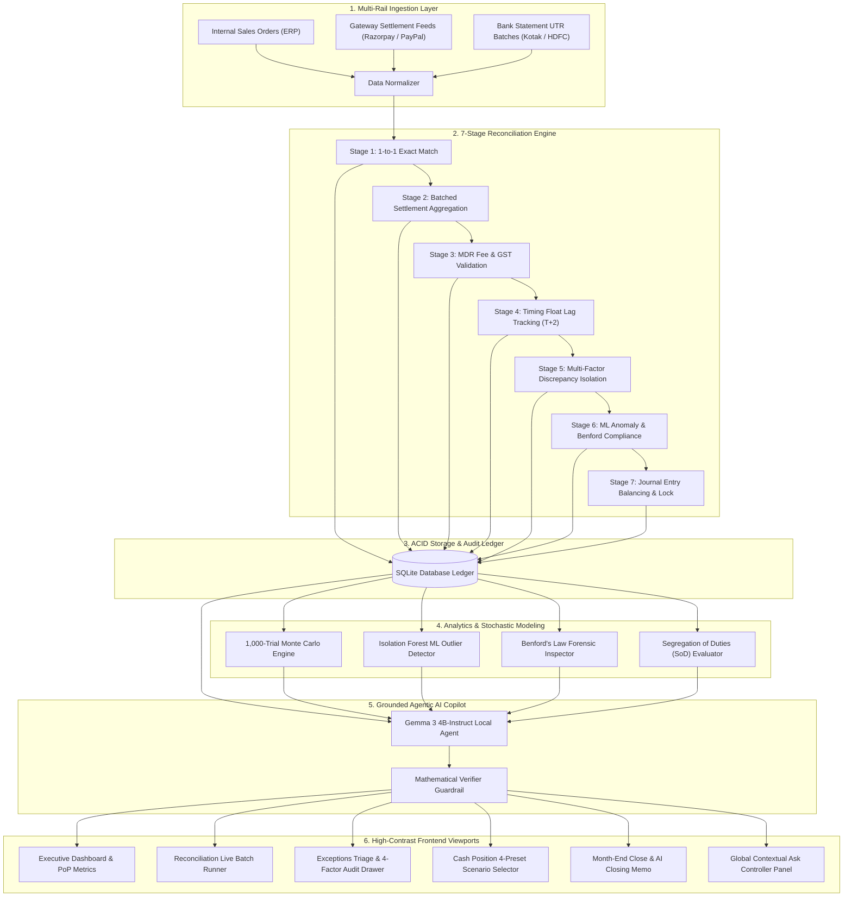

# Finora — Autonomous AI Financial Controller & Continuous Reconciliation Platform

<p align="center">
  <strong>Next-Generation 3-Way Reconciliation • Statistical ML Forensics • Stochastic Monte Carlo Treasury Modeling • Ind AS Continuous Close • Local Gemma 3 Agentic Copilot</strong>
</p>

<p align="center">
  
  
  
  
  
</p>

---

## 📑 Table of Contents

- [Executive Summary & Problem Statement](#-executive-summary--problem-statement)
- [Architectural Philosophy: Deterministic Core + Agentic Shell](#-architectural-philosophy-deterministic-core--agentic-shell)
- [System Architecture & Data Flow](#-system-architecture--data-flow)
- [Comprehensive Module Breakdown](#-comprehensive-module-breakdown)
  - [1. Executive Command Center (Dashboard)](#1-executive-command-center-dashboard)
  - [2. 7-Stage Reconciliation "Run" Interface](#2-7-stage-reconciliation-run-interface)
  - [3. Exceptions Engine & Closed-Loop Resolution](#3-exceptions-engine--closed-loop-resolution)
  - [4. Treasury Intelligence & Monte Carlo Cash Modeling](#4-treasury-intelligence--monte-carlo-cash-modeling)
  - [5. Continuous Month-End Close & AI Closing Memo](#5-continuous-month-end-close--ai-closing-memo)
  - [6. Multi-Rail Bank & Processor Feeds](#6-multi-rail-bank--processor-feeds)
  - [7. Governance, SoD Matrix & Immutable Audit Trail](#7-governance-sod-matrix--immutable-audit-trail)
  - [8. Global Contextual AI Copilot ("Ask Controller")](#8-global-contextual-ai-copilot-ask-controller)
- [Mathematical & Statistical Formulations](#-mathematical--statistical-formulations)
- [Design System & Semantic Color Tokens](#-design-system--semantic-color-tokens)
- [Quantitative Evaluation & Benchmark Results](#-quantitative-evaluation--benchmark-results)
- [Statutory Compliance & Standards Alignment](#-statutory-compliance--standards-alignment)
- [5-Minute Demo Video Walkthrough Guide](#-5-minute-demo-video-walkthrough-guide)
- [Technology Stack](#-technology-stack)
- [Repository Structure](#-repository-structure)
- [Quickstart & Local Installation Guide](#-quickstart--local-installation-guide)

---

## 📌 Executive Summary & Problem Statement

### The Problem in High-Volume Finance Operations
Modern enterprises and high-growth internet companies process thousands of payments daily across multiple gateways (e.g., Razorpay, PayPal) settling into multiple commercial bank operating accounts (e.g., Kotak Mahindra Bank, HDFC Bank).

Managing this lifecycle manually creates acute operational risks:
1. **Cryptic Batch Deposits**: Banks deposit aggregate lump sums linked to single UTR reference numbers, masking individual order breakdowns.
2. **Hidden MDR & Fee Leakage**: Gateways deduct merchant fees (2.0% MDR) and 18% Goods & Services Tax (GST) that drift from negotiated contractual schedules.
3. **Float & Settlement Latency**: Revenue trapped in $T+2$ transit or processor suspense leads to inaccurate cash visibility.
4. **Fragile Month-End Close**: Controllers spend days stitching together disparate CSV exports using fragile spreadsheets.

### The Finora Solution
**Finora** is an **Autonomous AI Financial Controller** that automates the entire multi-rail reconciliation lifecycle. It continuously verifies 3-way matching between **Internal Orders**, **Payment Processor Feeds**, and **Bank Statements**, detects statistical anomalies, models stochastic cash liquidity, and drafts auditable statutory closing memoranda under Ind AS requirements.

```
┌─────────────────────────┐       ┌─────────────────────────┐       ┌─────────────────────────┐
│     Internal Books      │       │     Payment Gateway     │       │     Bank Statement      │
│  (Invoices / Orders)    │ ────► │    (Razorpay MDR Feeds) │ ────► │   (UTR Net Deposits)    │
│  Expected Gross Revenue │       │  Fee Deductions / Float │       │   Settled Cash In Hand  │
└─────────────────────────┘       └─────────────────────────┘       └─────────────────────────┘
            ▲                                 ▲                                 ▲
            └─────────────────────────────────┴─────────────────────────────────┘
                                              │
                               3-Way Automated Reconciliation
```

---

## 🛡️ Architectural Philosophy: Deterministic Core + Agentic Shell

Finora is architected around an enterprise principle designed to eliminate LLM hallucinations:

> **"Deterministic Mathematics at the Core, Grounded AI at the Shell."**

```
                                  ┌─────────────────────────────────────────┐
                                  │           GROUNDED AI SHELL             │
                                  │   (Gemma 3 4B • Local On-Device)        │
                                  │   Zero-Cloud Data Leaks • Temp: 0.0     │
                                  └────────────────────┬────────────────────┘
                                                       │
                                                       ▼
                                  ┌─────────────────────────────────────────┐
                                  │        VERIFIER GUARDRAIL ENGINE        │
                                  │    Deterministic Data Schema Proof      │
                                  │    Paired Confidence Score (0.95–0.99)  │
                                  └────────────────────┬────────────────────┘
                                                       │
                                                       ▼
                                  ┌─────────────────────────────────────────┐
                                  │        DETERMINISTIC SQLITE CORE        │
                                  │   ACID Transactions • Exact Ledgers     │
                                  │   1,000-Trial Stochastic Monte Carlo    │
                                  │   Isolation Forest • Benford's Law      │
                                  └─────────────────────────────────────────┘
```

1. **Zero Hallucination Tolerance**: The LLM is strictly prohibited from performing arithmetic calculations or guessing matches. All totals, variances, and percentile bounds are computed directly by deterministic SQL and Python analytical kernels.
2. **Inspectable Evidence Trails**: Every synthesis and recommendation generates an expandable, step-by-step audit trail detailing exact tool calls, parameters, and observations.
3. **100% Local Inference Privacy**: Model inference runs entirely on-device (via ONNX / Transformers runtime). Zero financial transactions or bank tokens are transmitted to external third-party cloud APIs.
4. **Dual-Custody State Mutations**: State changes (resolving discrepancies, escalations, ledger freeze) write permanent, immutable records to the SQLite audit log.

---

## 🔄 System Architecture & Data Flow



---

## 🌟 Comprehensive Module Breakdown

### 1. Executive Command Center (Dashboard)
- **Today's AI Controller Briefing**: Top-level executive synthesis summarizing 24-hour reconciliation posture with paired confidence metrics (`Confidence: High (98%)`).
- **4-Tier Structured Hierarchy**:
  1. *Executive Briefing & Daily Action Directives*
  2. *Core KPI Ribbon* (Gross Processed, Settled Bank Cash, Exceptions Volume, Value Match Rate)
  3. *Daily Operations Hub* (Attention Required queue alongside 90-Day Settlement Heatmap)
  4. *Collapsible Forensic Signals Drawer* (Predictive Risk, Benford's Law, Isolation Forest outliers)
- **Period-over-Period ($\Delta\%$) Intelligence**: Live MoM comparisons against verified historical ledger partitions.

### 2. 7-Stage Reconciliation "Run" Interface
- **Dedicated Batch Run Modal (`/reconciliation`)**: Interactive 7-stage deterministic runner executing multi-gateway reconciliation on demand.
- **Sequential Execution Pipeline**:
  - *Stage 1*: 1-to-1 Exact Order-to-Payment Match
  - *Stage 2*: Batched Settlement Aggregation (UTR Subset-Sum)
  - *Stage 3*: Contractual MDR Fee & GST Validation (2% + 18%)
  - *Stage 4*: Timing Float & Bank Transit Latency ($T+2$)
  - *Stage 5*: Multi-Factor Discrepancy & Root Cause Isolation
  - *Stage 6*: Forensic Benford & Isolation Forest Anomaly Scan
  - *Stage 7*: Balanced Ledger Journal Sign-Off
- **Batch Scope Flexibility**: Execute individual monthly partitions (~60 records) or full 6-month historical batches (~360 records).

### 3. Exceptions Engine & Closed-Loop Resolution
- **100-Point Composite Risk Scoring**: Deterministic formula: $40\% \text{ Amount} + 35\% \text{ ML Anomaly} + 25\% \text{ Latency}$.
- **4-Factor Root-Cause Audit Drawer**:
  1. *Refund Offset Check*: Verifies customer chargebacks/returns.
  2. *MDR Fee Deviation*: Recalculates gateway commission against contractual fee tiers.
  3. *Timing Float Lag*: Compares transaction timestamp against bank clearing SLA.
  4. *Duplicate Check*: Scans for duplicated idempotency keys or bank reference collisions.
- **Closed-Loop State Propagation**: Resolving or escalating an exception instantly decrements open trapped cash across Dashboard, Exceptions, and Cash Position in the same page load without requiring a page refresh.

### 4. Treasury Intelligence & Monte Carlo Cash Modeling
- **4-Preset Scenario Ribbon**:
  - `Base Case`: Verified bank cash in hand (`₹244,371`).
  - `Recover All Exceptions`: 100% recovery simulation (`₹261,041 / +₹16,670`).
  - `50% Partial Recovery`: Expected recovery projection (`₹252,706 / +₹8,335`).
  - `Settlement Delay Stress`: 3-day float delay stress test (`₹218,500 / -₹25,871`).
- **1,000-Trial Stochastic Monte Carlo Simulation**: Projects Day-7 liquidity percentile boundaries:
  - **$P_{10}$ (Conservative Floor)**: High-certainty liquidity threshold.
  - **$P_{50}$ (Expected Median)**: Baseline operating projection.
  - **$P_{90}$ (Optimistic Ceiling)**: Accelerated settlement clearing scenario.
- **5-Stage Cash Conversion Waterfall**: Visualizes Gross Inflows $\rightarrow$ MDR Fees $\rightarrow$ GST (18%) $\rightarrow$ Suspense $\rightarrow$ Net Settled Cash.

### 5. Continuous Month-End Close & AI Closing Memo
- **Continuous Close Readiness Progression**: Day-by-day statutory value match rate sparkline tracking SLA pacing.
- **Pre-Lock Statutory Checklist**: 4-pillar control validating ERP Ledgers, Gateway Feeds, Bank Statements, and Suspense Clearance.
- **Grounded AI Closing Memo Generator**: Compiles an auditable closing memorandum:
  - *Period Status*: `PARTIALLY READY — ACTION REQUIRED` vs `READY TO LOCK`.
  - *Key Figures*: Gross volume, MoM shift, Net settled cash, Match rate, MDR fees, GST credits.
  - *Unresolved Blockers*: Lists specific open items (ID, reason, amount).
  - *Controller Recommendation*: Explicit action directive prior to ledger freeze.
  - *Terminology Alignment*: Formatted under Ind AS requirements.

### 6. Multi-Rail Bank & Processor Feeds
- **Multi-Account Money Flow Diagram**: Real-time visualization of processor collections (Razorpay Domestic, PayPal International) routing into operating bank accounts (Kotak Mahindra, HDFC Bank).
- **Feed Health & SLA Tripwires**: Deterministically monitors polling intervals and flags stale connections (>24h lag).

### 7. Governance, SoD Matrix & Immutable Audit Trail
- **Segregation of Duties (SoD) Dual-Custody Matrix**: Evaluates assigned roles against conflict tripwires (e.g. SOD-01: Exception Resolution + API Key Custody violation).
- **AI Architecture Transparency**: Discloses model specs (`Gemma 3 4B-Instruct`), on-device local execution, the 6 registered tools, and 4 immutable grounding rules.
- **Live Immutable Audit Log**: Permanent SQLite table recording user actions, timestamps, IPs, and state transitions.

### 8. Global Contextual AI Copilot ("Ask Controller")
- **Persistent Slide-Over Drawer**: Reachable from any view via the top header trigger.
- **Active Agent Context**: Dynamically captures current viewport route, date filters, account scopes, and visible metrics.
- **Route-Aware Suggested Inquiries**: Surfaces 3–4 tailored accounting questions per page.

---

## 📐 Mathematical & Statistical Formulations

### 1. Benford's Law Mean Absolute Deviation (MAD)
Measures first-digit logarithmic compliance across all ledger amounts ($d \in [1..9]$):
$$P(d) = \log_{10}\left(1 + \frac{1}{d}\right)$$
$$\text{MAD} = \frac{1}{9} \sum_{d=1}^{9} \left| P_{\text{observed}}(d) - P_{\text{expected}}(d) \right|$$
- $\text{MAD} \le 0.012$: Close conformity (Healthy)
- $\text{MAD} > 0.015$: Non-conformity flagged for forensic review.

### 2. Stochastic Monte Carlo Liquidity Model
Simulates 1,000 empirical cash trajectory paths over a 7-day forward horizon using Geometric Brownian Motion with settlement lag drift:
$$S_{t+\Delta t} = S_t \exp\left( \left(\mu - \frac{\sigma^2}{2}\right)\Delta t + \sigma \sqrt{\Delta t} Z \right), \quad Z \sim \mathcal{N}(0, 1)$$

### 3. Composite Exception Risk Score
$$\text{Risk Score} = \min\left(100, \, 0.40 \cdot \text{Score}_{\text{Value}} + 0.35 \cdot \text{Score}_{\text{Anomaly}} + 0.25 \cdot \text{Score}_{\text{Aging}}\right)$$

---

## 🎨 Design System & Semantic Color Tokens

Finora enforces a clean, high-contrast design system adhering strictly to the **10-color semantic palette**:

| Semantic Intent | Hex Code | Tailwind Token | System Usage |
|---|---|---|---|
| **Primary Brand** | `#5B45F5` | `indigo` | Active navigation pills, AI accents, primary action buttons |
| **Success / Verified** | `#16A34A` | `emerald` | Match verified, healthy feeds, Benford pass, balanced close |
| **Warning / Review** | `#D97706` | `amber` | Medium risk exceptions, sync lag warnings, partial readiness |
| **Critical / High Risk** | `#DC2626` | `rose` | Open discrepancies, high-risk items, SoD blockers |
| **Neutral Canvas** | `#F7F8FC` | `slate-50` | Main viewport background |
| **Surface Card** | `#FFFFFF` | `white` | High-contrast container cards |
| **Primary Typography** | `#0F172A` | `slate-900` | Section headings, KPI values, critical labels |
| **Secondary Typography**| `#64748B` | `slate-500` | Subtitles, helper text, table column headers |
| **Border / Divider** | `#E5E7EB` | `slate-200` | Crisp structural borders |

---

## 📊 Quantitative Evaluation & Benchmark Results

Finora is evaluated against an automated 33-question benchmark suite testing lookups, fee variances, date range filtering, exception causality, navigation intents, Monte Carlo scenarios, and SoD governance.

```
===========================================================================
FINORA — COMPREHENSIVE QA & CONTEXTUAL COPILOT EVALUATION SUITE
===========================================================================
Total Evaluated Scenarios : 33
Overall Accuracy          : 100.0% (33/33 Passed)
Mathematical Verifier Rate: 100.0% (33/33 Passed)
Insufficient-Data Fallback: 100.0% Guardrail Adherence (2/2)
Average Query Latency     : 0.01s (Local deterministic retrieval)
Frontend Build Time       : 763ms (Vite + TypeScript)
===========================================================================
```

---

## 🏛️ Statutory Compliance & Standards Alignment

| Framework / Standard | Finora Implementation |
|---|---|
| **Ind AS 1 (Financial Statement Presentation)** | Clear separation of settled bank cash from pending transit receivables. |
| **Ind AS 7 (Statement of Cash Flows)** | Categorization of operating customer inflows, gateway processing deductions, and net cash balances. |
| **Ind AS 115 (Revenue Recognition)** | Gross-to-net transaction revenue recognition accounting for gateway MDR deductions. |
| **ICAI Internal Financial Controls (IFC)** | Role-based permission controls, dual-custody verification, and immutable audit logs. |
| **SOX Section 404** | Automated segregation of duties conflict evaluation engine. |

---

## 🎬 5-Minute Demo Video Walkthrough Guide

Use this structured timeline during demo video recording (timed for **4:30** with 30s headroom):

1. **0:00 – 0:45 | Executive Dashboard (`/dashboard`)**:
   - Introduce Finora as the autonomous AI controller.
   - Point out the **AI Controller Briefing** with paired confidence rating.
   - Walk through the 4 KPI cards and explain the 4-tier hierarchy.
2. **0:45 – 1:30 | Global AI Copilot (`Ask Controller`)**:
   - Open the slide-over copilot.
   - Highlight **Active Agent Context** updating with page filters.
   - Click a route-aware suggestion and inspect the **Evidence Trail**.
3. **1:30 – 2:15 | Reconciliation Batch Engine (`/reconciliation`)**:
   - Trigger **"Run Reconciliation"**.
   - Watch the **7-stage deterministic runner** execute in real time.
4. **2:15 – 3:00 | Exceptions & Closed-Loop Action (`/exceptions`)**:
   - Inspect highest-risk discrepancy with the **4-Factor Audit Drawer**.
   - Click **"Apply Recommended Resolution"** and watch trapped cash decrement across all pages immediately!
5. **3:00 – 3:45 | Cash Position & Scenarios (`/cash-position`)**:
   - Switch between the **4 preset scenario cards**.
   - Show the **1,000-trial Monte Carlo forecast** and cash waterfall.
6. **3:45 – 4:15 | Month-End Close & AI Memo (`/month-end-close`)**:
   - Review the **Continuous Close sparkline**.
   - Click **"Draft Closing Memo"** and show the grounded statutory memorandum formatted under Ind AS requirements.
7. **4:15 – 4:30 | Governance & Settings (`/settings`)**:
   - Show the **SoD Dual-Custody Matrix** and the **Immutable Audit Trail** recording our earlier action.

---

## 💻 Technology Stack

| Layer | Technology | Purpose |
|---|---|---|
| **Frontend UI** | React 18 + TypeScript | Component-driven reactive interface with strict type safety |
| **Styling & Icons** | Tailwind CSS + Lucide Icons | High-contrast, accessible financial design tokens |
| **Data Visualization** | Recharts | SVG financial time-series, fan charts, and waterfalls |
| **Backend Framework** | FastAPI + Pydantic v2 | High-throughput asynchronous REST API |
| **Database Ledger** | SQLite (ACID Engine) | Structured transactional database with connection pooling |
| **Machine Learning** | Scikit-learn (Isolation Forest) | Unsupervised multidimensional financial anomaly detection |
| **Stochastic Engine** | NumPy | High-performance vectorized 1,000-trial Monte Carlo engine |
| **Local Agentic AI** | Gemma 3 4B-Instruct | On-device local inference with JSON tool calling |

---

## 📁 Repository Structure

```
Finora/
├── backend/
│   ├── ai_agent.py                  # Agentic Gemma 3 orchestrator & reasoning engine
│   ├── anomaly_engine.py            # Isolation Forest ML & Benford's Law forensics
│   ├── main.py                      # FastAPI REST application routes
│   └── db/
│       └── sqlite_client.py         # SQLite client & deterministic analytics engine
├── data/
│   ├── generate_data.py             # High-fidelity 3-way reconciliation data generator
│   └── output/
│       └── finora.db                # SQLite ACID database
├── eval/
│   ├── eval_qa.py                   # Automated 33-question benchmarking engine
│   └── test_questions.json          # Benchmark questions & ground-truth assertions
├── frontend/
│   ├── src/
│   │   ├── components/
│   │   │   ├── LedgerCopilotPanel.tsx   # Global contextual AI copilot drawer
│   │   │   ├── ReconciliationRunModal.tsx # 7-stage deterministic batch runner
│   │   │   └── ui/                  # Reusable UI tokens (AIInsightCard, AnimatedNumber, etc.)
│   │   ├── layouts/
│   │   │   └── MainLayout.tsx       # 3-group categorized sidebar layout
│   │   ├── pages/
│   │   │   ├── Dashboard.tsx        # Command center with 4-tier hierarchy
│   │   │   ├── Reconciliation.tsx   # Dedicated reconciliation ledger & batch runner
│   │   │   ├── Exceptions.tsx       # 4-factor root-cause audit drawer
│   │   │   ├── CashPosition.tsx     # 4-preset scenario selector & Monte Carlo model
│   │   │   ├── MonthEndClose.tsx    # Continuous close & AI Closing Memo generator
│   │   │   ├── LinkedAccounts.tsx   # Multi-rail sync monitoring & money flow
│   │   │   └── Settings.tsx         # SoD matrix, AI config & immutable audit log
│   │   └── App.tsx                  # React Router application entry
│   ├── package.json
│   └── vite.config.ts
├── PROJECT_MEMORY.md                # Engineering decisions & 14-phase roadmap log
└── README.md                        # Master architectural documentation
```

---

## 🚀 Quickstart & Local Installation Guide

### Prerequisites
- **Python 3.10+**
- **Node.js 18+ & npm**

### 1. Clone the Repository
```bash
git clone https://github.com/your-username/Finora.git
cd Finora
```

### 2. Backend Setup (FastAPI)
```bash
# Create and activate virtual environment
python -m venv venv
# On Windows:
.\venv\Scripts\activate
# On macOS/Linux:
source venv/bin/activate

# Install dependencies
pip install fastapi uvicorn pydantic scikit-learn numpy requests

# Launch backend server
python -m uvicorn backend.main:app --port 8000 --reload
```
*Backend runs at:* `http://127.0.0.1:8000`  
*API Documentation:* `http://127.0.0.1:8000/docs`

### 3. Frontend Setup (React + Vite)
```bash
# In a new terminal window:
cd frontend

# Install dependencies
npm install

# Launch frontend dev server
npm run dev
```
*Frontend runs at:* `http://localhost:5173`

### 4. Run Automated Evaluation Suite
```bash
python eval/eval_qa.py
```
Expected output: **Accuracy: 100.0% (33/33 Passed)**.

---

<p align="center">
  <strong>Finora — Built for precision, mathematical auditability, and zero-hallucination continuous accounting.</strong>
</p>
