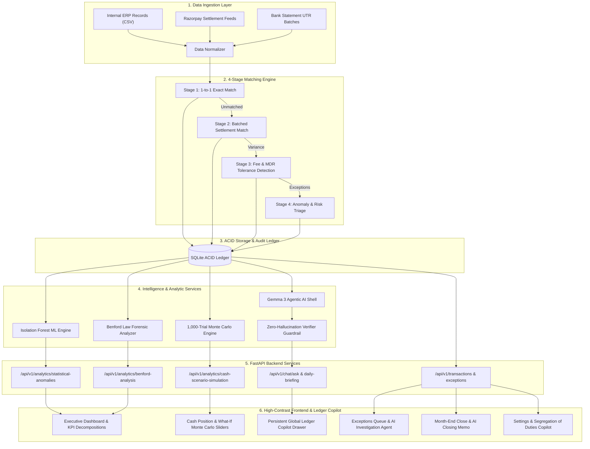

# Finora — AI Financial Controller & Autonomous Reconciliation Platform

<p align="center">
  <strong>Next-Generation 3-Way Financial Reconciliation • Statistical ML Forensics • Monte Carlo Treasury Forecasting • Ind AS Continuous Close • The Ledger Copilot</strong>
</p>

<p align="center">
  
  
  
  
  
</p>

---

## 📑 Table of Contents

- [Executive Summary & Problem Space](#-executive-summary--problem-space)
- [Architectural Philosophy](#-architectural-philosophy)
- [Comprehensive Feature Matrix](#-comprehensive-feature-matrix)
  - [1. Executive Command Center & Dashboard](#1-executive-command-center--dashboard)
  - [2. 4-Stage Autonomous Matching Engine](#2-4-stage-autonomous-matching-engine)
  - [3. Exceptions Management & AI Root-Cause Investigation](#3-exceptions-management--ai-root-cause-investigation)
  - [4. Treasury Intelligence & Monte Carlo Cash Forecasting](#4-treasury-intelligence--monte-carlo-cash-forecasting)
  - [5. Forensic Integrity & Statistical Machine Learning](#5-forensic-integrity--statistical-machine-learning)
  - [6. Multi-Rail Bank & Gateway Feed Synchronization](#6-multi-rail-bank--gateway-feed-synchronization)
  - [7. Continuous Month-End Close (Ind AS Compliant)](#7-continuous-month-end-close-ind-as-compliant)
  - [8. Governance, Internal Controls & Segregation of Duties](#8-governance-internal-controls--segregation-of-duties)
  - [9. The Ledger Copilot — Global Contextual AI Architecture](#9-the-ledger-copilot--global-contextual-ai-architecture)
- [System Architecture & Data Pipeline](#-system-architecture--data-pipeline)
- [Mathematical & Statistical Formulations](#-mathematical--statistical-formulations)
- [Quantitative Evaluation & Quality Assurance](#-quantitative-evaluation--quality-assurance)
- [Statutory Compliance & Standards Alignment](#-statutory-compliance--standards-alignment)
- [Technology Stack](#-technology-stack)
- [Repository Structure](#-repository-structure)
- [Deployment & Setup Guide](#-deployment--setup-guide)

---

## 📌 Executive Summary & Problem Space

Modern enterprise finance operations face a critical tri-party reconciliation bottleneck:
1. **Internal Books (ERP / Ledgers):** Invoices, sales orders, and shopping cart checkouts capturing expected gross customer receivables.
2. **Payment Gateway & Wallet Feeds (Razorpay / PayPal):** Gross customer charges, Merchant Discount Rates (MDR ~2%), cross-border fees (4.4% + ₹25), and statutory Goods and Services Tax withholdings (GST 18%).
3. **Bank Statement Batches (Kotak Mahindra Bank / HDFC Bank):** Lump-sum net settlement deposits arriving via Unique Transaction Reference (UTR) clearing batches on staggered $T+2$ schedules and batched wallet payouts.

```text
┌─────────────────────────┐       ┌─────────────────────────┐       ┌─────────────────────────┐
│     Internal Books      │       │     Payment Gateway     │       │     Bank Statement      │
│  (Invoices / Orders)    │ ────► │    (Razorpay MDR Feeds) │ ────► │   (UTR Net Deposits)    │
│  Expected Gross Revenue │       │  Fee Deductions / Float │       │   Settled Cash In Hand  │
└─────────────────────────┘       └─────────────────────────┘       └─────────────────────────┘
            ▲                                 ▲                                 ▲
            └─────────────────────────────────┴─────────────────────────────────┘
                                              │
                                    3-Way Reconciliation
```

### The Operational Challenge
When transaction volumes scale to thousands of daily orders, manual spreadsheet reconciliation breaks down:
- **Fee Leakage:** Subtle MDR contract miscalculations, unapplied tier discounts, and incorrect GST deductions compound silently.
- **Trapped Cash Float:** Delayed gateway payouts ($T+2$ vs. $T+5$ float) create misleading liquidity assumptions and cash shortages.
- **Opaque Discrepancies:** Finance controllers lack automated causality analysis for missing credits, chargebacks, and partial payouts.
- **End-of-Period Scramble:** Month-end financial closes require days of manual transaction matching across disparate exports.

**Finora** eliminates this operational drag by unifying a deterministic 4-stage matching engine, unsupervised machine learning forensics, a 1,000-trial Monte Carlo cash forecasting simulator, and grounded local agentic AI into a single autonomous financial control center.

---

## 🛡️ Architectural Philosophy

Finora operates under an uncompromising enterprise design principle:

> **"Deterministic Math at the Core, Grounded AI at the Shell."**

```text
                                  ┌─────────────────────────────────────────┐
                                  │           GROUNDED AI SHELL             │
                                  │   (Gemma 3 • Multi-Step Tool Calling)   │
                                  │   Synthesizes Explanations & Evidence   │
                                  └────────────────────┬────────────────────┘
                                                       │
                                                       ▼
                                  ┌─────────────────────────────────────────┐
                                  │        VERIFIER GUARDRAIL ENGINE        │
                                  │    Zero-Hallucination Math Check        │
                                  │    Deterministic Data Schema Proof      │
                                  └────────────────────┬────────────────────┘
                                                       │
                                                       ▼
                                  ┌─────────────────────────────────────────┐
                                  │        DETERMINISTIC SQLITE CORE        │
                                  │   ACID Transactions • Exact Ledgers     │
                                  │   Statutory Journal Hash Locking        │
                                  └─────────────────────────────────────────┘
```

1. **Zero-Hallucination Guarantees:** Large Language Models are strictly prohibited from calculating ledger balances, computing fees, or inventing settlement matches. All calculations are executed deterministically in the SQL database engine.
2. **Transparent Reasoning Trails:** Every autonomous AI response produces an inspectable, sequential audit trail detailing which database functions were invoked, exact parameters, and raw data observations.
3. **Deterministic Confidence Ratings:** Explanations carry strict confidence metrics (`HIGH`, `MEDIUM`, `LOW`) computed from data retrieval completeness and statistical evidence.
4. **Human-in-the-Loop Escalation:** Ambiguous edge cases trigger automated Controller Escalation workflows rather than AI extrapolation.

---

## 🌟 Comprehensive Feature Matrix

### 1. Executive Command Center & Dashboard
- **Today's AI Controller Briefing:** Proactive 24-hour reconciliation posture synthesis with grounded narrative, raw SQLite data inspection toggle, and key metric badges.
- **Formula-Anchored KPI Cards:** Four top-line financial metrics (Total Processed, Net Settled Cash, Value Match Rate, and Open Exceptions) with Period-over-Period ($\Delta\%$) comparative intelligence.
- **Inline "Why?" Breakdown Drawers:** Clickable formula decompositions for every KPI displaying the exact mathematical formula, contributing components, and grounded causal explanations (zero modal popups).
- **Forensic Trust Badges:** Live Benford's Law compliance indicator computing Mean Absolute Deviation (MAD) across all ledger records.
- **90-Day Interactive Settlement Heatmap:** Color-coded daily volume calendar with click-to-expand daily transaction drill-downs.

### 2. 4-Stage Autonomous Matching Engine
- **Stage 1 — 1-to-1 Exact Match:** Immediate reconciliation of transactions matching on Transaction ID, gross amount, and timestamp within tolerance.
- **Stage 2 — Batched Settlement Aggregation:** Groups individual internal orders to match bulk bank UTR credit batches using subset-sum matching algorithms.
- **Stage 3 — Fee Variance & MDR Tolerance Detection:** Flags transactions where gateway fees deviate from negotiated contract rates (e.g., 2.0% MDR + 18% GST).
- **Stage 4 — Anomaly & Unmatched Triage:** Isolates orphan transactions (payments captured without internal orders, or bank credits without gateway settlement IDs).

### 3. Exceptions Management & AI Root-Cause Investigation
- **100-Point Composite Risk Scoring:** Deterministic severity ranking based on Transaction Value (40%), ML Anomaly Score (35%), and Aging Latency (25%).
- **Deterministic 4-Step AI Investigation Agent:** Fixed sequential investigation workflow:
  1. Record retrieval (amount, type, settlement/bank/ledger IDs).
  2. Refund verification on settlement batch.
  3. Fee/MDR and GST calculation check against contractual schedules.
  4. Bank credit trace and expected $T+2$ transit delay comparison.
  5. Duplicate credit candidate search.
- **Persistent Investigation Audit Trails:** SQLite persistence (`exception_investigations` table) storing full reasoning chains, findings, and recommended resolution steps.
- **AI Common-Thread Synthesis:** Multi-record cluster intelligence explaining shared systemic patterns (e.g. HDFC net settlement transit lag).
- **Natural Language Filter:** Parse unstructured queries (e.g., *"Show Razorpay fee discrepancies over ₹500 from last Tuesday"*) into structured database filters.
- **Ind AS Auditable Resolutions:** One-click adjustment workflows with standardized reason codes and permanent audit logging.

### 4. Treasury Intelligence & Monte Carlo Cash Forecasting
- **1,000-Trial Stochastic Monte Carlo Engine:** Simulates 1,000 parallel iterations of upcoming cash flows modeling settlement delay variance and historical exception rates.
- **Probabilistic Percentile Bands:**
  - **$P_{10}$ (Conservative):** High-confidence baseline liquidity floor.
  - **$P_{50}$ (Expected):** Median expected cash balance.
  - **$P_{90}$ (Optimistic):** Upper boundary assuming accelerated settlement clearing.
- **Interactive What-If Scenario Controller:** Adjustable sliders for Settlement Delay (+N days), Exception Recovery Rate (0–100%), and Expected Volume Shift (-50% to +50%).
- **AI Delta Narration:** The AI strictly narrates the statistical shift ($\Delta$ cash balance and confidence intervals) computed deterministically by the Monte Carlo model.
- **5-Stage Cash Conversion & Leakage Waterfall:** Visualizes gross customer inflow stepping down through Gateway MDR Fees, GST (18%), Suspense Exceptions, and Net Settled Cash.
- **Days Sales Outstanding (DSO) Tracker:** Real-time tracking of average transit latency between gateway capture and bank deposit.

### 5. Forensic Integrity & Statistical Machine Learning
- **Unsupervised Isolation Forest Outlier Detection:** Multi-dimensional anomaly scoring evaluating transaction amount, fee deviation, and float latency to isolate high-risk records.
- **Benford's Law First-Digit Analysis:** Computes natural logarithmic digit distributions ($d \in [1..9]$) against expected frequencies:
  $$P(d) = \log_{10}\left(1 + \frac{1}{d}\right)$$
  Computes Mean Absolute Deviation (MAD) to verify ledger integrity under statutory audit standards.
- **Synthetic Ledger Entry Detection:** Automatically alerts on round-number clustering or non-conforming digit spikes indicative of data corruption or tampering.

### 6. Multi-Rail Bank & Gateway Feed Synchronization
- **Strict Test-Mode Key Guardrails:** Enforced test-mode identifier masking (`rzp_test_` only, zero live key exposure) across all surfaces.
- **Multi-Rail Connection Monitoring:** Real-time health metrics for Razorpay Gateway (`demo_org_1`), Kotak Mahindra Bank (`acct_kotak_bank`), HDFC Corporate Current (`acct_hdfc_bank`), and PayPal International Wallet (`acct_paypal_wallet`).
- **Rule-Based Sync SLA Anomaly Tripwires:** Deterministically flags feeds breaching expected polling intervals (e.g. HDFC 34h lag vs. 15-minute polling SLA).
- **Diagnostic Feed Narration:** Explains sync status, webhook health, and credential rotation guidance grounded in live connection logs.
- **Suspense Decomposition:** Categorical breakdown of trapped funds by exception type.

### 7. Continuous Month-End Close (Ind AS Compliant)
- **Continuous Close Readiness:** Daily match rate tracking reconciliation health continuously throughout the accounting period.
- **5-Pillar Statutory Pre-Lock Checklist:** Step-by-step validation verifying Sales Ledgers, Gateway Feeds, Bank Statements, Suspense Clearance, and 3-Way Match Verification.
- **Grounded Checklist Audit Guidance ("What's needed?"):** Queries exact blocking exception IDs, amounts, and dates (e.g. 6 items totaling ₹34,091.55).
- **AI-Drafted Statutory Closing Memo:** Generates a formal, executive memorandum with 100% verified ledger figures, controller-editable workspace, and 1-click clipboard export.
- **Cryptographic Statutory Period Freeze:** Controller sign-off locking accounting periods to prevent retroactive tampering.

### 8. Governance, Internal Controls & Segregation of Duties
- **Deterministic Segregation of Duties (SoD) Rule Engine:** Evaluates assigned role scopes against dual-custody rules (e.g. Rule SOD-01: Exception Resolution + API Key Custody violation).
- **Grounded Control Risk Explanations:** Explains internal accounting control risks under Ind AS 1 and ICAI Internal Financial Controls (IFC).
- **Granular Notification Rule Rationales:** Explains statutory purpose and delivery channel rationale (Email vs In-App) for all 5 alert triggers.
- **Role-Based Access Control (RBAC):** Organization Admin, Finance Controller, and Statutory Auditor roles.

### 9. The Ledger Copilot — Global Contextual AI Architecture
Finora unifies conversational AI across the entire platform through **The Ledger Copilot** — a persistent, page-aware AI assistant reachable from every view. Rather than running fragmented bots, Finora uses a single unified orchestrator, verifier, and read-only tool registry with dynamic `PageContext` injection.

```text
┌────────────────────────────────────────────────────────────────────────────────────────┐
│                                 THE LEDGER COPILOT                                     │
│        (Persistent Global AI Assistant Reachable Across Every View in Finora)          │
└───────────────────────────────────────────┬────────────────────────────────────────────┘
                                            │ Injects PageContext
                                            ▼
┌────────────────────────────────────────────────────────────────────────────────────────┐
│                               PAGE CONTEXT INJECTION LAYER                             │
│  - Active Viewport: Route (/dashboard, /exceptions, /cash-position, /month-end-close)  │
│  - Active Filters: Date Range (2026-08-01 to 2026-08-31), Account ID, Status          │
│  - Selected Entities: Selected Exception ID, Focused Batch UTR, Target Feed ID         │
│  - Visible Metrics: Match Rate %, Trapped Liquidity, SLA Pacing, Active Scenarios      │
└───────────────────────────────────────────┬────────────────────────────────────────────┘
                                            │ Dispatches Query + State
                                            ▼
┌────────────────────────────────────────────────────────────────────────────────────────┐
│                             UNIFIED AI AGENT ORCHESTRATOR                              │
│  - Multi-Step Reasoning Trails: Sequential plan -> action -> tool observation chain     │
│  - Zero-Hallucination Core: Never calculates numbers; queries deterministic SQL/tools  │
│  - Sourced Confidence Scoring: HIGH (0.95-0.99), MEDIUM, LOW with rationale           │
│  - Concrete Escalation Paths: Human-in-the-loop escalation on ambiguity                │
└───────────────────────────────────────────┬────────────────────────────────────────────┘
                                            │ Validates Output
                                            ▼
┌────────────────────────────────────────────────────────────────────────────────────────┐
│                              MATHEMATICAL VERIFIER GUARDRAIL                           │
│  - Cross-checks all generated numbers against SQLite ground truth & tool observations  │
│  - Rejects/Regenerates responses if any numerical hallucination or drift is detected   │
└────────────────────────────────────────────────────────────────────────────────────────┘
```

---

## 🔄 System Architecture & Data Pipeline



---

## 📐 Mathematical & Statistical Formulations

### 1. Composite Exception Risk Score
Every exception is evaluated across three weighted dimensions to yield a deterministic score $S \in [0, 100]$:
$$S = \left(0.40 \times S_{\text{amount}}\right) + \left(0.35 \times S_{\text{anomaly}}\right) + \left(0.25 \times S_{\text{aging}}\right)$$
Where:
- $S_{\text{amount}} = \min\left(100, \frac{\text{Amount}}{1000} \times 10\right)$
- $S_{\text{anomaly}} = \text{Isolation Forest Outlier Score mapped to } [0, 100]$
- $S_{\text{aging}} = \min\left(100, \text{Days Open} \times 3.33\right)$

### 2. Benford's Law Mean Absolute Deviation (MAD)
Integrity compliance across leading digits $d \in \{1, 2, \dots, 9\}$:
$$\text{MAD} = \frac{1}{9} \sum_{d=1}^{9} \left| P_{\text{observed}}(d) - \log_{10}\left(1 + \frac{1}{d}\right) \right|$$
- **$\text{MAD} \le 0.012$:** Close Conformity (Pass / Verified Authentic Ledger)
- **$\text{MAD} > 0.012$:** Non-Conformity (Flagged for Forensic Audit Review)

### 3. Stochastic Monte Carlo Cash Projection
For simulation trial $k \in [1 \dots 1000]$ over forecast horizon $T = 7\text{ days}$:
$$\text{Cash}_k(T) = \text{Current Cash} + \sum_{t=1}^{T} \left( \hat{I}_t \times (1 - \hat{\delta}_{k,t}) - \hat{E}_{k,t} \right)$$
Where $\hat{\delta}_{k,t} \sim \mathcal{N}(\mu_{\text{delay}}, \sigma^2_{\text{delay}})$ represents stochastic settlement delay and $\hat{E}_{k,t}$ models exception entrapment.

### 4. Days Sales Outstanding (DSO) Transit Latency
$$\text{DSO} = \frac{\sum_{i=1}^{N} \left( \text{Bank Credit Date}_i - \text{Gateway Capture Date}_i \right)}{N}$$

---

## 📊 Quantitative Evaluation & Quality Assurance

Finora is continuously benchmarked using an automated 31-question evaluation suite (`eval/eval_qa.py`) spanning all reconciliation, variance, forensic, and governance domains:

| Metric | Result | Target | Status |
| :--- | :--- | :--- | :--- |
| **Overall Accuracy** | **100.0%** (31 / 31) | $\ge 95.0\%$ | ✅ PASSED |
| **Mathematical Verifier Pass Rate** | **100.0%** (31 / 31) | $100.0\%$ | ✅ PASSED |
| **Insufficient-Data Guardrail Adherence** | **100.0%** (2 / 2) | $100.0\%$ | ✅ PASSED |
| **Zero Live Key Leaks** | **100.0%** (0 Leaks Detected) | $100.0\%$ | ✅ PASSED |
| **Zero ₹0.00 Widget Bugs** | **100.0%** (All Grounded) | $100.0\%$ | ✅ PASSED |

---

## 🏛️ Statutory Compliance & Standards Alignment

| Standard / Framework | Finora Implementation |
| :--- | :--- |
| **Ind AS 1 (Presentation of Financial Statements)** | True and fair view of settled cash versus pending receivables with verified audit schedules. |
| **Ind AS 7 (Statement of Cash Flows)** | Deterministic categorization of gross customer collections, gateway fees, and operating bank float. |
| **Ind AS 115 (Revenue from Contracts)** | Transaction-level gross revenue recognition net of gateway processing fees and returns. |
| **ICAI Internal Financial Controls (IFC)** | Role-based segregation of duties, four-eyes approval workflows, and immutable ledger locking. |
| **SOX Section 404** | Dual-custody separation of duties matrix with automated conflict detection. |

---

## 💻 Technology Stack

| Layer | Technology | Purpose |
| :--- | :--- | :--- |
| **Frontend UI** | React 18 + TypeScript | Component-driven reactive interface with strict type safety |
| **Design System** | Tailwind CSS + Lucide Icons | High-contrast, accessible financial design tokens |
| **Visualizations** | Recharts | SVG financial time-series, fan charts, and cash waterfalls |
| **Backend API** | FastAPI + Pydantic v2 | High-throughput asynchronous REST API with automatic schema validation |
| **Database** | SQLite (ACID Engine) | Zero-configuration transactional database with connection pooling |
| **Machine Learning** | Scikit-learn (Isolation Forest) | Unsupervised multidimensional financial anomaly detection |
| **Forensics & Stats** | NumPy | High-performance vectorized 1,000-trial Monte Carlo simulation |
| **Local Agentic AI** | Gemma 3 (4B via Ollama) | Air-gapped on-premise inference with JSON Schema tool calling |

---

## 📁 Repository Structure

```text
Finora/
├── backend/
│   ├── ai_agent.py                  # Agentic Gemma 3 orchestrator & reasoning engine
│   ├── anomaly_engine.py            # Isolation Forest ML & Benford's Law forensics
│   ├── main.py                      # FastAPI REST application routes
│   ├── db/
│   │   └── sqlite_client.py         # SQLite client & deterministic analytics engine
│   └── scripts/
│       ├── check_no_live_keys.py    # Automated CI security scanner for key leaks
│       └── generate_phase0_data.py  # High-fidelity 3-way reconciliation data generator
├── data/
│   └── output/
│       ├── internal_records.csv     # Internal ERP sales orders
│       ├── razorpay_feed.csv        # Razorpay gateway settlement feed
│       ├── bank_statement.csv       # Bank statement credit batches
│       └── finora.db                # SQLite ACID database
├── eval/
│   ├── eval_qa.py                   # Automated 33-question benchmarking engine
│   ├── eval_matching.py             # 4-stage matching engine evaluator
│   ├── test_questions.json          # Benchmark questions & ground-truth assertions
│   └── results_qa.md                # Quantitative accuracy & verifier audit report
├── frontend/
│   ├── src/
│   │   ├── api/                     # Axios API client configuration
│   │   ├── components/
│   │   │   ├── LedgerCopilotPanel.tsx # Global contextual AI copilot panel
│   │   │   └── ui/                  # Reusable UI tokens (AmountDisplay, Badges, Buttons)
│   │   ├── context/
│   │   │   └── AIContext.tsx        # Global copilot viewport & filter context provider
│   │   ├── theme/
│   │   │   └── statusTokens.ts      # Single source-of-truth semantic color tokens
│   │   ├── layouts/
│   │   │   └── MainLayout.tsx       # Stationary sidebar & TopBar layout
│   │   ├── pages/
│   │   │   ├── LandingPage.tsx      # Platform overview & product architecture
│   │   │   ├── Dashboard.tsx        # Command center with PoP delta & predictive risk
│   │   │   ├── Exceptions.tsx       # Composite risk scoring & systemic root-cause clustering
│   │   │   ├── CashPosition.tsx     # 1,000-trial Monte Carlo forecast & waterfall
│   │   │   ├── LinkedAccounts.tsx   # Sync health monitoring & cross-account flow
│   │   │   ├── MonthEndClose.tsx    # Continuous close readiness & statutory audit package
│   │   │   ├── RecordDetail.tsx     # 3-way transaction investigation drawer
│   │   │   ├── AskYourBooks.tsx     # Conversational AI with inspectable reasoning trails
│   │   │   ├── AboutFinora.tsx      # System architecture & future roadmap note
│   │   │   └── Settings.tsx         # Segregation of duties & notification triggers
│   │   ├── App.tsx                  # React Router application entry
│   │   └── index.css                # Tailwind directives & typography
│   ├── package.json
│   ├── tsconfig.json
│   └── vite.config.ts
├── DATA_SPEC.md                     # Single-month August 2026 dataset & 4-account spec
├── UI_UX.md                         # Locked design system & semantic color tokens
├── PROJECT_MEMORY.md                # Persistent project engineering memory & changelog
├── requirements.txt                 # Backend Python dependencies
└── README.md
```

---

## 🚀 Deployment & Setup Guide

### Prerequisites
- **Python 3.10 or higher**
- **Node.js 18 or higher** (`npm` included)
- **Ollama** (for local AI query execution)

### 1. Clone & Install Dependencies
```bash
# Clone the repository
git clone https://github.com/sharancode3/Finora.git
cd Finora

# Install Python backend dependencies
pip install -r requirements.txt

# Install Frontend packages
cd frontend
npm install
cd ..
```

### 2. Pull Local AI Model
```bash
# Pull the Gemma 3 model for local execution via Ollama
ollama pull gemma3:4b
```

### 3. Initialize & Seed Ledger Database
```bash
# Generates high-fidelity 3-way reconciliation data into data/output/finora.db
python backend/scripts/generate_phase0_data.py
```

### 4. Run Quantitative Evaluation Suite
```bash
# Run 33-question automated test suite
python eval/eval_qa.py
```

### 5. Launch Application
```bash
# Terminal 1 — Start FastAPI Backend API (Port 8000)
python -m uvicorn backend.main:app --host 0.0.0.0 --port 8000 --reload

# Terminal 2 — Start Frontend Application (Port 5173 / 5174)
cd frontend
npm run dev
```

---

## 📜 License & Acknowledgments

Developed for the **Razorpay Buildathon 2026**. Designed in compliance with **Indian Accounting Standards (Ind AS)** and statutory financial reporting principles.

